# Atlas — Product Requirements Document

---

## 1. Document Information

| Field | Value |
|-------|-------|
| Product Name | Atlas |
| Product Type | AI-powered software engineering learning ecosystem |
| Document Status | Initial structured PRD |
| Version | 0.1 |
| Source of Truth | Doc 4.0 — Atlas Product Requirements Document v4.0 (August 2026) |
| Last Updated | September 2026 |
| Related Documents | Architecture.md · Design.md · Rules.md · Memory.md |

---

## 2. Product Overview

### What is Atlas?

Atlas is an AI-powered software engineering learning ecosystem designed to help learners become professional software engineers through guided practice, real-world software engineering missions, AI mentorship, and production-inspired development workflows.

### What problem does Atlas solve?

Traditional programming education creates fragmented learning. Learners accumulate isolated knowledge across multiple sources — syntax from one place, data structures from another, frameworks from tutorials — yet still struggle to understand requirements, build complete features, debug real codebases, make engineering trade-offs, structure software, test properly, optimize performance, explain technical decisions, and build credible evidence of engineering ability.

Atlas connects those pieces into a coherent engineering learning experience.

### Why Atlas exists

Atlas teaches learners how software engineering work actually happens. Instead of presenting hundreds of disconnected questions, Atlas progressively exposes learners to realistic engineering situations: understand a requirement, identify constraints, break a problem into tasks, select data structures and architecture, implement the feature, compile and test, debug failures, analyze performance, improve code quality, receive guided feedback, reflect on decisions, and preserve evidence of the work.

### Core Promise

> **Atlas does not just teach people to code. Atlas teaches people to engineer.**

### Product Philosophy

> "Learn Like an Engineer. Build Like an Engineer. Get Hired Like an Engineer."

---

## 3. Vision & Mission

### Product Vision

Atlas aims to become a comprehensive software engineering development ecosystem where a person can:

> START AS A BEGINNER → LEARN FUNDAMENTALS → BUILD LOGIC → LEARN TECHNOLOGIES → BUILD REAL FEATURES → DEBUG REALISTIC SYSTEMS → OPTIMIZE SOFTWARE → LEARN ENGINEERING PRACTICES → BUILD VERIFIED EXPERIENCE → CREATE A PROFESSIONAL ENGINEERING PASSPORT → BECOME INTERVIEW READY → CONNECT WITH EMPLOYERS

### Long-Term Ambition

Connect learning, practice, engineering simulation, AI mentorship, verified evidence, and career opportunities into one system.

### Core Principles

Every feature should support one or more of these principles:

1. **Learn by Building** — Engineering ability is developed through building, not watching.
2. **Engineering First** — Every feature must serve engineering growth.
3. **Think Before Code** — Planning, design, and reasoning precede implementation.
4. **Guide Instead of Solving** — The system teaches thinking, not copy-paste answers.
5. **AI as Mentor** — AI accelerates learning by coaching, not by doing the work.
6. **Practical over Theoretical** — Real-world engineering problems over abstract exercises.
7. **Portfolio Driven** — Every meaningful action should contribute to a professional engineering profile.
8. **Industry Ready** — The learner should feel production-ready by the time they complete the journey.

### What Atlas Is NOT

Atlas is NOT:

- A LeetCode clone
- A HackerRank clone
- A video-course platform
- A generic coding playground
- A normal portfolio builder
- An AI chatbot that gives code answers

---

### Product Roadmap

| Phase | Focus | Capabilities |
|-------|-------|-------------|
| Phase 1 — Foundations | Core platform | Authentication, Learning foundation, Missions, Execution, Progress, Portfolio, Admin |
| Phase 2 — AI Learning | Intelligence layer | Adaptive learning, AI mentor, Personalized recommendations, Knowledge gap detection, Advanced guidance |
| Phase 3 — Engineering Simulator | Story Universe | Advanced engineering workflows, Larger project simulations, Production-like scenarios |
| Phase 4 — Collaboration | Team-based learning | Team missions, Pair programming, Collaborative engineering |
| Phase 5 — Hiring Platform | Career connection | Companies, Recruiters, Assessments, Verified engineering evidence, Hiring pipelines |
| Phase 6 — Atlas Ecosystem | Scale and extensibility | Universities, Enterprise, SDK, Plugins, Marketplace / ecosystem, Broader engineering tracks |

---

## 4. Problem Statement

### Learner Pain Points

| Problem | Description |
|---------|-------------|
| Fragmented Knowledge | Learners know individual concepts but cannot connect them into complete engineering capability |
| No Engineering Context | Existing platforms present isolated problems without real-world context |
| No Evidence of Ability | Resumes claim skills but cannot prove them with verified work |
| Algorithm-Only Focus | Competitive programming judges do not teach full engineering thinking |
| Lack of Personalization | One-size-fits-all paths ignore individual strengths, weaknesses, and goals |
| No Progressive Mentorship | Learners either get no guidance or get full solutions — nothing in between |

### Why Existing Solutions Are Insufficient

| Platform Type | Limitation |
|---------------|------------|
| LeetCode / HackerRank | Algorithmic focus, no engineering context, no portfolio evidence |
| Video Courses | Passive learning, no practice, no verification |
| Bootcamps | Expensive, time-bound, no continuous evidence building |
| YouTube / Tutorials | Disconnected, no structured progression, no assessment |

---

## 5. Product Goals

### Primary Goals

1. Teach engineering thinking through progressive, production-inspired missions
2. Build verified engineering evidence through the Engineering Passport
3. Provide personalized learning via the Adaptive Learning Engine
4. Deliver guided struggle through Guide Mode, Simplify Mode, and the Hint System
5. Mentor learners with AI while preserving productive struggle
6. Create a connected learning loop: Learn → Think → Plan → Build → Debug → Test → Optimize → Reflect → Prove → Grow

### Secondary Goals

1. Build a platform that scales to multiple engineering tracks
2. Create a hiring-ready pipeline from learning to employment
3. Support universities and enterprises with structured learning
4. Establish a community of engineering learners

### Long-Term Goals

1. Connect learning outcomes to hiring decisions
2. Support 10+ engineering tracks
3. Enable enterprise and university deployments
4. Build the Engineering Talent Network

---

## 6. Non-Goals

Atlas is NOT trying to:

| Non-Goal | Rationale |
|----------|-----------|
| Be a competitive programming judge | Atlas focuses on engineering, not speed-coding |
| Replace university CS education | Atlas supplements and accelerates engineering practice |
| Be a social media platform | Learning and engineering evidence are the focus |
| Provide AI-generated code answers | AI mentors thinking; it does not do the work |
| Build a freelance marketplace | Career connection, not gig marketplace |
| Create a children's gamification app | Atlas is for serious engineering learners |

---

## 7. Target Users

### 7.1 Student / Learner (Primary)

| Attribute | Description |
|-----------|-------------|
| **Who** | Aspiring software engineers, CS students, career switchers, bootcamp graduates |
| **Goals** | Learn engineering skills, build verified evidence, prepare for internships/jobs |
| **Needs** | Structured learning paths, guided practice, AI mentorship, portfolio evidence |
| **Pain Points** | Fragmented learning, no real-world practice, no proof of skills |
| **Atlas Usage** | Lessons, missions, logic building, Guide Mode, Simplify Mode, hints, code execution, AI feedback, mastery tracking, progression rewards, Engineering Passport |

### 7.2 Mentor

| Attribute | Description |
|-----------|-------------|
| **Who** | Experienced engineers who guide learners |
| **Goals** | Review learner work, provide feedback, support learning |
| **Needs** | Learner context, submission visibility, feedback tools |
| **Atlas Usage** | Review submissions, provide feedback, create/maintain educational content |

### 7.3 Administrator

| Attribute | Description |
|-----------|-------------|
| **Who** | Platform operators |
| **Goals** | Manage users, content, AI, analytics, moderation, system settings |
| **Needs** | Admin dashboard, user management, content management, analytics |
| **Atlas Usage** | Atlas Control Center (ACC) — all administrative functions |

### 7.4 Company (Future)

| Attribute | Description |
|-----------|-------------|
| **Who** | Hiring companies and recruiters |
| **Goals** | Discover talent, review engineering evidence, conduct assessments |
| **Needs** | Engineering Passport visibility, verified skills, assessment tools |
| **Atlas Usage** | Publishing assessments, reviewing evidence, recruiting talent |

### 7.5 Future Roles

| Role | Status |
|------|--------|
| College / University | FUTURE |
| Recruiter | FUTURE |
| Content Creator | FUTURE |
| Organization | FUTURE |
| Enterprise Admin | FUTURE |
| AI Moderator | FUTURE |

---

## 8. User Roles & Permissions

### Role Hierarchy

| Role | Description | Scope |
|------|-------------|-------|
| **Student** | Learner using the platform | Own learning, missions, portfolio |
| **Mentor** | Reviews learner work, provides feedback | Assigned learners |
| **Guider** | Provides guidance through Guide Mode | Assigned learners / missions |
| **Admin** | Manages platform operations | Users, content, missions, AI, analytics |
| **Super Admin** | Full system control | All platform functions |

### Role Responsibilities

**Student:**
- Complete lessons and missions
- Build logic and engineering skills
- Use Guide Mode, Simplify Mode, hints
- Submit code for evaluation
- Build Engineering Passport
- Track personal progress and mastery

**Mentor:**
- Review mission submissions
- Provide feedback on learner work
- Create and maintain educational content
- Support learners in their journey

**Admin:**
- Manage users and roles
- Manage missions and lessons
- Configure AI settings
- Monitor analytics
- Moderate platform content
- Manage system settings and feature flags

**Super Admin:**
- All Admin permissions
- System configuration
- Audit log access
- Infrastructure management

---

## 9. Product Learning Philosophy

### Learn by Building

Engineering ability is developed through building, not watching. Every learning activity should eventually become an engineering experience rather than an isolated question.

### Logic Before Competitive Programming

Atlas deliberately builds logic before expecting advanced competitive programming performance:

1. **Basic Logic** — Variables, conditions, loops, functions, collections
2. **Applied Logic** — Filtering, searching, sorting, validation, state transitions, event handling
3. **Engineering Logic** — Data modeling, API logic, caching, indexing, pub/sub, authentication, pagination, error handling, performance optimization

### Engineering-First Learning

Every feature must support engineering growth. A feature should not exist simply because a competitor has it.

### Product-Oriented Problems

Instead of asking "Sort an array," Atlas asks "An Instagram-like application has 50,000 followers. Implement a follower discovery/search mechanism and compare a linear scan with an indexed approach." This connects DSA to engineering.

### Guided Learning

The system should help a learner become better at thinking, not merely better at copying solutions.

### Productive Struggle

Atlas should encourage productive struggle. The learner should be challenged but supported — never abandoned and never given the answer immediately.

### AI as Mentor

AI accelerates learning by coaching, not by doing the work. The AI should not behave as a code vending machine.

### Portfolio-Driven Learning

Every meaningful action should contribute to a professional engineering profile. The Engineering Passport turns completed work into evidence.

---

## 10. End-to-End User Journey

### Canonical Learner Journey

```
Register
  → Select Goal
    → Choose Learning Path
      → Complete Lessons
        → Build Logic
          → Solve Engineering Missions
            → Debug Applications
              → Optimize Systems
                → Receive Guided / AI Feedback
                  → Reflect
                    → Build Engineering Evidence
                      → Engineering Passport
                        → Certification / Readiness
                          → Interview / Career
                            → Employment
```

### Onboarding Flow

```
Landing Page
  → Sign Up / Login
    → Welcome
      → Career Goal Selection
        → Current Skill Level
          → Daily Learning Time
            → Career Target
              → Learning Track
                → Personalized Roadmap
                  → Dashboard
```

### Onboarding Details

| Step | Options |
|------|---------|
| **Career Goal** | Android Developer, iOS Developer, Frontend Developer, Backend Developer, Full Stack Developer, AI/ML, Cybersecurity, Other (future tracks) |
| **Skill Level** | Complete Beginner, Beginner, Intermediate, Advanced |
| **Daily Learning Time** | 15 minutes, 30 minutes, 1 hour, 2 hours, 4 hours |
| **Career Target** | Internship, Job, Career Switch, College, Placement |

### Important: The user should NOT be dumped into a generic dashboard immediately after registration. First-time onboarding must collect enough information to start personalization.

### Connected Learning Loop

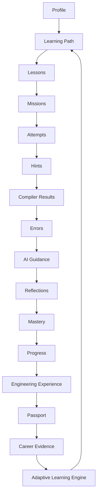

---

## 11. Product Architecture at Product Level

Atlas is a connected learning system, not a collection of pages. The major product systems interact as follows:

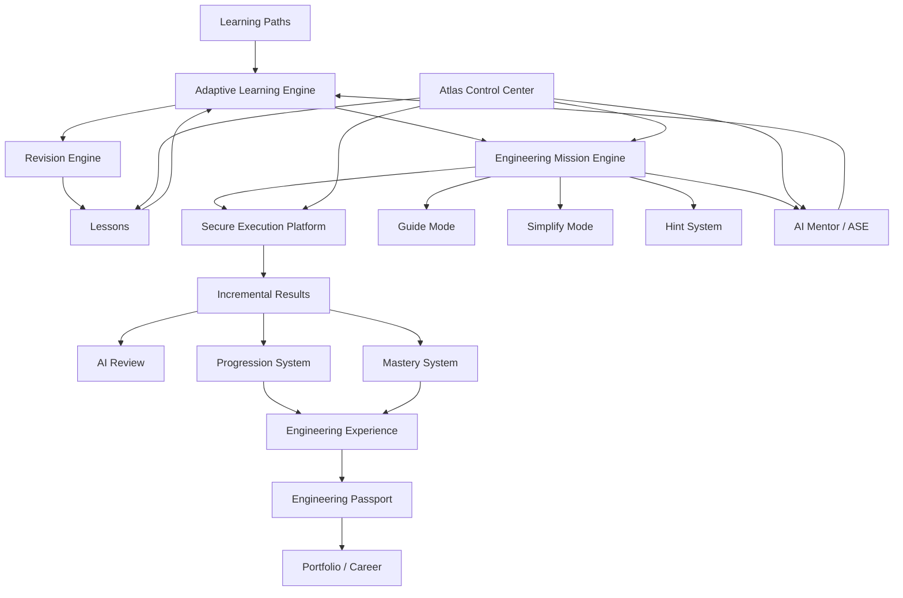

### System Interactions

| System | Feeds Into | Receives From |
|--------|-----------|---------------|
| Learning Paths | Adaptive Learning Engine | User Profile, Career Goals |
| Lessons | Adaptive Learning Engine | Mastery Data |
| Engineering Mission Engine | SEP, AI Review, Progression | ALE Recommendations, User Submissions |
| Guide Mode | Learner Context | Mission Data, Learner History |
| Simplify Mode | Decomposed Missions | Mission Data, Struggle Signals |
| Hint System | Progressive Help | Mission Data, Learner Progress |
| Secure Execution Platform | Compilation, Tests, Benchmarks | Code Submissions |
| AI Mentor | Learner Coaching | ALE Signals, Mission Context, Learner History |
| Adaptive Learning Engine | Recommendations, Roadmaps | All Learning Signals |
| Progression System | XP, Levels, Badges | Mission Completion, Learning Activity |
| Mastery System | Concept Mastery, Knowledge Gaps | Submission Results, Practice Data |
| Engineering Experience | Verified Evidence | Mission Outcomes, Reviews |
| Engineering Passport | Portfolio, Resume, Hiring Profile | Engineering Experience |
| Revision Engine | Spaced Repetition Scheduling | Mastery Data, Retention Estimates |

---

## 12. Product Modules

### 12.1 Authentication

**Purpose:** Secure user registration, login, and session management.

**Features:**
- Google OAuth login
- GitHub OAuth login
- Session management
- Profile creation during onboarding

**Implementation Notes:**
- Google Cloud OAuth client configured (client name: "Atlas Web", type: Web application)
- GitHub OAuth App created (Application name: "Atlas")
- Callback URL must exactly match configured URL
- API keys and secrets must never be committed to source control
- Production OAuth callbacks must be configured separately

**Status:** Prototype stage — end-to-end verification needed.

---

### 12.2 Onboarding

**Purpose:** Collect learner information to personalize the learning experience from the start.

**Flow:**
1. Landing Page → Sign Up / Login
2. Welcome screen
3. Career Goal selection
4. Current Skill Level assessment
5. Daily Learning Time preference
6. Career Target selection
7. Learning Track selection
8. Personalized Roadmap generation
9. Dashboard entry

**Key Rule:** The user must NOT be dumped into a generic dashboard after registration. First-time onboarding must collect enough information to personalize the experience.

**Cyberpunk UI Elements (Prototype):**
- Student/Admin mode selection
- Security keypad concept
- Telemetry/decryption terminal
- Callsign onboarding
- Track selection
- Radar/badge verification

---

### 12.3 Dashboard

**Purpose:** Central hub showing learner progress, recommendations, and quick actions.

**Dashboard Elements:**
- Engineering maturity indicator
- Learning velocity
- Code quality metrics
- Live execution map
- AI Mentor chat access
- User metrics
- Current mission status
- Recommended next actions

---

### 12.4 Learning Engine

**Purpose:** Structured progression from fundamentals through advanced engineering.

**Learning Progression:**
1. Fundamentals
2. Logic building
3. Programming concepts
4. DSA / application of logic
5. Framework concepts
6. Real-world engineering missions
7. Debugging and optimization
8. Architecture and testing
9. Portfolio evidence
10. Career readiness

**Learning Modes:**

| Mode | Description | Assistance Level | Portfolio Eligible |
|------|-------------|-----------------|-------------------|
| Guided Mode | Maximum assistance, beginner friendly | High | No |
| Practice Mode | Hints available, AI Mentor active | Medium | No |
| Challenge Mode | Minimal assistance | Low | Yes |
| Interview Mode | Timed, no hints, company-style evaluation | None | Yes |
| Revision Mode | Focused on weak concepts | Medium | No |
| Sprint Mode | Time-boxed daily missions | Medium | No |

---

### 12.5 Learning Paths

**Purpose:** Career-oriented learning tracks that provide structured progression toward a specific engineering role.

**Available Tracks:**
- Android Developer
- iOS Developer
- Frontend Developer
- Backend Developer
- Full Stack Developer
- AI/ML
- Cybersecurity
- Other future tracks

**Track Structure:**
Career Path → Track → Module → Topic → Chapter → Mission

**Example:**
Android → Jetpack Compose → State Management → remember() → Mission

---

### 12.6 Lessons

**Purpose:** Concept instruction and foundational knowledge delivery.

**Lesson Properties:**
- Concept ID
- Prerequisites
- Difficulty level
- Estimated completion time
- Mastery requirements for progression

**Lesson Flow:**
Learn concept → Practice → Assessment → Mastery check → Unlock next

**Prerequisite System:** Learners should not unlock advanced concepts by merely clicking previous lessons. Prerequisites and mastery must matter.

---

### 12.7 Logic Building

**Purpose:** Deliberately build computational thinking before expecting advanced competitive programming performance.

**Progression:**

| Stage | Focus | Examples |
|-------|-------|---------|
| Basic Logic | Core programming constructs | Variables, conditions, loops, functions, collections |
| Applied Logic | Practical data operations | Filtering, searching, sorting, validation, state transitions, event handling |
| Engineering Logic | Software engineering patterns | Data modeling, API logic, caching, indexing, pub/sub, authentication, pagination, error handling, performance optimization |

**Example Problem (Instead of "Sort an array"):**
> "An Instagram-like application has 50,000 followers. Implement a follower discovery/search mechanism and compare a linear scan with an indexed approach."

This connects DSA to engineering.

**Logic Sandbox Challenges (Prototype):**
- Email syntax validation
- Instagram follower sorting/search
- Pub/Sub dispatching
- Memory leak analysis

---

### 12.8 Engineering Mission Engine (EME)

**Purpose:** The heart of Atlas — transforms learning activities into realistic engineering experiences.

#### Mission Philosophy

Every mission should answer:
1. Why does this problem exist?
2. Where would it happen in a real product?
3. Which engineering concepts are being practiced?
4. How will solving it improve the learner?

If a mission cannot answer those questions, it should be reconsidered.

#### Mission Hierarchy

```
Career Path
  → Track
    → Module
      → Topic
        → Chapter
          → Mission
            → Stage
              → Task
```

**Example:**
Android → Jetpack Compose → State Management → remember() → Mission → Stage 1 → Stage 2 → Stage 3

#### Mission Lifecycle

```
Discover Mission
  → Understand Context
    → Read Story
      → Analyze Requirements
        → Plan Solution
          → Code
            → Compile
              → Run Tests
                → AI Review
                  → Reflection
                    → Portfolio Update
                      → XP / Mastery Update
```

#### Mission Types

| Type | Focus | Example |
|------|-------|---------|
| **Logic Mission** | Build computational thinking | "Sort Instagram followers efficiently." |
| **Feature Mission** | Implement a real product feature | "Build a notification preference system." |
| **Bug Hunt Mission** | Debug broken code | Receive broken code and fix it |
| **Refactoring Mission** | Improve code quality without changing behavior | Restructure existing code |
| **Performance Mission** | Reduce CPU, memory, latency | Optimize resource usage |
| **Security Mission** | Identify and fix vulnerabilities | Secure a system |
| **Architecture Mission** | Improve structure and technical boundaries | Redesign system architecture |
| **Testing Mission** | Write unit, UI, integration tests | Create comprehensive tests |
| **System Design Mission** | Design a scalable system | Architect a production system |
| **DevOps Mission** | Deploy or operate software | Set up CI/CD pipeline |
| **Accessibility Mission** | Improve accessibility | Make software accessible |
| **Interview Mission** | Simulate company-style technical assessment | Timed coding challenge |
| **Team Mission** | Future collaboration-based engineering work | FUTURE |

#### Mission Stages

Each mission can have multiple stages. Each stage can contain tasks.

#### Mission Requirements

- Story/context must be provided
- Business context must be clear
- Learning objectives must be defined
- Difficulty must be appropriate
- Concepts must be tagged
- Stages must be structured
- Guide behavior must be configured
- Hint progression must be defined
- Validation must include hidden tests
- Acceptance criteria must be defined
- Rewards must be specified
- Portfolio artifacts must be identified

#### Mission Evaluation Pipeline

1. Compilation
2. Unit tests
3. Static analysis
4. Style / complexity checks
5. Security checks
6. Performance benchmarks
6. Architecture rules
7. Accessibility checks
8. AI engineering review
9. Portfolio readiness

Different mission types can use different pipelines:

| Mission Type | Pipeline |
|-------------|----------|
| Android Feature | Compile → UI Tests → Architecture → AI Review |
| Backend API | Compile → Integration Tests → Performance → Security → AI Review |
| Frontend | Build → Visual Validation → Accessibility → AI Review |

---

### 12.9 Guide Mode

**Purpose:** Provide structured guidance without immediately giving the answer.

#### Guidance Behavior

The mentor should ask questions such as:
- What have you tried?
- What do you think the requirement means?
- What data do you have?
- What output is expected?
- What edge cases exist?
- What approach are you considering?
- What would happen if the input became 10x larger?

#### What Guide Mode Should NOT Do

Guide Mode should NOT become: "Here is the complete code."

#### Core Rule

The system should preserve productive struggle. The goal is to teach the learner how to think.

---

### 12.10 Simplify Mode

**Purpose:** For learners who cannot handle the complete mission, decompose it into smaller stages.

#### Mission Decomposition Example

**Original Mission:** "Build a follower search system."

**Simplified Stages:**
1. Understand the data model
2. Create follower list
3. Implement linear search
4. Measure performance
5. Identify bottleneck
6. Introduce indexing
7. Compare approaches
8. Reflect

#### Behavior

- The learner completes one stage before unlocking the next
- Simplify Mode preserves the underlying learning objective
- Each stage builds toward the complete mission

---

### 12.11 Hint System

**Purpose:** Progressive help that escalates only when the learner needs it.

#### Hint Levels

| Level | Type of Help | Description |
|-------|-------------|-------------|
| Level 1 | Requirement clarification | Clarify what the problem is asking |
| Level 2 | Concept explanation | Explain the relevant concept |
| Level 3 | Approach suggestion | Suggest an approach to consider |
| Level 4 | Pseudocode | Provide pseudocode for the approach |
| Level 5 | Partial implementation | Show partial implementation |
| Level 6 | Complete solution | Full solution (final escalation, not default) |

#### Hint Impact

Hint usage can affect:
- Learning analytics
- Mastery interpretation
- Mission scoring
- XP modifiers
- Portfolio eligibility (depending on mission policy)

---

### 12.12 Engineering Thinking Canvas

**Purpose:** Before the learner writes code, guide them through structured engineering thinking.

#### Canvas Steps

| Step | Name | Focus |
|------|------|-------|
| Step 1 | Understand | What is the problem? What inputs exist? What outputs are expected? What constraints exist? |
| Step 2 | Design | What data structures are appropriate? What architecture fits? What edge cases exist? |
| Step 3 | Plan | Write pseudocode. Break into subtasks. Estimate time complexity. Estimate space complexity. |
| Step 4 | Build | Unlock the coding environment |

This teaches professional engineering habits instead of immediately rewarding code typing.

---

### 12.13 Code Workspace

**Purpose:** The integrated development environment where learners write, test, and submit code.

**Workspace Features:**
- Code editor
- File tree / project structure view
- Console output
- Performance metrics display
- Submit action
- Execute/compile action
- Optimize action

**Current Prototype:**
- Kotlin file tree
- Code editor
- Linear O(N) example
- Optimize action
- Execute compiler action
- Console output
- Performance metrics

**Naming Options (under consideration):**
- Atlas Studio
- Atlas Forge
- Mission Studio
- Engineering Workspace
- Engineering Lab

Final naming governed by Design.md / product decisions.

---

### 12.14 Compiler / Execution

**Purpose:** Secure code compilation, execution, testing, and evaluation.

**See Section 19 for detailed product requirements.**

---

### 12.15 Hidden Tests

**Purpose:** Verify code correctness beyond visible test cases.

Hidden tests are part of the mission validation pipeline and ensure the learner's solution works for cases they cannot see.

**Behavior:**
- Hidden tests run after code submission
- Results are reported to the learner as pass/fail
- Hidden test details are NOT revealed to prevent overfitting
- Hidden tests contribute to mission scoring

---

### 12.16 AI Mentor

**Purpose:** An AI engineering mentor (Atlas Senior Engineer — ASE) that helps learners think critically, debug independently, improve architecture, understand trade-offs, build confidence, and improve engineering judgment.

**See Section 20 for detailed product requirements.**

---

### 12.17 AI Review

**Purpose:** Automated review of code submissions for engineering quality.

**Review Dimensions:**
- Code correctness
- Architecture quality
- Performance characteristics
- Security posture
- Code style and maintainability
- Test coverage
- Documentation quality

**Behavior:**
- AI Review runs after successful code execution
- Results feed into progression, mastery, and portfolio systems
- AI Review provides actionable feedback
- AI Review does not replace human mentor review

---

### 12.18 Adaptive Learning Engine (ALE)

**Purpose:** The intelligence layer that personalizes the learning experience continuously.

**See Section 21 for detailed product requirements.**

---

### 12.19 Knowledge / Mastery System

**Purpose:** Track concepts, not only completed pages.

#### Concept Properties

| Property | Description |
|----------|-------------|
| Concept ID | Unique identifier |
| Mastery % | Mastery level (0-100) |
| Confidence % | Confidence in mastery |
| Practice count | Number of times practiced |
| Revision count | Number of revisions |
| Last reviewed | Timestamp of last review |
| Average score | Average assessment score |
| Hint usage | Number of hints used |
| Failure count | Number of failures |
| Estimated retention | Predicted retention level |
| AI notes | AI-generated learning notes |

#### Concept States

```
Not Started → Learning → Practicing → Needs Revision → Mastered → Expert
```

#### Adaptive Difficulty Levels

```
Very Easy → Easy → Comfortable → Stretch → Challenge → Expert
```

#### Key Rule

The learner should not simply unlock advanced concepts because they clicked previous lessons. Prerequisites and mastery must matter.

---

### 12.20 Revision System

**Purpose:** Spaced repetition to reinforce learning and improve retention.

#### Spaced Repetition Schedule

```
Learn today → Tomorrow → 3 days → 7 days → 14 days → 30 days → 90 days
```

The schedule adapts based on mastery and performance.

#### Revision Engine Behavior

- Tracks concept retention over time
- Suggests revision when retention drops below threshold
- Adapts intervals based on performance during revision
- Integrates with the Adaptive Learning Engine

---

### 12.21 Gamification / Progression

**Purpose:** Motivate meaningful learning activity through progression rewards.

**See Section 22 for detailed product requirements.**

---

### 12.22 Engineering Experience

**Purpose:** Maintain an evolving engineering resume showing real evidence of work completed.

#### Evidence Types

| Evidence Type | Description |
|---------------|-------------|
| Features built | Count of production-inspired features implemented |
| Bugs fixed | Count of software defects resolved |
| Technologies practiced | Technologies used across missions |
| Architecture patterns used | Patterns applied in missions |
| Tests written | Automated tests created |
| Performance optimizations | Optimizations performed |
| Missions completed | Total missions finished |

#### Example Evidence Profile

> Built 42 production-inspired features · Resolved 187 software defects · Designed 15 scalable APIs · Completed 23 architecture missions · Optimized 11 applications · Wrote 640 automated tests

This is more meaningful than "Level 73."

---

### 12.23 Engineering Passport

**Purpose:** More than a portfolio — a comprehensive professional engineering identity.

**See Section 23 for detailed product requirements.**

---

### 12.24 Admin Control Center (ACC)

**Purpose:** Internal operating system for Atlas platform management.

**See Section 24 for detailed product requirements.**

---

### 12.25 Analytics

**Purpose:** Track learning, engagement, technical, and business metrics.

**See Section 26 for detailed product requirements.**

---

### 12.26 Notifications

**Purpose:** Keep learners engaged and informed.

**Notification Types:**
- Learning reminders
- Mission reminders
- Achievement notifications
- Security notifications
- Streak reminders
- Revision reminders

**Channels:**
- Email
- In-app notifications
- Push notifications (future)

---

### 12.27 Community

**Status:** FUTURE

**Planned Features:**
- Discussions
- Questions
- Mentoring
- Community moderation
- Reputation
- Social features

---

### 12.28 Hiring

**Status:** FUTURE

**See Section 32 for detailed requirements.**

---

### 12.29 Enterprise / University

**Status:** FUTURE

**See Section 33 for detailed requirements.**

---

## 13. Feature Requirements

### User Problem → Feature Traceability

This table maps each user problem (from Section 4) to the Atlas feature that solves it and the expected outcome.

| User Problem | User Need | Atlas Solution | Feature | Expected Outcome |
|-------------|-----------|---------------|---------|-----------------|
| Fragmented knowledge across sources | Structured, connected learning path | Learning Paths + Adaptive Learning Engine | FR-LEARN-001, FR-ALE-001 | Learners follow a coherent progression from fundamentals to engineering readiness |
| No engineering context in existing platforms | Real-world engineering problems | Engineering Mission Engine | FR-MISSION-001, FR-MISSION-002 | Learners practice in realistic product scenarios, not isolated puzzles |
| No evidence of ability | Verified proof of engineering skills | Engineering Passport | FR-PORT-001 | Learners build a portfolio that PROVES skills with mission-linked evidence |
| Algorithm-only focus | Full engineering thinking practice | Logic Building + Mission Types | FR-LEARN-001 (Logic progression), FR-MISSION-001 | Learners build logic, then apply it to features, bugs, architecture, performance |
| Lack of personalization | Adaptive learning tailored to individual | Adaptive Learning Engine | FR-ALE-001 | Roadmaps, difficulty, and recommendations adapt to each learner |
| No progressive mentorship | Guidance without giving answers | Guide Mode + Simplify Mode + Hint System | FR-GUIDE-001, FR-SIMPLIFY-001, FR-HINT-001 | Learners receive escalating help that preserves productive struggle |
| Learners get stuck without support | Immediate, contextual help | AI Mentor | FR-AI-001 | AI coaches learners through problems without providing solutions |
| Code correctness not validated | Secure compilation and testing | Compiler / Execution | FR-COMPILER-001 | Code is compiled, tested, and benchmarked in a secure sandbox |
| Code quality not assessed | Engineering quality feedback | AI Review | FR-AI-002 | Submissions are reviewed for correctness, architecture, security, and style |
| Learning progress not tracked | Visible progression and motivation | Gamification / Progression | FR-PROG-001 | XP, levels, streaks, and badges motivate meaningful learning |
| New users need orientation | Personalized onboarding | Onboarding | FR-ONBOARD-001 | First-time flow collects goals and skills to generate a personalized roadmap |
| Platform needs administration | Content and user management | Admin Control Center | FR-ADMIN-001 | Admins manage users, missions, AI, analytics, and platform settings |

---

### FR-AUTH-001: User Registration

**Purpose:** Allow users to create accounts and authenticate.

**User Story:**
As a learner,
I want to sign up using my Google or GitHub account,
so that I can start learning without creating a separate password.

**Functional Requirements:**
- FR-AUTH-001a: Users can register via Google OAuth
- FR-AUTH-001b: Users can register via GitHub OAuth
- FR-AUTH-001c: Session tokens are managed securely
- FR-AUTH-001d: User profiles are created on first login
- FR-AUTH-001e: API keys and secrets are never exposed to the client

**States:**
- Initial → Loading → Success → Error → Retry

**Acceptance Criteria:**
- Given a new user visits Atlas
- When they click "Sign Up with Google" or "Sign Up with GitHub"
- Then they are redirected to the OAuth provider
- And upon successful authentication, their account is created
- And they are redirected to onboarding

---

### FR-AUTH-002: OAuth Callback

**Purpose:** Handle OAuth callback correctly.

**Acceptance Criteria:**
- Given a user completes OAuth authentication
- When the callback URL is invoked
- Then the callback URL exactly matches the configured URL
- And the session is established
- And the user is redirected to the appropriate next step

---

### FR-ONBOARD-001: First-Time Onboarding

**Purpose:** Collect learner information for personalization.

**User Story:**
As a new learner,
I want to tell Atlas about my goals and current skill level,
so that my learning experience is personalized from the start.

**Functional Requirements:**
- FR-ONBOARD-001a: Onboarding flow is presented after first login
- FR-ONBOARD-001b: Career Goal selection is required
- FR-ONBOARD-001c: Current Skill Level assessment is required
- FR-ONBOARD-001d: Daily Learning Time preference is collected
- FR-ONBOARD-001e: Career Target is collected
- FR-ONBOARD-001f: Learning Track is selected
- FR-ONBOARD-001g: Personalized Roadmap is generated
- FR-ONBOARD-001h: User is NOT shown a generic dashboard before onboarding completes

**States:**
- Initial → Step In Progress → Step Complete → All Steps Complete → Roadmap Generated → Dashboard

**Acceptance Criteria:**
- Given a user completes registration for the first time
- When onboarding begins
- Then the user is guided through career goal, skill level, learning time, career target, and track selection
- And a personalized roadmap is generated
- And the user is redirected to the dashboard with their personalized learning path

---

### FR-LEARN-001: Learning Path Progression

**Purpose:** Guide learners through structured progression.

**User Story:**
As a learner,
I want a clear learning path tailored to my career goal,
so that I know exactly what to learn next.

**Functional Requirements:**
- FR-LEARN-001a: Learning paths are organized by career goal
- FR-LEARN-001b: Paths progress from fundamentals through advanced topics
- FR-LEARN-001c: Prerequisites must be met before advancing
- FR-LEARN-001d: Mastery levels gate progression
- FR-LEARN-001e: The Adaptive Learning Engine can adjust the path

**Business Rules:**
- Learners cannot skip prerequisites
- Mastery thresholds must be met before unlocking next concepts
- Path adjustments are logged for analytics

**Acceptance Criteria:**
- Given a learner has a personalized learning path
- When the learner opens their dashboard
- Then they see their current position in the path
- And prerequisite-gated content is visually locked
- And ALE recommendations appear for next steps

- Given a learner has not met mastery thresholds for a prerequisite
- When they attempt to access the next concept
- Then the system prevents access and shows the prerequisite requirement

---

### FR-LEARN-002: Lesson Completion

**Purpose:** Deliver concept instruction and assess understanding.

**User Story:**
As a learner,
I want to complete lessons that teach me concepts,
so that I can build the knowledge needed for engineering missions.

**Functional Requirements:**
- FR-LEARN-002a: Lessons present concept material
- FR-LEARN-002b: Lessons include practice exercises
- FR-LEARN-002c: Lesson completion requires passing assessment
- FR-LEARN-002d: Mastery is tracked per concept
- FR-LEARN-002e: Completed lessons unlock subsequent content

**States:**
- Not Started → In Progress → Assessment → Pass → Mastery Updated → Unlocked Next

**Acceptance Criteria:**
- Given a learner opens a lesson
- When the lesson is presented
- Then concept material, practice exercises, and assessment are available
- And the learner's starting mastery level is displayed

- Given a learner completes the lesson assessment
- When the assessment is graded
- Then mastery is updated based on the score
- And subsequent content is unlocked if mastery thresholds are met

---

### FR-MISSION-001: Mission Discovery

**Purpose:** Allow learners to discover and select engineering missions.

**User Story:**
As a learner,
I want to see missions recommended for me based on my learning path,
so that I practice the right engineering skills at the right time.

**Functional Requirements:**
- FR-MISSION-001a: Missions are presented with story/context
- FR-MISSION-001b: Missions show difficulty level
- FR-MISSION-001c: Missions show prerequisite requirements
- FR-MISSION-001d: Missions show estimated time
- FR-MISSION-001e: ALE recommends missions based on learner profile
- FR-MISSION-001f: Locked missions show unlock requirements

**States:**
- Locked → Available → In Progress → Submitted → Completed → Failed → Retry

**Acceptance Criteria:**
- Given a learner is viewing their learning path
- When missions are displayed
- Then each mission shows story/context, difficulty, prerequisites, and estimated time
- And ALE-recommended missions are highlighted
- And locked missions show what is required to unlock them

- Given a learner has completed the prerequisites for a mission
- When the mission becomes available
- Then the learner can open and begin the mission

---

### FR-MISSION-002: Mission Execution

**Purpose:** Execute the full mission lifecycle.

**User Story:**
As a learner,
I want to work through a complete engineering mission,
so that I experience realistic software engineering workflows.

**Functional Requirements:**
- FR-MISSION-002a: Story and context are presented first
- FR-MISSION-002b: Requirements are clearly stated
- FR-MISSION-002c: Engineering Thinking Canvas is available before coding
- FR-MISSION-002d: Code workspace is unlocked after planning
- FR-MISSION-002e: Code submission triggers compilation and testing
- FR-MISSION-002f: Hidden tests validate correctness
- FR-MISSION-002g: Incremental results are provided
- FR-MISSION-002h: AI Review evaluates engineering quality
- FR-MISSION-002i: Reflection is prompted after completion
- FR-MISSION-002j: Portfolio artifacts are updated

**Business Rules:**
- Mission philosophy questions must be answerable for every mission
- Every mission must have context, objectives, and acceptance criteria
- Different mission types use different evaluation pipelines

**Acceptance Criteria:**
- Given a learner opens a mission
- When the mission loads
- Then story/context is presented before any coding environment
- And requirements are clearly stated
- And the Engineering Thinking Canvas is available

- Given a learner submits code for a mission
- When the submission is processed
- Then compilation is attempted
- And tests (including hidden tests) are executed
- And incremental results are provided
- And AI Review evaluates engineering quality
- And a reflection prompt is shown after completion
- And portfolio artifacts are updated if the mission passes

---

### FR-GUIDE-001: Guide Mode

**Purpose:** Provide structured guidance during mission execution.

**User Story:**
As a struggling learner,
I want to receive guided questions and suggestions,
so that I can think through the problem without being given the answer.

**Functional Requirements:**
- FR-GUIDE-001a: Guide Mode asks clarifying questions
- FR-GUIDE-001b: Guide Mode does NOT reveal complete solutions
- FR-GUIDE-001c: Guide Mode preserves productive struggle
- FR-GUIDE-001d: Guide Mode provides increasing levels of help
- FR-GUIDE-001e: Guide Mode usage is tracked for analytics

**Business Rules:**
- Guide Mode should never become "Here is the complete code"
- Guide questions should encourage critical thinking
- Guide Mode works within the mission context

**Acceptance Criteria:**
- Given a learner is working on a mission and requests guidance
- When Guide Mode is activated
- Then clarifying questions are presented (not code solutions)
- And questions are contextual to the current mission and learner's attempt
- And productive struggle is preserved

- Given a learner uses Guide Mode
- When guidance is provided
- Then no complete code solutions are revealed
- And Guide Mode usage is tracked for analytics

---

### FR-SIMPLIFY-001: Simplify Mode

**Purpose:** Decompose complex missions into manageable stages.

**User Story:**
As a learner who finds a mission too difficult,
I want the mission broken into smaller steps,
so that I can build up to the complete solution.

**Functional Requirements:**
- FR-SIMPLIFY-001a: Complex missions can be decomposed into stages
- FR-SIMPLIFY-001b: Stages are completed sequentially
- FR-SIMPLIFY-001c: Each stage unlocks the next
- FR-SIMPLIFY-001d: Simplify Mode preserves the learning objective
- FR-SIMPLIFY-001e: Stage completion contributes to mission completion

**Business Rules:**
- Simplify Mode does not lower the learning standard
- Each stage builds toward the complete mission
- Learner must complete each stage before proceeding

**Acceptance Criteria:**
- Given a learner requests Simplify Mode for a complex mission
- When the mission is decomposed
- Then the mission is broken into sequential stages
- And each stage is locked until the previous stage is completed
- And the underlying learning objective is preserved

- Given a learner completes all simplified stages
- When the final stage is completed
- Then the overall mission is marked as completed
- And stage completion contributes to mission-level mastery and XP

---

### FR-HINT-001: Progressive Hint System

**Purpose:** Provide escalating help when learners are stuck.

**User Story:**
As a stuck learner,
I want to access hints that help me think through the problem,
so that I can make progress without losing the learning experience.

**Functional Requirements:**
- FR-HINT-001a: Hints are available in 6 progressive levels
- FR-HINT-001b: Each level provides more help than the previous
- FR-HINT-001c: Hint usage is tracked
- FR-HINT-001d: Hint usage affects mission scoring
- FR-HINT-001e: Hint usage affects XP modifiers
- FR-HINT-001f: Hint usage may affect portfolio eligibility (per mission policy)

**Business Rules:**
- Level 6 (complete solution) is the final escalation, not the default
- Hint levels progress from clarification to solution
- Higher hint usage reduces mission score impact

**Acceptance Criteria:**
- Given a learner requests a hint during a mission
- When the hint is delivered
- Then the hint corresponds to the current hint level (1-6)
- And each successive hint reveals more than the previous
- And hint usage is recorded

- Given a learner has used hints at a given level
- When mission scoring is calculated
- Then hint usage is factored into the score
- And XP modifiers are applied based on hint usage

---

### FR-COMPILER-001: Code Compilation and Execution

**Purpose:** Securely compile, execute, and evaluate learner code.

**User Story:**
As a learner,
I want to compile and run my code against tests,
so that I can verify my solution works.

**Functional Requirements:**
- FR-COMPILER-001a: Code is compiled in a secure sandbox
- FR-COMPILER-001b: Tests are executed against submitted code
- FR-COMPILER-001c: Hidden tests validate correctness beyond visible cases
- FR-COMPILER-001d: Time limits are enforced
- FR-COMPILER-001e: Memory limits are enforced
- FR-COMPILER-001f: Performance measurements are collected
- FR-COMPILER-001g: Results are reported incrementally
- FR-COMPILER-001h: Error messages are clear and actionable
- FR-COMPILER-001i: Each execution is isolated and ephemeral

**Business Rules:**
- No sandbox should survive after execution
- All executions must be resource-limited
- Code execution must be isolated from other users

**Acceptance Criteria:**
- Given a learner submits code
- When the code is processed
- Then it is compiled in an isolated sandbox
- And tests (including hidden tests) are executed
- And time and memory limits are enforced
- And performance measurements are collected
- And results are reported incrementally

- Given a code execution completes
- When results are generated
- Then clear and actionable error messages are provided on failure
- And the sandbox is destroyed after execution

---

### FR-AI-001: AI Mentor

**Purpose:** Provide AI-powered engineering mentorship.

**User Story:**
As a learner,
I want an AI mentor that helps me think through engineering problems,
so that I can develop my engineering judgment.

**Functional Requirements:**
- FR-AI-001a: AI Mentor understands learner level
- FR-AI-001b: AI Mentor understands mission context
- FR-AI-001c: AI Mentor considers previous attempts
- FR-AI-001d: AI Mentor considers errors and hint usage
- FR-AI-001e: AI Mentor considers weak concepts
- FR-AI-001f: AI Mentor considers learning goals and progress
- FR-AI-001g: AI Mentor does NOT provide complete code solutions
- FR-AI-001h: AI Mentor preserves productive struggle

**Business Rules:**
- ALE decides WHAT the learner needs; AI Mentor decides HOW to teach it
- AI should not behave as a code vending machine
- AI response quality must be monitored

**Acceptance Criteria:**
- Given a learner interacts with the AI Mentor
- When the AI responds
- Then the response is contextual to the learner's level, mission, and attempt history
- And the response does not provide complete code solutions
- And productive struggle is preserved

- Given a learner requests help from the AI Mentor
- When the AI responds
- Then the response considers weak concepts, errors, and hint usage
- And the interaction is tracked for analytics

---

### FR-AI-002: AI Review

**Purpose:** Automated engineering quality review of code submissions.

**User Story:**
As a learner,
I want my code reviewed for engineering quality,
so that I can improve my code beyond just making tests pass.

**Functional Requirements:**
- FR-AI-002a: Code correctness is evaluated
- FR-AI-002b: Architecture quality is assessed
- FR-AI-002c: Performance characteristics are analyzed
- FR-AI-002d: Security posture is reviewed
- FR-AI-002e: Code style and maintainability are evaluated
- FR-AI-002f: Test coverage is assessed
- FR-AI-002g: Actionable feedback is provided

**Acceptance Criteria:**
- Given a learner submits code that passes compilation and tests
- When AI Review runs
- Then the submission is evaluated for code correctness, architecture quality, performance, security, maintainability, test coverage, and documentation
- And actionable feedback is provided
- And results feed into progression, mastery, and portfolio systems

---

### FR-ALE-001: Adaptive Learning Engine

**Purpose:** Personalize the learning experience continuously.

**User Story:**
As a learner,
I want the platform to adapt to my progress and needs,
so that my learning experience is always relevant and appropriately challenging.

**Functional Requirements:**
- FR-ALE-001a: ALE collects input signals (profile, scores, attempts, errors, concepts, progress)
- FR-ALE-001b: ALE generates personalized roadmaps
- FR-ALE-001c: ALE recommends lessons and missions
- FR-ALE-001d: ALE schedules revision reminders
- FR-ALE-001e: ALE adjusts difficulty dynamically
- FR-ALE-001f: ALE sets weekly goals
- FR-ALE-001g: ALE suggests AI mentoring focus areas
- FR-ALE-001h: ALE evaluates interview readiness
- FR-ALE-001i: ALE generates learning plans

**Acceptance Criteria:**
- Given a learner has been active on the platform
- When ALE processes learning signals
- Then the personalized roadmap is adjusted based on performance, errors, and concept mastery
- And recommended lessons and missions are updated
- And difficulty is adapted dynamically
- And revision reminders are scheduled based on retention estimates

- Given a learner's mastery drops below a threshold
- When ALE detects the knowledge gap
- Then revision is recommended
- And AI mentoring focus areas are updated

---

### FR-PROG-001: Gamification and Progression

**Purpose:** Motivate learning through XP, levels, streaks, and badges.

**User Story:**
As a learner,
I want to see my progress through XP, levels, and achievements,
so that I stay motivated and can track my growth.

**Functional Requirements:**
- FR-PROG-001a: XP is awarded for meaningful learning activity
- FR-PROG-001b: Levels reflect learning progress
- FR-PROG-001c: Streaks track daily learning consistency
- FR-PROG-001d: Badges recognize specific achievements
- FR-PROG-001e: Progress rewards meaningful learning, not just screen time

**Business Rules:**
- A learner should NOT become an "expert" merely because they earned XP
- Progress should reward meaningful learning activity
- Gamification should improve engineering ability, not merely increase screen time

**Acceptance Criteria:**
- Given a learner completes a meaningful learning activity
- When progression is calculated
- Then XP is awarded proportional to the activity's learning value
- And streaks are updated for daily learning consistency
- And badges are awarded when achievement criteria are met
- And levels reflect genuine learning progress, not just activity volume

---

### FR-PORT-001: Engineering Passport

**Purpose:** Build a comprehensive professional engineering identity.

**User Story:**
As a learner,
I want a professional engineering profile that proves my abilities with evidence,
so that I can present verified engineering work to employers.

**Functional Requirements:**
- FR-PORT-001a: Private passport contains AI notes, weak areas, mistakes, reflections, analytics
- FR-PORT-001b: Public passport contains projects, skills, achievements, certificates, experience, artifacts
- FR-PORT-001c: Engineering timeline shows learning history
- FR-PORT-001d: Portfolio artifacts are linked to specific missions and reviews
- FR-PORT-001e: Verification system connects achievements to actual work

**Core Philosophy:** A portfolio should PROVE, not merely CLAIM.

Instead of: "I know Android."
Atlas should show: Built Android features · Fixed Android bugs · Completed Compose missions · Implemented MVVM · Passed architecture reviews

**Acceptance Criteria:**
- Given a learner has completed engineering missions
- When the Engineering Passport is viewed
- Then the private passport shows AI notes, weak areas, mistakes, reflections, and analytics
- And the public passport shows projects, skills, achievements, certificates, and portfolio artifacts
- And artifacts are linked to specific missions and reviews

- Given a learner views their public passport
- When the portfolio is displayed
- Then achievements are verified against actual mission outcomes
- And the engineering timeline shows the learning history
- And a resume can be generated from verified experience

---

### FR-ADMIN-001: Admin Management

**Purpose:** Platform administration through the Atlas Control Center.

**User Story:**
As an administrator,
I want comprehensive tools to manage the platform,
so that I can ensure quality learning experiences.

**Functional Requirements:**
- FR-ADMIN-001a: User management (view, edit, role assignment)
- FR-ADMIN-001b: Content management (lessons, missions)
- FR-ADMIN-001c: Mission Studio for non-engineering curriculum creators
- FR-ADMIN-001d: AI prompt and safety management
- FR-ADMIN-001e: Analytics dashboard
- FR-ADMIN-001f: Content moderation
- FR-ADMIN-001g: Feature flag management
- FR-ADMIN-001h: System settings
- FR-ADMIN-001i: Audit logs

**Acceptance Criteria:**
- Given an administrator logs into the Atlas Control Center
- When the admin dashboard loads
- Then platform health, user statistics, learning metrics, and system status are displayed

- Given an administrator manages users
- When a user is selected
- Then the admin can view, edit, and assign roles
- And changes are logged in the audit trail

- Given an administrator manages content
- When lessons or missions are created or edited
- Then changes are saved and published as appropriate
- And content is version-controlled

---

## 14. Learning System

### Learning Path Structure

```
Career Goal
  → Track
    → Module
      → Topic
        → Chapter
          → Lessons
          → Missions
```

### Learning Progression

```
Fundamentals
  → Logic Building
    → Programming Concepts
      → DSA / Application of Logic
        → Framework Concepts
          → Real-World Engineering Missions
            → Debugging and Optimization
              → Architecture and Testing
                → Portfolio Evidence
                  → Career Readiness
```

### Mastery Tracking

| Concept Property | Description |
|-----------------|-------------|
| Concept ID | Unique identifier |
| Mastery % | Mastery level (0-100) |
| Confidence % | Confidence in mastery |
| Practice count | Times practiced |
| Revision count | Times revised |
| Last reviewed | Timestamp |
| Average score | Assessment average |
| Hint usage | Hints consumed |
| Failure count | Failures experienced |
| Estimated retention | Predicted retention |
| AI notes | AI-generated notes |

### Concept States

```
Not Started → Learning → Practicing → Needs Revision → Mastered → Expert
```

### Difficulty Levels

```
Very Easy → Easy → Comfortable → Stretch → Challenge → Expert
```

### Learning Modes

| Mode | Assistance | Portfolio Eligible | Use Case |
|------|-----------|-------------------|----------|
| Guided Mode | Maximum | No | Beginners |
| Practice Mode | Medium (hints + AI) | No | Building skills |
| Challenge Mode | Minimal | Yes | Proving ability |
| Interview Mode | None (timed) | Yes | Interview prep |
| Revision Mode | Medium | No | Reinforcing weak areas |
| Sprint Mode | Medium | No | Daily practice |

### Prerequisite System

- Prerequisites must be met before advancing
- Mastery thresholds gate progression
- Advanced concepts cannot be unlocked by merely clicking through lessons
- ALE can adjust prerequisites based on learner performance

---

## 15. Engineering Mission Engine (EME)

### Mission Purpose

The EME is the heart of Atlas. It transforms learning activities into realistic engineering experiences. Every learning activity should eventually become an engineering experience rather than an isolated question.

### Mission Structure

```
Career Path → Track → Module → Topic → Chapter → Mission → Stage → Task
```

### Mission Lifecycle

```mermaid
graph LR
    A[Discover] --> B[Understand Context]
    B --> C[Read Story]
    C --> D[Analyze Requirements]
    D --> E[Plan Solution]
    E --> F[Code]
    F --> G[Compile]
    G --> H[Run Tests]
    H --> I[AI Review]
    I --> J[Reflection]
    J --> K[Portfolio Update]
    K --> L[XP / Mastery Update]
```

### Mission Types

| Type | Focus | Example |
|------|-------|---------|
| Logic | Computational thinking | "Sort Instagram followers efficiently." |
| Feature | Real product feature | "Build a notification preference system." |
| Bug Hunt | Debug broken code | Receive broken code and fix it |
| Refactoring | Improve code quality | Restructure without changing behavior |
| Performance | Reduce resource costs | Optimize CPU, memory, latency |
| Security | Fix vulnerabilities | Secure a system |
| Architecture | Improve structure | Redesign system boundaries |
| Testing | Write tests | Create comprehensive test suite |
| System Design | Design scalable system | Architect production system |
| DevOps | Deploy/operate | Set up CI/CD pipeline |
| Accessibility | Improve accessibility | Make software accessible |
| Interview | Company-style assessment | Timed coding challenge |
| Team | FUTURE — collaboration | Group engineering work |

### Mission Requirements

Every mission must include:
- Story and business context
- Learning objectives
- Difficulty level
- Tagged concepts
- Structured stages
- Guide behavior configuration
- Hint progression
- Validation pipeline (including hidden tests)
- Acceptance criteria
- Reward specification
- Portfolio artifact definitions

### Mission Evaluation Pipeline

| Pipeline Step | Description |
|--------------|-------------|
| 1. Compilation | Code must compile successfully |
| 2. Unit tests | Code must pass unit tests |
| 3. Static analysis | Code must pass static analysis |
| 4. Style / complexity | Code style and complexity are checked |
| 5. Security checks | Security vulnerabilities are detected |
| 6. Performance benchmarks | Performance is measured |
| 7. Architecture rules | Architecture patterns are validated |
| 8. Accessibility checks | Accessibility requirements are verified |
| 9. AI engineering review | AI evaluates engineering quality |
| 10. Portfolio readiness | Evidence is assessed for portfolio inclusion |

### Pipeline Variation by Mission Type

| Mission Type | Pipeline |
|-------------|----------|
| Android Feature | Compile → UI Tests → Architecture → AI Review |
| Backend API | Compile → Integration Tests → Performance → Security → AI Review |
| Frontend | Build → Visual Validation → Accessibility → AI Review |

### Mission Constraints

- Every mission must answer: Why does this problem exist? Where would it happen? Which concepts are practiced? How will solving it improve the learner?
- If a mission cannot answer those questions, it should be reconsidered
- Different mission types can use different evaluation pipelines
- The goal is to evaluate engineering work, not just "does it compile?"

---

## 16. Guide Mode

### Purpose

Guide Mode exists to provide structured guidance without immediately giving the answer. It teaches the learner how to think.

### When It Appears

- During mission execution when the learner is stuck
- When the learner requests guidance
- When ALE detects struggle patterns

### Guidance Behavior

The mentor asks questions:
- What have you tried?
- What do you think the requirement means?
- What data do you have?
- What output is expected?
- What edge cases exist?
- What approach are you considering?
- What would happen if the input became 10x larger?

### What Guide Mode Should NOT Do

- Should NOT provide complete code solutions
- Should NOT become "Here is the complete code"
- Should NOT remove productive struggle

### Relationship with Hints

Guide Mode provides conversational guidance. Hints provide structured, progressive escalation. Both serve to help the learner without solving the problem.

### Relationship with AI Mentor

Guide Mode is the structured guidance framework. AI Mentor provides contextual, personalized coaching within that framework.

### Core Rule

The system should preserve productive struggle. The goal is to teach the learner how to think.

---

## 17. Simplify Mode

### Purpose

For learners who cannot handle the complete mission, Simplify Mode decomposes the mission into smaller stages while preserving the learning objective.

### Trigger Conditions

- Learner requests Simplify Mode
- ALE detects significant struggle
- Learner has made multiple failed attempts

### Mission Decomposition

**Example:**

| Original Mission | Simplified Stages |
|-----------------|-------------------|
| "Build a follower search system." | Stage 1: Understand the data model |
| | Stage 2: Create follower list |
| | Stage 3: Implement linear search |
| | Stage 4: Measure performance |
| | Stage 5: Identify bottleneck |
| | Stage 6: Introduce indexing |
| | Stage 7: Compare approaches |
| | Stage 8: Reflect |

### Stage Completion

- The learner completes one stage before unlocking the next
- Each stage builds toward the complete mission
- Stage completion contributes to mission completion

### Relationship with Guide Mode

Guide Mode provides questions and guidance. Simplify Mode provides structural decomposition. Both can be used together.

### Relationship with Original Mission

Simplify Mode does NOT lower the learning standard. The learner must still complete all stages that together form the original mission.

---

## 18. Hint System

### Progressive Hint Levels

| Level | Type | What is Revealed | Restrictions |
|-------|------|-----------------|-------------|
| Level 1 | Requirement clarification | Clarifies what the problem is asking | No technical guidance |
| Level 2 | Concept explanation | Explains the relevant concept | No approach guidance |
| Level 3 | Approach suggestion | Suggests an approach to consider | No implementation details |
| Level 4 | Pseudocode | Provides pseudocode for the approach | No actual code |
| Level 5 | Partial implementation | Shows partial implementation | Incomplete code only |
| Level 6 | Complete solution | Full solution | Final escalation only |

### Effect on Scoring

| Aspect | Impact |
|--------|--------|
| Learning analytics | Hint usage is tracked |
| Mastery interpretation | Higher hint usage may reduce mastery confidence |
| Mission scoring | Higher hint usage reduces mission score |
| XP modifiers | XP may be reduced based on hint usage |
| Portfolio eligibility | May affect eligibility depending on mission policy |

### Business Rule

The complete solution (Level 6) should be the final escalation, not the default.

---

## 19. Code Execution / Compiler

### Product Requirements

#### Supported Languages (Phase 1)

**Programming:**
- Java
- Kotlin
- Python
- JavaScript
- TypeScript
- C++
- Go

**Mobile:**
- Kotlin / Android components
- Limited Swift

**Backend:**
- Spring Boot snippets
- Node.js snippets

**Future:**
- Rust, C#, PHP, Ruby, Scala, Dart
- Broader mobile execution

#### Core Functional Requirements

| Requirement | Description |
|------------|-------------|
| Code submission | Learner submits code through the workspace |
| Compilation | Code is compiled in a secure sandbox |
| Runtime execution | Code runs in an isolated environment |
| Test execution | Tests (including hidden tests) are executed |
| Hidden tests | Tests not visible to the learner validate correctness |
| Time limits | Execution is bounded by time limits |
| Memory limits | Execution is bounded by memory limits |
| Performance measurements | CPU, memory, latency are measured |
| Result reporting | Results are reported incrementally |
| Error reporting | Clear, actionable error messages are provided |
| Security | All executions are isolated and ephemeral |

#### Execution Flow

```
Student → Engineering Mission Engine → Submission Service → Queue → Sandbox Scheduler → Secure Sandbox → Compiler → Test Runner → Performance Analyzer → Result Generator → AI Review → Progress Engine
```

#### Sandbox Principles

Every execution must be:
- **Isolated** — No cross-execution contamination
- **Disposable** — Cleaned up after execution
- **Stateless** — No persistent state between runs
- **Ephemeral** — No sandbox survives after execution
- **Resource-limited** — Bounded CPU, memory, time
- **Observable** — Results and errors are captured

#### Engineering Validation Pipeline

1. Compilation
2. Unit tests
3. Static analysis
4. Style / complexity checks
5. Security checks
6. Performance benchmarks
7. Architecture rules
8. Accessibility checks
9. AI engineering review
10. Portfolio readiness

Different mission types can use different pipelines.

#### Important Notes

- The current prototype uses Node.js-based benchmark/emulation — NOT a production-grade secure compiler
- Production direction is the Secure Execution Platform (SEP)
- The exact implementation strategy for full Android/iOS project execution is an architecture concern (see Architecture.md)

---

## 20. AI System

### AI Mentor (Atlas Senior Engineer — ASE)

#### Purpose

An AI engineering mentor that helps learners think critically, debug independently, improve architecture, understand trade-offs, build confidence, and improve engineering judgment.

#### What AI Mentor Understands

| Signal | Description |
|--------|-------------|
| Learner level | Current skill level and experience |
| Mission context | What the mission requires |
| Previous attempts | History of attempts and errors |
| Errors | Specific errors encountered |
| Hint usage | How many and which hints were used |
| Weak concepts | Concepts the learner struggles with |
| Learning goals | Career goal and target |
| Progress | Overall learning progress |

#### Core Rule

> Never remove productive struggle.

#### What AI Mentor Does

- Ask guiding questions
- Point out areas for improvement
- Suggest concepts to review
- Help debug by asking questions, not by providing answers
- Encourage engineering thinking

#### What AI Mentor Does NOT Do

- Provide complete code solutions
- Do the learner's work
- Behave as a code vending machine

### AI Review

#### Purpose

Automated review of code submissions for engineering quality beyond test passing.

#### Review Dimensions

| Dimension | Description |
|-----------|-------------|
| Code correctness | Does the code work as intended? |
| Architecture quality | Is the code well-structured? |
| Performance | Are there performance concerns? |
| Security | Are there security vulnerabilities? |
| Maintainability | Is the code maintainable? |
| Test coverage | Are tests comprehensive? |
| Documentation | Is the code well-documented? |

#### Behavior

- AI Review runs after successful code execution
- Results feed into progression, mastery, and portfolio systems
- AI Review provides actionable feedback
- AI Review does not replace human mentor review

### AI Safety

| Requirement | Description |
|-------------|-------------|
| Prompt management | AI prompts must be version-controlled |
| Safety rules | AI behavior must be constrained |
| Rate limits | AI usage must be rate-limited |
| Usage tracking | AI usage must be tracked |
| Cost tracking | AI costs must be monitored |
| Context management | AI context must be managed |
| Evaluation | AI responses must be evaluated |
| Fallback behavior | Fallback behavior must exist when AI is unavailable |

### Distinction Between AI Systems

| System | Decides | Focus |
|--------|---------|-------|
| Adaptive Learning Engine | WHAT the learner needs | Learning path, recommendations, difficulty |
| AI Mentor | HOW to teach it | Coaching, questioning, guiding |
| AI Review | Engineering quality | Code quality, architecture, security, performance |

---

## 21. Adaptive Learning Engine (ALE)

### Purpose

The intelligence layer that connects lessons, missions, AI Mentor, progress, recommendations, revision, and career goals. ALE personalizes the learning experience continuously.

### Input Signals

| Signal Category | Signals |
|----------------|---------|
| User Profile | Career goal, preferred language, experience level, daily learning time |
| Performance | Mission scores, completion time, submission attempts |
| Learning Behavior | Hint usage, AI usage, error patterns |
| Knowledge | Weak concepts, strong concepts, common mistakes |
| Progression | XP, badges, level, streak |
| Technical | Compile errors, runtime errors, test failures |
| Code Quality | Complexity, maintainability, naming, architecture |

### Outputs

| Output | Description |
|--------|-------------|
| Personalized roadmap | Adjusted learning path |
| Recommended lesson | Next lesson to study |
| Recommended mission | Next mission to attempt |
| Revision reminders | When to review weak concepts |
| Difficulty adjustments | Dynamic difficulty scaling |
| Weekly goals | Learning goals for the week |
| AI mentoring suggestions | Focus areas for AI Mentor |
| Interview readiness | Assessment of interview preparedness |
| Learning plans | Structured learning plans |

### ALE and Other Systems

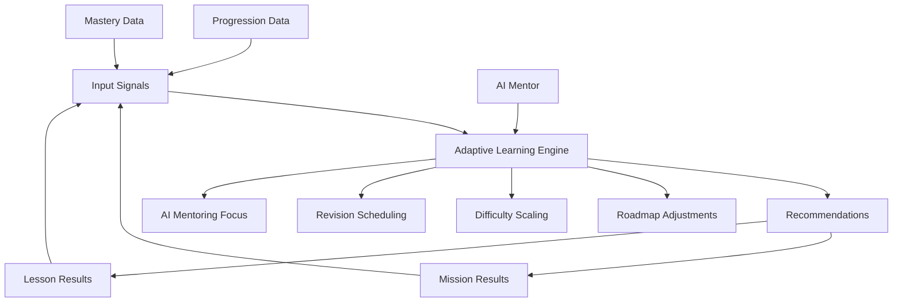

### Feedback Loops

ALE continuously improves by:
1. Collecting learning signals
2. Analyzing patterns
3. Adjusting recommendations
4. Monitoring outcomes
5. Refining personalization

---

## 22. Progression / Gamification

### Three Separate Concepts

Atlas keeps three concepts deliberately separate:

| Concept | What It Tracks | Example |
|---------|---------------|---------|
| **Progress** | XP, levels, streaks, badges, motivation | Level 73, 5000 XP |
| **Mastery** | Knowledge and skill development | 85% mastery in Kotlin |
| **Engineering Experience** | Real evidence of work completed | Built 42 features, fixed 187 bugs |

> A learner should not become an "expert" merely because they earned XP.

### Progression Elements

| Element | Description |
|---------|-------------|
| XP | Experience points for meaningful learning activity |
| Levels | Reflect learning progress |
| Ranks | Engineering rank progression |
| Streaks | Daily learning consistency |
| Badges | Specific achievement recognition |
| Challenges | Time-limited learning challenges |
| Rewards | Unlockable rewards |
| Coins | In-platform currency |
| Leaderboards | Ranking among peers |
| Engineering reputation | Reputation based on engineering work |
| Engineering journal | Record of engineering reflections |
| Milestones | Significant learning milestones |

### Business Rules

- Progress should reward meaningful learning activity
- Gamification should improve engineering ability, not merely increase screen time
- Atlas should use gamification to motivate, not to distract

---

## 23. Engineering Passport / Portfolio

### Purpose

More than a portfolio — a comprehensive professional engineering identity.

### Core Philosophy

> A portfolio should PROVE, not merely CLAIM.

Instead of: "I know Android."
Atlas should show: Built Android features · Fixed Android bugs · Completed Compose missions · Implemented MVVM · Passed architecture reviews

### Private Passport

| Element | Description |
|---------|-------------|
| AI notes | AI-generated learning observations |
| Weak areas | Identified areas needing improvement |
| Mistakes | Learning from errors |
| Reflections | Learner's self-reflections |
| Learning analytics | Detailed learning data |

### Public Passport

| Element | Description |
|---------|-------------|
| Projects | Completed engineering projects |
| Skills | Verified engineering skills |
| Achievements | Earned achievements |
| Certificates | Earned certificates |
| Engineering experience | Verified engineering evidence |
| Portfolio artifacts | Mission outcomes and reviews |

### Engineering Timeline

Visual representation of the learner's engineering journey over time.

### Resume Generation

Auto-generated resume from verified engineering experience.

### Recruiter View (FUTURE)

| Element | Description |
|---------|-------------|
| Verified skills | Skills verified through mission completion |
| Project evidence | Actual project outcomes |
| Code samples | Representative code from missions |
| Growth timeline | Learning progression over time |
| Interview readiness | Assessment of interview preparedness |

---

## 24. Admin / CMS

### Atlas Control Center (ACC)

The internal operating system for Atlas platform management.

### Admin Dashboard

- Overview of platform health
- User statistics
- Learning metrics
- System status

### User Management

| Function | Description |
|----------|-------------|
| User directory | View all users |
| Role management | Assign and manage roles |
| User profiles | View and edit user details |
| Activity logs | View user activity |

### Content Management

| Function | Description |
|----------|-------------|
| Lesson management | Create, edit, publish lessons |
| Mission management | Create, edit, publish missions |
| Learning path management | Configure learning paths |
| Track management | Manage engineering tracks |

### Mission Studio

**Major future feature.** Mission Studio allows non-engineering curriculum creators to configure:

| Configuration | Description |
|--------------|-------------|
| Story | Mission narrative |
| Business context | Real-world context |
| Learning objectives | What the learner will practice |
| Difficulty | Mission difficulty level |
| Concepts | Tagged concepts |
| Stages | Mission stage structure |
| Guide behavior | How Guide Mode behaves |
| Hint progression | Hint level configuration |
| Validation | Test and evaluation pipeline |
| Hidden tests | Hidden test cases |
| AI prompts | AI Mentor context |
| Rewards | XP, badges, portfolio artifacts |
| Portfolio artifacts | What gets added to the passport |
| Acceptance criteria | Completion requirements |

### AI Management

| Function | Description |
|----------|-------------|
| Prompt management | Version-controlled AI prompts |
| Safety configuration | AI behavior constraints |
| Usage monitoring | Track AI usage and costs |

### Compiler Management

| Function | Description |
|----------|-------------|
| Language configuration | Supported languages |
| Sandbox management | Execution environment settings |
| Resource limits | Time, memory, CPU limits |

### Analytics

| Function | Description |
|----------|-------------|
| Learning analytics | Lesson and mission completion |
| User behavior | Engagement and retention |
| Business metrics | DAU, WAU, MAU, conversion |
| AI usage analytics | AI interaction patterns |

### Moderation

| Function | Description |
|----------|-------------|
| Content moderation | Review and approve content |
| User moderation | Manage user behavior |
| Report handling | Handle user reports |

### Feature Flags

| Function | Description |
|----------|-------------|
| Feature toggles | Enable/disable features |
| A/B testing | Experiment configuration |
| Gradual rollouts | Phased feature releases |

### System Management

| Function | Description |
|----------|-------------|
| System settings | Platform configuration |
| Infrastructure | System health monitoring |
| Audit logs | Security and change audit trails |

### Role-Based Access

| Role | Access Level |
|------|-------------|
| Admin | Standard administrative functions |
| Super Admin | Full system control |
| Mentor | Learner review and feedback |
| Guider | Guide Mode interaction |
| Student | Own learning and portfolio |

---

## 25. Business / Monetization

### Revenue Model

Atlas is planned as a subscription-based product with tiered pricing.

### Monetization Areas

| Area | Description |
|------|-------------|
| Free tier | Limited missions, limited AI usage, basic progress tracking |
| Premium tier | Full access to missions, AI, and features |
| AI usage | AI Mentor and AI Review usage limits |
| Compiler usage | Execution time and frequency limits |
| Enterprise | Custom deployments for organizations |
| University licensing | Institutional access |
| Creator economics | Content creator revenue sharing (FUTURE) |

### Billing

- Subscription management
- Usage-based billing for AI and compiler resources
- Enterprise invoicing

### Limits and Quotas

- Free tier: Limited daily missions, limited AI interactions, basic compiler access
- Premium tier: Unlimited missions, full AI access, priority compiler
- Enterprise: Custom quotas

### Pricing

> **Note:** Specific pricing values are NOT defined in this PRD. Pricing decisions should be defined in a separate approved document.

---

## 26. Analytics

### Learning Analytics

| Metric | Description |
|--------|-------------|
| Lesson completion rate | Percentage of lessons completed |
| Mission completion rate | Percentage of missions completed |
| Guide Mode usage | How often Guide Mode is used |
| Hint usage | How often hints are used and at which levels |
| Knowledge retention | Retention over time |

### Mission Analytics

| Metric | Description |
|--------|-------------|
| Mission completion rate | Percentage of missions completed per type |
| Average attempts | Average attempts per mission |
| Time to completion | Average time to complete missions |
| Error patterns | Common errors across missions |

### User Behavior Analytics

| Metric | Description |
|--------|-------------|
| DAU / WAU / MAU | Daily, weekly, monthly active users |
| Session duration | Average session length |
| Feature usage | Which features are used most |
| Drop-off points | Where users abandon learning |

### AI Usage Analytics

| Metric | Description |
|--------|-------------|
| AI Mentor interactions | Frequency and topics |
| AI Review usage | How often AI Review is used |
| AI cost per user | Cost of AI per user |
| AI satisfaction | Quality of AI interactions |

### Compiler Usage Analytics

| Metric | Description |
|--------|-------------|
| Compilation frequency | How often code is compiled |
| Success rate | Compilation success percentage |
| Language distribution | Which languages are used |
| Performance metrics | Average execution time and resources |

### Retention Analytics

| Metric | Description |
|--------|-------------|
| Day 1 / Day 7 / Day 30 retention | User retention over time |
| Streak distribution | Distribution of learning streaks |
| Return rate | How often users return |

### Business Metrics

| Metric | Description |
|--------|-------------|
| Premium conversion | Free to premium conversion rate |
| Portfolio completion | Percentage of users with complete portfolios |
| Interview success rate | Interview outcome for Atlas users |

---

## 27. Non-Functional Requirements

### Performance

| Requirement | Description |
|-------------|-------------|
| Page load | Pages must load within acceptable time |
| API latency | API responses must be within acceptable time |
| Compilation speed | Code compilation must complete within time limits |
| AI response time | AI Mentor responses must be timely |

### Scalability

| Requirement | Description |
|-------------|-------------|
| User scaling | Platform must support growing user base |
| Mission scaling | Content library must scale |
| Execution scaling | Compiler infrastructure must scale |
| AI scaling | AI usage must be manageable at scale |

### Security

| Requirement | Description |
|-------------|-------------|
| Authentication | Secure OAuth authentication |
| Authorization | Role-based access control |
| Session management | Secure session handling |
| Data protection | User data must be protected |
| Code execution isolation | All code execution must be isolated |
| Abuse prevention | Rate limiting and abuse detection |

### Privacy

| Requirement | Description |
|-------------|-------------|
| Data minimization | Collect only necessary data |
| User consent | Consent for data collection |
| Data portability | Users can export their data |
| Right to deletion | Users can delete their data |

### Reliability

| Requirement | Description |
|-------------|-------------|
| Crash-free sessions | Minimize crashes |
| Error handling | Graceful error handling |
| Recovery | System recovery mechanisms |

### Availability

| Requirement | Description |
|-------------|-------------|
| Uptime | High availability target |
| Backup | Regular data backups |
| Disaster recovery | Recovery procedures |

### Accessibility

| Requirement | Description |
|-------------|-------------|
| Keyboard navigation | Full keyboard accessibility |
| Screen readers | Screen reader compatibility |
| Focus states | Visible focus indicators |
| Labels | Proper form labels |
| Contrast | Sufficient color contrast |
| Error announcements | Accessible error messages |
| Reduced motion | Reduced motion support |
| Responsive behavior | Responsive design |

### Compatibility

| Requirement | Description |
|-------------|-------------|
| Browser support | Modern browser compatibility |
| Device support | Desktop and tablet support |
| Responsive design | Adapts to screen sizes |

### Maintainability

| Requirement | Description |
|-------------|-------------|
| Code quality | Clean, maintainable code |
| Documentation | Up-to-date documentation |
| Testing | Comprehensive test coverage |

### Observability

| Requirement | Description |
|-------------|-------------|
| Logging | Comprehensive logging |
| Monitoring | System monitoring |
| Alerting | Alert mechanisms |

### Cost

| Requirement | Description |
|-------------|-------------|
| AI cost management | Monitor and control AI costs |
| Infrastructure cost | Manage infrastructure costs |
| Compiler cost | Manage compiler infrastructure costs |

### AI Safety

| Requirement | Description |
|-------------|-------------|
| Prompt management | Version-controlled prompts |
| Safety rules | AI behavior constraints |
| Rate limiting | AI usage rate limits |
| Usage tracking | Track all AI usage |
| Cost tracking | Track AI costs |
| Context management | Manage AI context |
| Evaluation | Evaluate AI responses |
| Fallback | Fallback when AI unavailable |

---

## 28. Security Requirements

### Authentication

- Google OAuth for user authentication
- GitHub OAuth for user authentication
- Secure session token management
- Token refresh and expiration

### Authorization

- Role-based access control (Student, Mentor, Guider, Admin, Super Admin)
- Server-side authorization enforcement
- API boundary validation

### Session Security

- Secure session tokens
- Session expiration
- Session invalidation on logout

### Secret Handling

- API keys stored in environment variables
- Secrets never committed to source control
- Secrets never exposed to frontend code
- `.env` files in `.gitignore`
- `.env.example` files tracked for reference

### OAuth Security

- Callback URLs must exactly match configured URLs
- OAuth tokens handled server-side
- Production callbacks configured separately from development

### Data Protection

- User data encrypted at rest and in transit
- Minimal data collection
- Data isolation between users

### Code Execution Isolation

- All code execution in isolated sandboxes
- No cross-execution contamination
- Sandboxes are ephemeral and disposable
- Resource limits enforced

### Abuse Prevention

- Rate limiting on API endpoints
- Rate limiting on AI usage
- Rate limiting on compiler usage
- Abuse detection and prevention

### Privacy

- User consent for data collection
- Data minimization
- Right to deletion
- Data portability

### Auditability

- Audit logs for administrative actions
- Security event logging
- Change tracking

---

## 29. Accessibility

### Requirements (from PRD)

| Requirement | Description |
|-------------|-------------|
| Keyboard navigation | All interactive elements must be keyboard accessible |
| Screen readers | Content must be compatible with screen readers |
| Focus states | Visible focus indicators on all interactive elements |
| Labels | Proper labels on all form elements |
| Contrast | Sufficient color contrast ratios |
| Error announcements | Errors must be announced to screen readers |
| Reduced motion | Support for prefers-reduced-motion |
| Responsive behavior | Must work on different screen sizes |

---

## 30. Notifications

### Notification Types

| Type | Channel | Trigger |
|------|---------|---------|
| Learning reminders | Email, In-app | Based on learning schedule |
| Mission reminders | Email, In-app | Mission deadlines or recommendations |
| Achievement notifications | In-app | Badge earned, level up, milestone reached |
| Security notifications | Email | Account security events |
| Streak reminders | In-app, Email | Streak at risk |
| Revision reminders | In-app | Spaced repetition schedule |

---

## 31. Community

**Status:** FUTURE

### Planned Features

| Feature | Description |
|---------|-------------|
| Discussions | Topic-based discussions |
| Questions | Q&A system |
| Mentoring | Peer and expert mentoring |
| Community moderation | Content and behavior moderation |
| Reputation | Community reputation system |
| Social features | Following, sharing, collaboration |

---

## 32. Career / Hiring

**Status:** FUTURE

### Engineering Talent Network (ETN)

| Capability | Description |
|-----------|-------------|
| Companies | Publish jobs and assessments |
| Recruiters | Review Engineering Passports, view verified evidence |
| Candidates | Invite to assessments, build hiring pipelines |
| Assessments | Company-style technical assessments |
| Hiring pipelines | End-to-end hiring workflow |
| Offers | Employment offers |

### Recruiter Filtering

| Filter | Description |
|--------|-------------|
| Track | Engineering track |
| Technology | Specific technologies |
| Mission count | Number of missions completed |
| Project count | Number of projects |
| Verified skills | Skills verified through missions |
| Experience level | Level of experience |
| Country | Geographic location |
| Language | Programming language |
| Availability | Job search status |
| Portfolio visibility | Public passport visibility |

### Verified Engineering Record (VER)

Future system connecting every major engineering achievement to the actual mission and review that produced it.

---

## 33. University / Enterprise

**Status:** FUTURE

### University Features

| Feature | Description |
|---------|-------------|
| University dashboards | Aggregate student progress |
| Student recommendations | Recommend students to employers |
| Internal assessments | Host institution-specific assessments |
| Placement drives | Organize placement events |
| Curriculum alignment | Map to university curriculum |

### Enterprise Features

| Feature | Description |
|---------|-------------|
| Enterprise dashboards | Organization-wide analytics |
| Organization management | Multi-team support |
| Custom curriculum | Company-specific learning paths |
| Cohorts | Group learning |
| Assessments | Company-specific assessments |
| Reporting | Custom reporting |
| Licensing | Enterprise licensing model |

---

## 34. MVP Scope

### MVP — IN SCOPE

| Module | Status |
|--------|--------|
| Authentication (Google + GitHub OAuth) | IN SCOPE |
| Onboarding | IN SCOPE |
| Dashboard | IN SCOPE |
| Learning Paths | IN SCOPE |
| Lessons | IN SCOPE |
| Mission Engine | IN SCOPE |
| Simplify Mode | IN SCOPE |
| Guide Mode | IN SCOPE |
| Hint System | IN SCOPE |
| Code Editor | IN SCOPE |
| Compiler (basic) | IN SCOPE |
| Hidden Tests | IN SCOPE |
| XP | IN SCOPE |
| Portfolio / Engineering Passport (basic) | IN SCOPE |
| AI Review | IN SCOPE |
| Admin Panel (basic) | IN SCOPE |

### MVP — OUT OF SCOPE

| Feature | Status |
|---------|--------|
| Team Collaboration | OUT OF SCOPE |
| Hiring Platform | OUT OF SCOPE |
| Live Competitions | OUT OF SCOPE |
| Marketplace | OUT OF SCOPE |
| Voice Mentor | OUT OF SCOPE |
| Mobile Applications | OUT OF SCOPE |
| Engineering Story Universe | OUT OF SCOPE |
| University Portal | OUT OF SCOPE |
| Enterprise Platform | OUT OF SCOPE |
| Plugin/SDK Ecosystem | OUT OF SCOPE |
| Full Atlas Senior Engineer | OUT OF SCOPE |

### Future

| Capability | Phase |
|-----------|-------|
| Adaptive Learning (full) | Phase 2 |
| AI Mentor (full) | Phase 2 |
| Personalized Recommendations | Phase 2 |
| Knowledge Gap Detection | Phase 2 |
| Advanced Guidance | Phase 2 |
| Story Universe | Phase 3 |
| Advanced Engineering Workflows | Phase 3 |
| Larger Project Simulations | Phase 3 |
| Production-Like Scenarios | Phase 3 |
| Team Missions | Phase 4 |
| Pair Programming | Phase 4 |
| Collaborative Engineering | Phase 4 |
| Companies | Phase 5 |
| Recruiters | Phase 5 |
| Assessments (Hiring) | Phase 5 |
| Verified Engineering Evidence | Phase 5 |
| Hiring Pipelines | Phase 5 |
| Universities | Phase 6 |
| Enterprise | Phase 6 |
| SDK | Phase 6 |
| Plugins | Phase 6 |
| Marketplace / Ecosystem | Phase 6 |
| Broader Engineering Tracks | Phase 6 |

---

## 35. Priority System

### P0 — Foundation

- Documentation
- Repository
- Environment management
- Authentication
- Database foundation
- Backend foundation
- Onboarding

### P1 — Core Learning

- Dashboard
- Learning Paths
- Lessons
- Mission Engine
- Guide Mode
- Simplify Mode
- Hint System

### P1 — Execution

- Code editor
- Submission service
- Compiler
- Hidden tests
- Sandbox
- Performance validation

### P2 — Intelligence

- Adaptive Learning Engine
- AI Mentor
- AI Review
- Knowledge graph
- Recommendations
- Revision

### P2 — Progression

- XP
- Levels
- Streaks
- Badges
- Mastery
- Engineering Experience

### P2 — Career Evidence

- Engineering Passport
- Portfolio
- Resume
- Public profile

### P3 — Internal Platform

- Admin Center
- Mission Studio
- Analytics
- Feature flags
- Audit logs

### FUTURE

- Story Universe
- Collaboration
- Hiring
- Universities
- Enterprise
- Marketplace
- Mobile applications
- Plugin ecosystem

---

## 36. Dependencies

### Authentication Providers

| Provider | Status | Notes |
|----------|--------|-------|
| Google OAuth | Configured, needs end-to-end verification | Client name: "Atlas Web" |
| GitHub OAuth | Created, redirect_uri issue to resolve | Callback must exactly match |

### AI Providers

| Provider | Status | Notes |
|----------|--------|-------|
| Google Gemini | Integration in progress | API key in backend/.env |

### Compiler Infrastructure

| Component | Status | Notes |
|-----------|--------|-------|
| Current prototype | Node.js benchmark simulation | NOT production-grade |
| Production direction | Secure Execution Platform (SEP) | Architecture concern (Architecture.md) |
| Sandbox technology | Firecracker MicroVM direction | Architecture concern |

### Database

| Component | Status | Notes |
|-----------|--------|-------|
| Current | SQLite prototype | Sufficient for prototype |
| Production | TBD | Architecture concern |

### External Services

| Service | Purpose | Status |
|---------|---------|--------|
| Vercel | Frontend deployment | Active |
| Google Cloud | OAuth + AI | Configured |

### Infrastructure

| Component | Status | Notes |
|-----------|--------|-------|
| Frontend | Vercel deployment | Active |
| Backend | TBD | Architecture concern |
| Compiler infrastructure | TBD | Architecture concern |

---

## 37. Risks

### Major Risks

| Risk | Impact | Mitigation |
|------|--------|-----------|
| Overly ambitious MVP | Scope creep, delayed delivery | Strict MVP scope adherence, phased development |
| High infrastructure cost | Budget overrun | Cost monitoring, resource limits, efficient architecture |
| AI hallucinations | Incorrect guidance, poor learner experience | AI safety rules, response evaluation, human review |
| Challenge content quality | Poor learning outcomes | Content review process, learner feedback loops |
| Scaling compiler infrastructure | Performance and cost issues | Resource limits, efficient sandbox design |
| Maintaining multiple language runtimes | Complexity and cost | Phase language support, reuse runtime infrastructure |

### Additional Practical Risks

| Risk | Impact | Mitigation |
|------|--------|-----------|
| Product has many ambitious modules | Development spread too thin | Phased development, do not build every concept simultaneously |
| OAuth callback configuration | Authentication failure | Verify exact callback URL matching |
| Prototype compiler mistaken for production | Security and reliability issues | Clear documentation that prototype is not production-grade |

---

## 38. Success Metrics

### Technical Metrics

| Metric | Description |
|--------|-------------|
| Crash-free sessions | Minimize application crashes |
| API latency | API response times within acceptable limits |
| Compiler success rate | Percentage of compilations that succeed |

### Learning Metrics

| Metric | Description |
|--------|-------------|
| Lesson completion rate | Percentage of started lessons completed |
| Mission completion rate | Percentage of started missions completed |
| Guide Mode usage | How often Guide Mode is engaged |
| Hint usage | How often hints are used |
| Knowledge retention | Retention over time |

### Business Metrics

| Metric | Description |
|--------|-------------|
| DAU / WAU / MAU | Daily, weekly, monthly active users |
| Premium conversion | Free to premium conversion rate |
| Student retention | User retention over time |
| Portfolio completion | Percentage of users with complete portfolios |
| Interview success rate | Interview outcomes for Atlas users |

### Future Metrics

Evaluate whether learners actually improve engineering ability.

---

## 39. Acceptance / Definition of Done

### Global Definition of Done

A feature is "done" when:

1. **Requirements Met** — All functional requirements from the PRD are implemented
2. **User Stories Validated** — User stories can be demonstrated end-to-end
3. **States Handled** — Loading, empty, success, error, and relevant states are handled
4. **Acceptance Criteria Pass** — All acceptance criteria pass
5. **Business Rules Enforced** — All business rules are implemented and tested
6. **MVP Scope Respected** — Feature is within MVP scope (or explicitly marked FUTURE)
7. **Security Validated** — Authentication and authorization enforced server-side
8. **Input Validation** — Inputs validated at API boundary
9. **Documentation Updated** — Documentation reflects the feature
10. **No Secrets Exposed** — No secrets in code, frontend, or logs

---

## 40. Product Terminology

| Term | Definition |
|------|-----------|
| **Atlas** | The AI-powered software engineering learning ecosystem |
| **ALE** | Adaptive Learning Engine — the intelligence layer for personalization |
| **EME** | Engineering Mission Engine — the core mission system |
| **SEP** | Secure Execution Platform — the code compilation and execution system |
| **ASE** | Atlas Senior Engineer — the AI mentor |
| **ACC** | Atlas Control Center — the admin platform |
| **ETN** | Engineering Talent Network — the future hiring platform |
| **EP** | Engineering Passport — the professional engineering identity |
| **VER** | Verified Engineering Record — future achievement verification |
| **Guide Mode** | Structured guidance without revealing answers |
| **Simplify Mode** | Mission decomposition into smaller stages |
| **Engineering Experience** | Real evidence of engineering work completed |
| **Mastery** | Knowledge and skill development level |
| **Progress** | XP, levels, streaks, badges, motivation |
| **Mission Studio** | Future tool for non-engineering curriculum creators |
| **Logic Building** | Progressive development of computational thinking |
| **Engineering Thinking Canvas** | Pre-coding planning framework |
| **Engineering Passport** | Professional engineering identity and portfolio |
| **Productive Struggle** | Learning through challenge with support |

---

## 41. Open Questions

| ID | Question | Status |
|----|----------|--------|
| OQ-001 | Final production database strategy (PostgreSQL vs. other)? | [ ] Open |
| OQ-002 | Exact production compiler/sandbox technology selection? | [ ] Open |
| OQ-003 | Final navigation structure and naming? | [ ] Open |
| OQ-004 | Final pricing tiers and values? | [ ] Open |
| OQ-005 | Full Android/iOS project execution architecture? | [ ] Open |
| OQ-006 | Custom domain final decision (atlasdevhub.com)? | [ ] Open |
| OQ-007 | Final AI provider selection beyond Gemini? | [ ] Open |
| OQ-008 | Production deployment platform (Vercel for frontend only?)? | [ ] Open |

---

## 42. Assumptions

The following assumptions are stated in the source PRD:

1. The current prototype compiler is NOT a production-grade secure compiler — it is a benchmark/emulation for demonstration only
2. The exact implementation strategy for full Android/iOS project execution is an architecture concern
3. Production API design should be defined in Architecture.md and versioned appropriately
4. Final naming for the coding workspace should be governed by Design.md / product decisions
5. Domain availability must be verified at the time of purchase (domain checker results are not final)
6. GitHub OAuth redirect_uri issue must be resolved before GitHub authentication works end-to-end
7. The current schema (users, missions, chat_messages) will need substantial expansion for production
8. The hiring ecosystem is explicitly outside the current MVP scope
9. Engineering Story Universe is future-facing and should not be assumed to be fully implemented in the MVP

---

## 43. Changelog

| Version | Date | Status | Notes |
|---------|------|--------|-------|
| 0.1 | September 2026 | Initial structured PRD | Converted from Doc 4.0 — Atlas Product Requirements Document v4.0 |

---

## 44. Traceability

### Requirement ID Convention

`FR-{MODULE}-{NUMBER}`

### Traceability Matrix

| Module | Requirement IDs | Key Features |
|--------|----------------|-------------|
| Authentication | FR-AUTH-001, FR-AUTH-002 | OAuth registration, callback handling |
| Onboarding | FR-ONBOARD-001 | First-time onboarding flow |
| Learning | FR-LEARN-001, FR-LEARN-002 | Learning path progression, lesson completion |
| Mission Engine | FR-MISSION-001, FR-MISSION-002 | Mission discovery, mission execution |
| Guide Mode | FR-GUIDE-001 | Structured guidance |
| Simplify Mode | FR-SIMPLIFY-001 | Mission decomposition |
| Hint System | FR-HINT-001 | Progressive hints |
| Compiler | FR-COMPILER-001 | Code compilation and execution |
| AI Mentor | FR-AI-001 | AI engineering mentorship |
| AI Review | FR-AI-002 | Automated code review |
| ALE | FR-ALE-001 | Adaptive learning |
| Progression | FR-PROG-001 | Gamification and progression |
| Portfolio | FR-PORT-001 | Engineering Passport |
| Admin | FR-ADMIN-001 | Platform administration |

---

## 45. Mermaid Diagrams

### Product Ecosystem

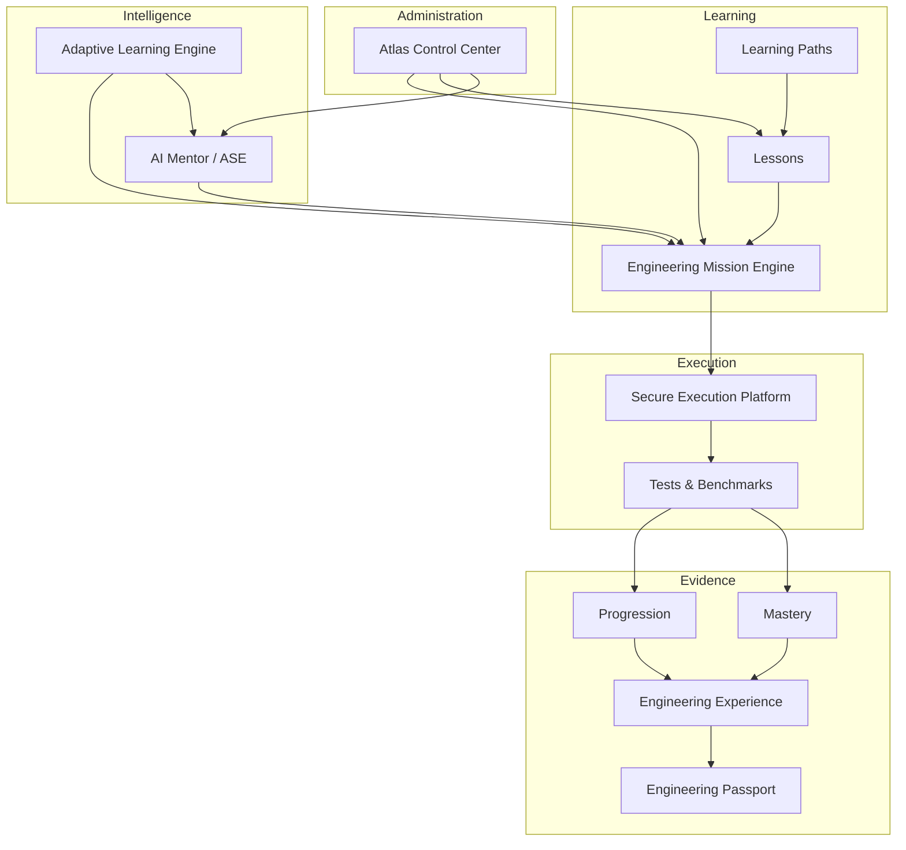

### User Journey

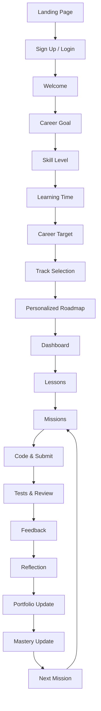

### Learning Loop

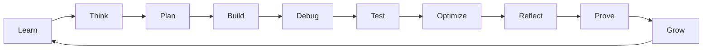

### Mission Lifecycle

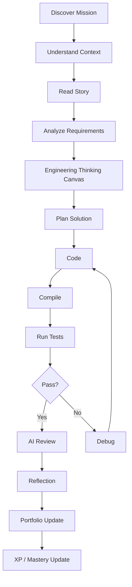

### AI/ALE Relationship

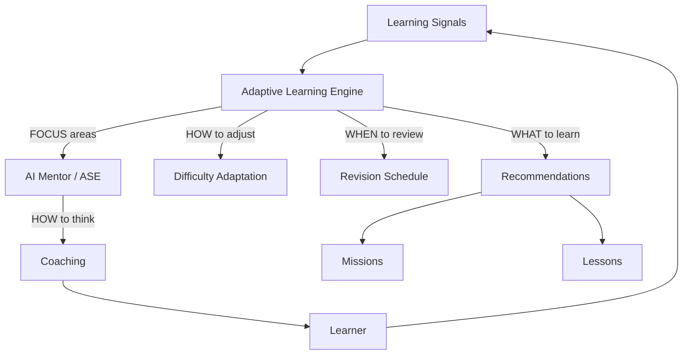

### Execution Flow

```mermaid
graph LR
    A[Learner Code] --> B[Submission Service]
    B --> C[Queue]
    C --> D[Sandbox Scheduler]
    D --> E[Secure Sandbox]
    E --> F[Compiler]
    F --> G[Test Runner]
    G --> H[Performance Analyzer]
    H --> I[Result Generator]
    I --> J[AI Review]
    J --> K[Progress Engine]
```

### Portfolio Progression

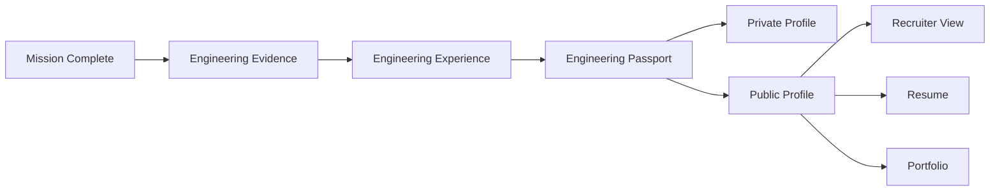

---

*End of Atlas Product Requirements Document v0.1*
