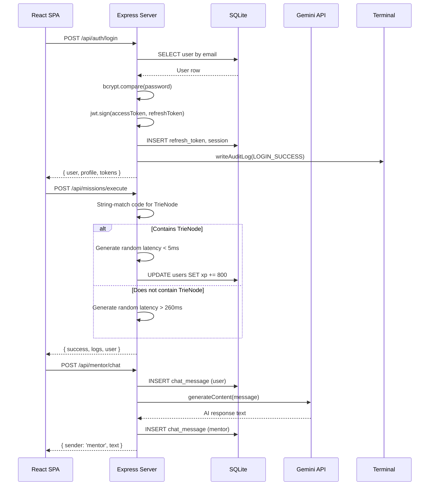
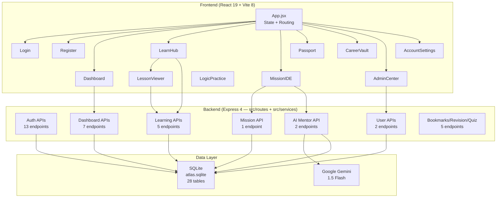
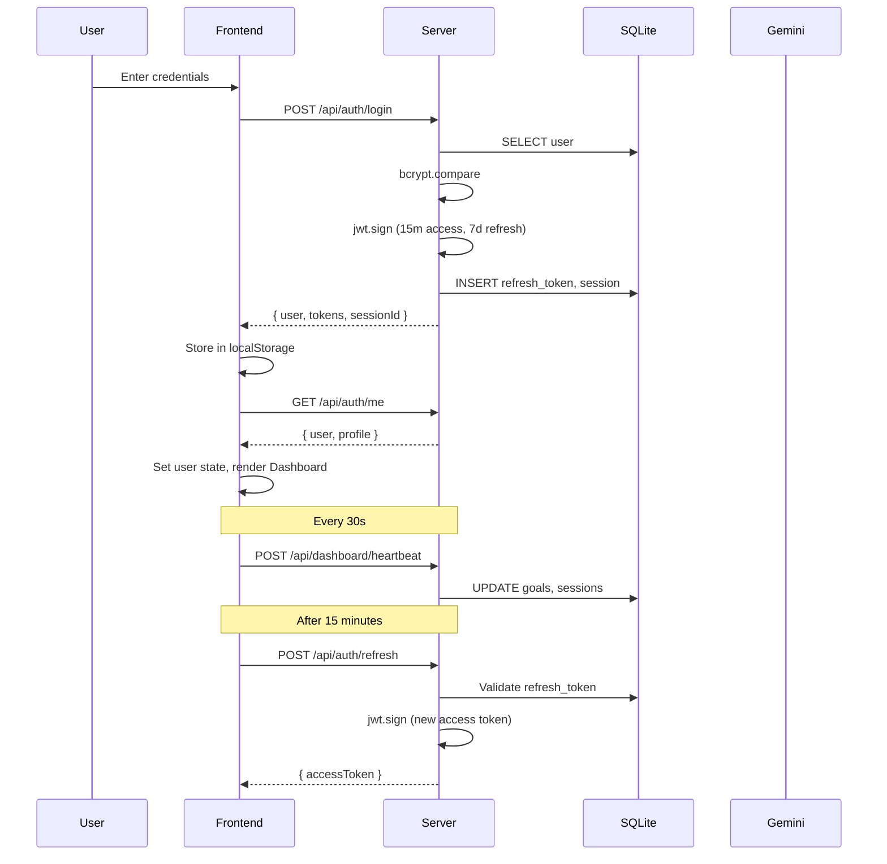
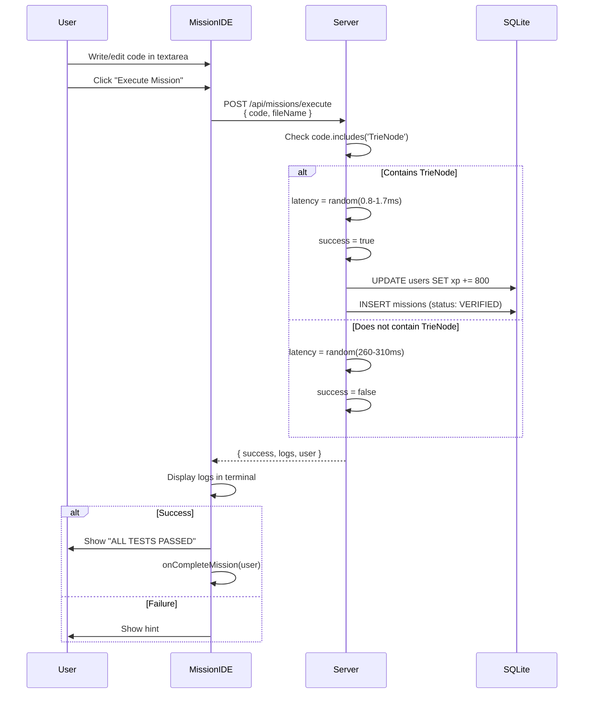
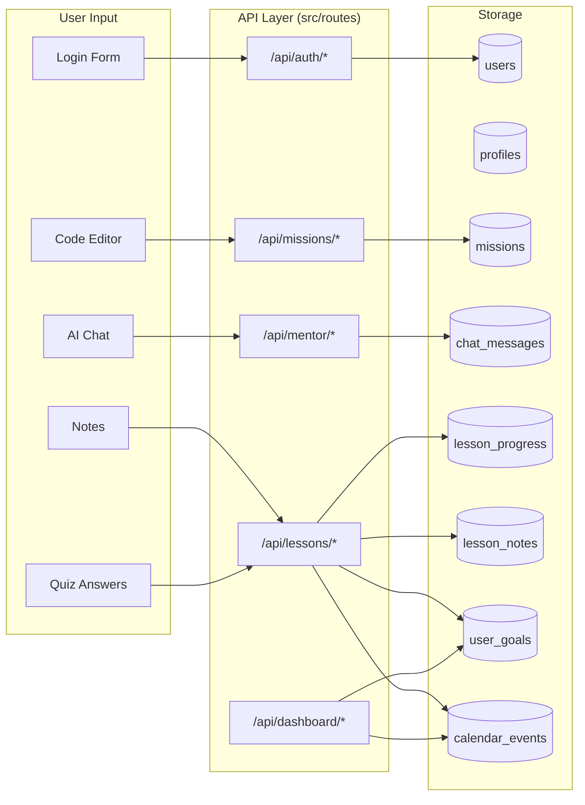

# Atlas — System Architecture Document

---

## 1. Document Information

| Field | Value |
|-------|-------|
| Product Name | Atlas |
| Document Type | System Architecture Specification |
| Document Status | Initial structured architecture |
| Version | 0.1 |
| Source of Truth Hierarchy | PRD.md > architecture.md > Design.md > Rules.md > Memory.md |
| Last Updated | September 2026 |
| Related Documents | PRD.md · Design.md · Rules.md · Memory.md |

---

## 2. System Overview

### What Atlas Is

Atlas is an AI-powered software engineering learning ecosystem. It connects structured learning paths, real-world engineering missions, AI mentorship, a prototype code execution platform, and a professional engineering passport into a single system.

### What Atlas Is NOT

Atlas is NOT a LeetCode clone, a HackerRank clone, a video-course platform, a generic coding playground, or an AI chatbot that gives code answers.

### Core System Boundaries

```
┌─────────────────────────────────────────────────────┐
│                   CLIENT (Browser)                   │
│  React 19 SPA · Vite 8 · Hash-Based Manual Routing  │
│  No React Router · State via useState/useEffect      │
│  Shared API client: src/api/client.js                │
└──────────────────────────┬──────────────────────────┘
                           │ REST API (JSON)
                           │ VITE_API_BASE_URL
┌──────────────────────────▼──────────────────────────┐
│                SERVER (Express 4)                    │
│  Modular: src/routes · src/middleware ·             │
│  src/services · src/config · src/db · src/utils      │
│  Auth · RBAC · Missions · AI · Dashboard · Lessons   │
│  Prototype compiler · Audit logging                  │
└──────────────────────────┬──────────────────────────┘
                           │
              ┌────────────┼────────────┐
              ▼            ▼            ▼
         SQLite DB    Gemini AI    Console Logs
      (atlas.sqlite)  (google)    (email sim)
```

---

## 3. Architectural Principles

| # | Principle | Current Status |
|---|-----------|---------------|
| 1 | Security first | Brute-force rate limiter, JWT auth, RBAC, bcrypt password hashing — implemented in src/middleware + src/services |
| 2 | Separation of concerns | **ACHIEVED** — Backend split into routes, middleware, services, config, db (schema/seed), utils |
| 3 | Progressive enhancement | Prototype compiler is simulated; full sandbox is future work |
| 4 | Observable system | Audit logs table exists; email dispatch logged to console only |
| 5 | Offline-first learning | Frontend works with seed data; some API fallbacks return hardcoded data |
| 6 | Statelessness | Server is stateless except SQLite; no in-memory session store for JWT (refresh tokens are DB-tracked) |
| 7 | Defense in depth | Multiple validation layers: client, server input validation, JWT verification, RBAC |
| 8 | Fail-safe defaults | Unverified email blocks login; roles default to 'Student'; tokens have expiry |

---

## 4. Current Production Architecture

### Architecture Style

**Modular Express application** — The backend is organized under `backend/src/` into config, database (schema + seed), middleware, routes, and services. The frontend is organized into feature-scoped component folders behind a shared API client.

### What Is Actually Implemented

| System | Status | Evidence |
|--------|--------|----------|
| Authentication (email/password) | ✅ Implemented | src/routes/auth.routes.js |
| Google OAuth | ✅ Implemented | src/routes/auth.routes.js, src/config/passport.js |
| GitHub OAuth | ✅ Implemented | src/routes/auth.routes.js, src/config/passport.js |
| JWT access/refresh tokens | ✅ Implemented | src/services/auth.service.js (signTokens/persistAuthSession) |
| RBAC middleware | ✅ Implemented | src/middleware/auth.js (authorizeRoles) |
| Brute-force rate limiter | ✅ Implemented | src/middleware/rateLimit.js |
| Audit logging | ✅ Implemented | src/middleware/audit.js, audit_logs table |
| Prototype code compiler | ⚠️ Simulated | src/services/compiler.service.js — string matching on code content, random latency |
| AI Mentor (Gemini) | ✅ Partial | src/services/ai.service.js — fallback to hardcoded responses |
| Dashboard API | ✅ Implemented | src/routes/dashboard.routes.js |
| Learning Module APIs | ✅ Implemented | src/routes/learning.routes.js |
| Lesson CRUD & Progress | ✅ Implemented | src/routes/learning.routes.js |
| Notes & Bookmarks | ✅ Implemented | src/routes/learning.routes.js |
| Revision Queue | ✅ Implemented (basic) | src/routes/learning.routes.js |
| Quiz Submission | ✅ Implemented | src/routes/learning.routes.js |
| Email dispatch | ⚠️ Console only | Dev verification/reset links logged to terminal, no actual email service |
| Password reset email | ⚠️ Console only | src/routes/auth.routes.js |

### What Is NOT Implemented (Future)

| System | PRD Reference | Status |
|--------|--------------|--------|
| Secure sandbox compiler (Docker/gVisor) | FR-COMPILER-001a | Not implemented — prototype is string-matching simulation |
| Hidden test execution | FR-COMPILER-001c | Not implemented |
| Memory/CPU limits enforcement | FR-COMPILER-001d/e | Not implemented |
| Incremental result streaming | FR-COMPILER-001g | Not implemented |
| Real email service (SMTP/SendGrid) | — | Console logs only |
| Adaptive learning engine | PRD §12.4 | Not implemented — recommendations are seed data |
| Spaced repetition (SM-2) | — | Endpoint exists but returns stub response |
| Production database (PostgreSQL) | — | SQLite only |
| Container orchestration | — | Not implemented |
| CI/CD pipeline | — | Not implemented |
| Automated testing | — | No test files exist |
| WebSocket/real-time updates | — | Not implemented |

---

## 5. Target/Production Architecture

The production architecture represents what Atlas should become. This is the target state, not the current implementation.

### Target System Topology

```
                         ┌──────────────────────┐
                         │    CDN / Edge Cache    │
                         │  (Static SPA assets)   │
                         └───────────┬──────────┘
                                     │
                         ┌───────────▼──────────┐
                         │   Load Balancer /     │
                         │   Reverse Proxy       │
                         │   (Nginx / Caddy)     │
                         └───────────┬──────────┘
                                     │
              ┌──────────────────────┼──────────────────────┐
              ▼                      ▼                      ▼
     ┌────────────────┐    ┌────────────────┐    ┌────────────────┐
     │  API Server    │    │  API Server    │    │  API Server    │
     │  (Node.js)     │    │  (Node.js)     │    │  (Node.js)     │
     └───────┬────────┘    └───────┬────────┘    └───────┬────────┘
             │                      │                      │
             └──────────────────────┼──────────────────────┘
                                    │
                    ┌───────────────┼───────────────┐
                    ▼               ▼               ▼
              ┌──────────┐   ┌──────────┐   ┌──────────────┐
              │ PostgreSQL│   │  Redis   │   │ Object Store │
              │ (Primary) │   │ (Cache)  │   │ (S3/Blob)    │
              └──────────┘   └──────────┘   └──────────────┘
                                    │
                         ┌──────────▼──────────┐
                         │  Sandbox Cluster     │
                         │  (Docker/gVisor)     │
                         │  Per-execution       │
                         │  isolation           │
                         └─────────────────────┘
```

### Target Service Boundaries

| Service | Responsibility | Current Equivalent |
|---------|---------------|-------------------|
| Auth Service | Registration, login, OAuth, tokens, sessions | src/services/auth.service.js |
| User Service | Profile, settings, role management | src/routes/users.routes.js + auth.routes.js |
| Learning Service | Tracks, modules, topics, lessons, progress | src/routes/learning.routes.js |
| Mission Service | Mission definitions, execution, results | src/routes/missions.routes.js |
| Compiler Service | Secure code compilation, test execution, benchmarking | Prototype simulation in src/services/compiler.service.js |
| AI Service | Mentor chat, review, recommendations | src/services/ai.service.js |
| Dashboard Service | Summary, plans, notifications, activity | src/routes/dashboard.routes.js |
| Admin Service | User management, tags, system config | src/routes/admin.routes.js |
| Audit Service | Event logging, compliance trail | src/middleware/audit.js |

---

## 6. Technology Stack

### Current Stack

| Layer | Technology | Version | Purpose |
|-------|-----------|---------|---------|
| Frontend Framework | React | 19.x | SPA rendering |
| Frontend Build | Vite | 8.x | Dev server, bundling |
| Routing | Hash-based manual | — | No React Router; state-driven in App.jsx |
| UI Icons | lucide-react | — | Icon library |
| Code Highlighting | highlight.js | — | Syntax highlighting in IDE |
| Markdown Rendering | react-markdown | — | Lesson content rendering |
| HTTP Client | fetch (native) | — | API calls |
| Backend Runtime | Node.js | — | Server execution |
| Web Framework | Express | 4.21.x | HTTP routing, middleware |
| Database | SQLite | via sqlite/sqlite3 | Local file database |
| ORM/Query | Raw SQL | — | No ORM; all queries inline |
| AI Provider | Google Gemini | @google/generative-ai 0.21.x | AI mentor responses |
| Authentication | JWT + Passport.js | jsonwebtoken 9.x, passport 0.7.x | Token auth, OAuth |
| Password Hashing | bcryptjs | 3.x | Password security |
| Session Management | express-session | 1.x | OAuth state management |
| UUID Generation | uuid | 14.x | ID generation |
| Environment Config | dotenv | 16.x | .env loading |

### Target Stack (Production)

| Layer | Technology | Purpose |
|-------|-----------|---------|
| Frontend | React 19 + Vite 8 | SPA (unchanged) |
| Routing | React Router v7 | Type-safe routing |
| State Management | Zustand or React Query | Server state caching |
| Backend | Node.js + Express (modular) | Split into route files |
| Database | PostgreSQL | Production relational DB |
| Cache | Redis | Session store, query cache |
| ORM | Drizzle or Prisma | Type-safe queries |
| AI | Gemini + provider abstraction | Multiple AI backends |
| Compiler Sandbox | Docker + gVisor | Secure code execution |
| Object Storage | S3-compatible | User uploads, artifacts |
| Email | SendGrid / AWS SES | Transactional email |
| Logging | Pino + structured JSON | Production logging |
| Monitoring | OpenTelemetry + Prometheus | Observability |
| CI/CD | GitHub Actions | Automated pipeline |
| Container Runtime | Docker Compose (dev) / K8s (prod) | Deployment |

---

## 7. Current Architecture (Detailed Code-Level)

### 7.1 Backend: src/ (modular)

**Entry point:** `backend/src/server.js` — boots database + Express app, listens on PORT.

**Module map:**

| Module | File | Content |
|--------|------|---------|
| Config | src/config/index.js | Env parsing, secrets, paths (db path = repoRoot/db/atlas.sqlite) |
| Passport Config | src/config/passport.js | Google + GitHub OAuth strategies |
| DB Init | src/db/index.js | Singleton connection, PRAGMA foreign_keys, createSchema + seed |
| DB Schema | src/db/schema.js | All CREATE TABLE IF NOT EXISTS definitions |
| DB Seed | src/db/seed.js | Seed data (inserted when users table empty) |
| Middleware | src/middleware/auth.js | authenticateToken, authorizeRoles |
| Middleware | src/middleware/rateLimit.js | Login brute-force limiter (5 fails → 15 min lock) |
| Middleware | src/middleware/audit.js | writeAuditLog |
| Routes | src/routes/auth.routes.js | Register, verify, login, refresh, logout, OAuth, profile, sessions |
| Routes | src/routes/users.routes.js | Users list + role update (RBAC) |
| Routes | src/routes/admin.routes.js | Security tags CRUD |
| Routes | src/routes/dashboard.routes.js | Summary, plan, notifications, preferences, heartbeat |
| Routes | src/routes/learning.routes.js | Tracks, lessons, progress, notes, bookmarks, revision, quiz |
| Routes | src/routes/missions.routes.js | Code execution (simulated) |
| Routes | src/routes/mentor.routes.js | History + AI mentor chat |
| Services | src/services/auth.service.js | signTokens, persistAuthSession, processOAuthLogin |
| Services | src/services/ai.service.js | Gemini client + generateMentorReply + fallback |
| Services | src/services/compiler.service.js | executeMissionSimulation (prototype) |
| Utils | src/utils/validators.js | Password regex, common validators |
| App Factory | src/app.js | createApp(), mounts middleware + all routes, /api/health |
| Scripts | src/scripts/reset-db.js | npm run db:reset — recreate schema + seeds |

**Middleware Stack (applied in order):**

```
1. cors()
2. express.json()
3. express-session (for OAuth)
4. passport.initialize()
5. passport.session()
```

**Per-Route Middleware:**

| Middleware | Usage |
|-----------|-------|
| `authenticateToken` | All protected API routes (JWT verification) |
| `authorizeRoles(...roles)` | Admin-only routes (RBAC check) |
| `rateLimitLogin` | Login endpoint only (brute-force protection) |

### 7.2 Database: src/db/

**Location:** `backend/src/db/schema.js` (tables) + `backend/src/db/seed.js` (seed data) + `backend/src/db/index.js` (init + singleton).

**Schema Management:**
- All tables created via `CREATE TABLE IF NOT EXISTS` — no migration system
- Seed data inserted on first run when `users` table is empty (or via `npm run db:reset`)
- Foreign keys enabled via `PRAGMA foreign_keys = ON`

**Database File:** `db/atlas.sqlite` (runtime file is git-ignored; re-seeds if deleted)

### 7.3 Frontend: App.jsx + components/

**Location:** `frontend/src/App.jsx` — root state/routing; feature components under `components/`.

**Routing Mechanism:**
- Hash-based: `window.location.hash` parsed into `hashPath` state
- No React Router — all routing is manual `if/else` blocks
- Unauthenticated routes: `#login`, `#register`, `#forgot-password`, `#reset-password`, `#verify-email`, `#keypad`, `#auth-success`
- Authenticated routes: `#onboarding-wizard`, `#admin`, default (dashboard)
- In-dashboard navigation: `activeTab` state drives content switching (sidebar extracted into `components/layout/Sidebar.jsx`)

**State Management:**
- All state via React `useState` in App.jsx
- No external state management library
- Tokens stored in `localStorage`
- User session restored on mount via refresh token
- All API calls go through the shared client `src/api/client.js` (apiFetch + apiUrl)

---

## 8. System Interaction Diagram

### Current Interactions (Actual)



---

## 9. Frontend Architecture

### Component Hierarchy

```
App.jsx (root — all state, routing, side effects)
├── [Unauthenticated]
│   ├── auth/Login
│   ├── auth/Register
│   ├── auth/VerifyEmail
│   ├── auth/ForgotPassword
│   ├── auth/ResetPassword
│   ├── auth/AuthSuccess
│   └── onboarding/Onboarding (cyberpunk keypad)
│
├── [Onboarding Wizard]
│   └── auth/OnboardingWizard
│
├── [Admin]
│   └── admin/AdminCenter
│
└── [Authenticated Dashboard]
    ├── layout/Sidebar (shared navigation)
    ├── dashboard/Dashboard (overview)
    ├── learn/LearnHub
    │   └── learn/LessonViewer
    ├── mission/MissionIDE
    ├── practice/LogicPractice
    ├── passport/Passport
    ├── career/CareerVault
    └── settings/AccountSettings

Shared: api/client.js (apiFetch + apiUrl — base URL + auth token injection)
```

### Component Inventory

| Component | File | Purpose |
|-----------|------|---------|
| App | App.jsx | Root: state, routing, session |
| Sidebar | layout/Sidebar.jsx | Shared dashboard navigation |
| Login | auth/Login.jsx | Email/password + OAuth buttons |
| Register | auth/Register.jsx | Registration form |
| VerifyEmail | auth/VerifyEmail.jsx | Token verification |
| ForgotPassword | auth/ForgotPassword.jsx | Email request |
| ResetPassword | auth/ResetPassword.jsx | New password form |
| AuthSuccess | auth/AuthSuccess.jsx | OAuth redirect handler |
| OnboardingWizard | auth/OnboardingWizard.jsx | Profile setup wizard |
| Onboarding | onboarding/Onboarding.jsx | Cyberpunk keypad onboarding |
| Dashboard | dashboard/Dashboard.jsx | Stats, goals, notifications |
| LearnHub | learn/LearnHub.jsx | Track/module browser |
| FlashCard | learn/FlashCard.jsx | Spaced-repetition deck card |
| LessonViewer | learn/LessonViewer.jsx | Markdown, quiz, flashcards |
| MissionIDE | mission/MissionIDE.jsx | Code editor + terminal |
| LogicPractice | practice/LogicPractice.jsx | Logic sandbox |
| Passport | passport/Passport.jsx | Engineering passport |
| CareerVault | career/CareerVault.jsx | Career readiness |
| AdminCenter | admin/AdminCenter.jsx | User management |
| AccountSettings | settings/AccountSettings.jsx | Profile/password/sessions |

### State Flow

```
App.jsx (single source of truth)
  ├── user (object)         — current user data
  ├── profile (object)      — user profile
  ├── accessToken (string)  — JWT access token
  ├── refreshToken (string) — JWT refresh token
  ├── sessionId (string)    — active session ID
  ├── activeTab (string)    — current dashboard section
  ├── activeLessonId (string|null) — current lesson
  ├── missionCompleted (boolean) — mission state
  ├── usersList (array)     — admin user directory
  └── hashPath (string)     — current URL hash
```

All child components receive state via props. No prop drilling libraries, no context providers, no global state store.

---

## 10. Backend Architecture

### Route Map

| # | Method | Path | Auth | RBAC | Handler Module |
|---|--------|------|------|------|-----------------|
| 1 | GET | /api/auth/check-username/:username | No | — | src/routes/auth.routes.js |
| 2 | POST | /api/auth/register | No | — | src/routes/auth.routes.js |
| 3 | POST | /api/auth/verify-email | No | — | src/routes/auth.routes.js |
| 4 | POST | /api/auth/resend-verification | No | — | src/routes/auth.routes.js |
| 5 | POST | /api/auth/login | Rate limit | — | src/routes/auth.routes.js |
| 6 | POST | /api/auth/refresh | No | — | src/routes/auth.routes.js |
| 7 | POST | /api/auth/logout | No | — | src/routes/auth.routes.js |
| 8 | POST | /api/auth/forgot-password | No | — | src/routes/auth.routes.js |
| 9 | POST | /api/auth/reset-password | No | — | src/routes/auth.routes.js |
| 10 | GET | /api/auth/google | No | — | src/routes/auth.routes.js |
| 11 | GET | /api/auth/google/callback | No | — | src/routes/auth.routes.js |
| 12 | GET | /api/auth/github | No | — | src/routes/auth.routes.js |
| 13 | GET | /api/auth/github/callback | No | — | src/routes/auth.routes.js |
| 14 | GET | /api/auth/me | JWT | — | src/routes/auth.routes.js |
| 15 | PUT | /api/auth/profile | JWT | — | src/routes/auth.routes.js |
| 16 | PUT | /api/auth/change-password | JWT | — | src/routes/auth.routes.js |
| 17 | GET | /api/auth/sessions | JWT | — | src/routes/auth.routes.js |
| 18 | DELETE | /api/auth/sessions/:sessionId | JWT | — | src/routes/auth.routes.js |
| 19 | DELETE | /api/auth/account | JWT | — | src/routes/auth.routes.js |
| 20 | GET | /api/users | JWT | admin, super admin, mentor | src/routes/users.routes.js |
| 21 | PUT | /api/users/:id/role | JWT | super admin | src/routes/users.routes.js |
| 22 | GET | /api/tags | JWT | admin, super admin, mentor | src/routes/admin.routes.js |
| 23 | POST | /api/tags | JWT | admin, super admin | src/routes/admin.routes.js |
| 24 | DELETE | /api/tags/:name | JWT | admin, super admin | src/routes/admin.routes.js |
| 25 | POST | /api/missions/execute | JWT | — | src/routes/missions.routes.js |
| 26 | GET | /api/mentor/history/:userId | JWT | — | src/routes/mentor.routes.js |
| 27 | POST | /api/mentor/chat | JWT | — | src/routes/mentor.routes.js |
| 28 | GET | /api/dashboard/summary | JWT | — | src/routes/dashboard.routes.js |
| 29 | POST | /api/dashboard/regenerate-plan | JWT | — | src/routes/dashboard.routes.js |
| 30 | POST | /api/dashboard/plan/toggle | JWT | — | src/routes/dashboard.routes.js |
| 31 | GET | /api/dashboard/notifications | JWT | — | src/routes/dashboard.routes.js |
| 32 | POST | /api/dashboard/notifications/:id/read | JWT | — | src/routes/dashboard.routes.js |
| 33 | DELETE | /api/dashboard/notifications/:id | JWT | — | src/routes/dashboard.routes.js |
| 34 | POST | /api/dashboard/preferences | JWT | — | src/routes/dashboard.routes.js |
| 35 | POST | /api/dashboard/heartbeat | JWT | — | src/routes/dashboard.routes.js |
| 36 | GET | /api/tracks | JWT | — | src/routes/learning.routes.js |
| 37 | GET | /api/tracks/:id | JWT | — | src/routes/learning.routes.js |
| 38 | GET | /api/lessons/:id | JWT | — | src/routes/learning.routes.js |
| 39 | POST | /api/lessons/:id/progress | JWT | — | src/routes/learning.routes.js |
| 40 | POST | /api/lessons/:id/notes | JWT | — | src/routes/learning.routes.js |
| 41 | DELETE | /api/lessons/notes/:id | JWT | — | src/routes/learning.routes.js |
| 42 | GET | /api/bookmarks | JWT | — | src/routes/learning.routes.js |
| 43 | POST | /api/bookmarks | JWT | — | src/routes/learning.routes.js |
| 44 | GET | /api/revision | JWT | — | src/routes/learning.routes.js |
| 45 | POST | /api/revision/rate | JWT | — | src/routes/learning.routes.js |
| 46 | POST | /api/quiz/submit | JWT | — | src/routes/learning.routes.js |
| — | GET | /api/health | No | — | src/app.js |

---

## 11. Data Layer

### 11.1 Database Schema (All 24 Tables)

**Source:** `backend/src/db/schema.js` — all tables defined via `CREATE TABLE IF NOT EXISTS`.

#### Core User & Auth Tables

| Table | Primary Key | Purpose |
|-------|------------|---------|
| `users` | `id TEXT` | User accounts (email, username, password_hash, role, xp, level, code_quality) |
| `profiles` | `id TEXT` | User profiles (full_name, avatar, country, career_goal, learning_track, tech_stack) |
| `sessions` | `id TEXT` | Active login sessions (user_id, ip_address, user_agent) |
| `oauth_accounts` | `id TEXT` | OAuth provider links (provider, provider_user_id) |
| `email_verifications` | `token TEXT` | Email verification tokens (expires_at, used) |
| `password_resets` | `token TEXT` | Password reset tokens (expires_at, used) |
| `refresh_tokens` | `token TEXT` | JWT refresh tokens (expires_at, revoked) |
| `audit_logs` | `id INTEGER AUTO` | Security event log (user_id, action, ip_address, timestamp) |

#### Mission & Chat Tables

| Table | Primary Key | Purpose |
|-------|------------|---------|
| `missions` | `id TEXT` | Mission attempts (user_id, title, status, source_code, latency, memory) |
| `chat_messages` | `id INTEGER AUTO` | AI mentor conversation history (user_id, sender, text, timestamp) |

#### Dashboard Tables

| Table | Primary Key | Purpose |
|-------|------------|---------|
| `learning_sessions` | `id TEXT` | Active learning session state (activity_type, editor_state, time_spent) |
| `user_goals` | `id TEXT` | Daily/weekly goals (goal_type, target_value, current_value) |
| `notifications` | `id TEXT` | User notifications (title, message, category, is_read) |
| `calendar_events` | `id TEXT` | Activity heatmap data (event_date, event_type, title) |
| `activity_logs` | `id INTEGER AUTO` | Activity timeline (activity_type, description, timestamp) |
| `learning_recommendations` | `id TEXT` | AI/seed recommendations (type, title, estimated_time, difficulty) |
| `dashboard_preferences` | `user_id TEXT` | Pinned actions and today's plan (JSON) |

#### Learning Module Tables

| Table | Primary Key | Purpose |
|-------|------------|---------|
| `learning_tracks` | `id TEXT` | Learning paths (Android, Backend, Web, DevOps, AI/ML, DSA) |
| `learning_modules` | `id TEXT` | Modules within tracks (track_id, order_index) |
| `learning_topics` | `id TEXT` | Topics within modules (module_id, order_index) |
| `lessons` | `id TEXT` | Individual lessons (topic_id, order_index, estimated_time, xp_reward) |
| `lesson_contents` | `lesson_id TEXT` | Lesson content (markdown_content, quiz_json, flashcards_json) |
| `lesson_resources` | `id TEXT` | External resources (title, url, type) |
| `lesson_progress` | `(user_id, lesson_id)` | Per-user lesson progress (status, progress_percent, last_position) |
| `lesson_notes` | `id TEXT` | User notes on lessons (note_text, tags, pinned) |
| `lesson_bookmarks` | `(user_id, item_type, item_id)` | Bookmarked items |
| `revision_queue` | `(user_id, lesson_id)` | Spaced repetition schedule (next_review_date, interval_days) |

#### Security & Tags

| Table | Primary Key | Purpose |
|-------|------------|---------|
| `security_tags` | `id TEXT` | Dynamic role tags (name) |

### 11.2 Entity Relationship

```
users ──1:1── profiles
users ──1:N── sessions
users ──1:N── oauth_accounts
users ──1:N── email_verifications
users ──1:N── password_resets
users ──1:N── refresh_tokens
users ──1:N── audit_logs
users ──1:N── missions
users ──1:N── chat_messages
users ──1:N── learning_sessions
users ──1:N── user_goals
users ──1:N── notifications
users ──1:N── calendar_events
users ──1:N── activity_logs
users ──1:N── learning_recommendations
users ──1:1── dashboard_preferences
users ──1:N── lesson_progress
users ──1:N── lesson_notes
users ──1:N── lesson_bookmarks
users ──1:N── revision_queue

learning_tracks ──1:N── learning_modules
learning_modules ──1:N── learning_topics
learning_topics ──1:N── lessons
lessons ──1:1── lesson_contents
lessons ──1:N── lesson_resources
lessons ──1:N── lesson_progress (via user)
lessons ──1:N── lesson_notes (via user)
lessons ──1:N── revision_queue (via user)
```

### 11.3 Seed Data

When the `users` table is empty, `src/db/seed.js` seeds:
- 5 users (abhi, sarah, vikram, elena, alex) with pre-hashed passwords
- 5 profiles with career goals and tech stacks
- 5 dashboard preferences with default plans
- 5 sets of daily/weekly goals
- 5 sets of notifications
- 5 sets of learning recommendations
- 1 learning session per user
- 10 calendar heatmap events per user
- 4 activity log entries per user
- 6 learning tracks, 2 modules, 2 topics, 3 lessons
- 3 lesson contents (markdown + quiz + flashcards JSON)
- 1 lesson resource
- 2 lesson progress entries (usr_1 only)
- 6 security tags

---

## 12. Authentication & Authorization

### Authentication Flow

```
┌─────────────────────────────────────────────────┐
│                  Login Options                    │
├─────────────────┬───────────────────────────────┤
│ Email/Password  │ Callsign/Passcode (Keypad)    │
│ loginId+password│ callsign+passcode              │
└────────┬────────┴───────────────┬───────────────┘
         │                        │
         ▼                        ▼
    SELECT user              SELECT user
    WHERE email/username     WHERE username
         │                   AND passcode (plain)
         ▼                        │
    bcrypt.compare                │
         │                        │
         ▼                        ▼
    Email verified? ◄─────────────┘
    (is_email_verified = 1)
         │
    YES  ▼
    jwt.sign(accessToken, 15m)
    jwt.sign(refreshToken, 7d)
    INSERT refresh_token
    INSERT session
    writeAuditLog(LOGIN_SUCCESS)
         │
         ▼
    { user, profile, tokens, sessionId }
```

### Token Lifecycle

| Token | Lifetime | Storage | Refresh |
|-------|----------|---------|---------|
| Access Token | 15 minutes | localStorage + memory | Via refresh token |
| Refresh Token | 7 days | localStorage + DB | One-time use (not rotated) |
| Session | Until logout | DB + localStorage | N/A |

### Role-Based Access Control (RBAC)

**Roles (from seed data):**

| Role | Access Level |
|------|-------------|
| Student | Default. Can access all learning features |
| jr architect | Student-level with staff badge |
| guider | Student + limited staff features |
| mentor | Staff. Can view users, manage tags |
| admin | Staff. User management, tag CRUD |
| super admin | Full access. Role changes, tag deletion |

**RBAC Enforcement:**

```javascript
// src/middleware/auth.js
function authorizeRoles(...allowedRoles) {
  return (req, res, next) => {
    if (!req.user || !allowedRoles.map(r => r.toLowerCase()).includes(req.user.role.toLowerCase())) {
      return res.status(403).json({ error: `Access Denied. Required role: [${allowedRoles.join(', ')}]` });
    }
    next();
  };
}
```

**Client-Side Role Gating:**

```javascript
// App.jsx:379
const isStaff = ['admin', 'super admin', 'mentor', 'guider'].includes(user.role?.toLowerCase());
```

### Security Controls

| Control | Implementation | Location |
|---------|---------------|----------|
| Brute-force protection | IP-based rate limiter (5 attempts → 15min lock) | src/middleware/rateLimit.js |
| Password strength | Min 10 chars, upper, lower, number, special char | src/utils/validators.js |
| Password hashing | bcrypt with salt rounds = 10 | src/routes/auth.routes.js |
| JWT verification | Bearer token in Authorization header | src/middleware/auth.js |
| Email verification | Token-based, 24h expiry | src/routes/auth.routes.js |
| Password reset | Token-based, 1h expiry, revokes all sessions | src/routes/auth.routes.js |
| Session revocation | DELETE from sessions table on logout | src/routes/auth.routes.js |
| Audit logging | All auth events logged with IP | src/middleware/audit.js |
| Account deletion | Cascade delete user and all related data | src/routes/auth.routes.js |
| CSRF protection | Not implemented | — |
| Helmet security headers | Not implemented | — |
| Input sanitization | Basic regex validation only | — |

---

## 13. API Design

### Conventions

| Aspect | Convention |
|--------|-----------|
| Base URL | Configured via `VITE_API_BASE_URL` (default: `http://localhost:5001/api`) |
| Content Type | `application/json` |
| Authentication | `Authorization: Bearer <accessToken>` header |
| Error Format | `{ error: "message" }` with appropriate HTTP status |
| Success Format | Varies per endpoint (object or array) |
| ID Format | `usr_`, `prof_`, `sess_`, `tag_`, `note_`, `cal_` prefixed UUIDs |
| Timestamps | ISO 8601 strings |

### Request/Response Examples

**POST /api/auth/login**
```json
// Request
{
  "loginId": "abhi",
  "password": "StudentPass2400!"
}

// Response (200)
{
  "user": {
    "id": "usr_1",
    "email": "abhi@atlas.dev",
    "username": "abhi",
    "role": "jr architect",
    "xp": 2800,
    "level": 3,
    "code_quality": 94
  },
  "profile": { ... },
  "accessToken": "eyJhbGciOiJIUzI1NiIs...",
  "refreshToken": "eyJhbGciOiJIUzI1NiIs...",
  "sessionId": "sess_a1b2c3d4"
}
```

**POST /api/missions/execute**
```json
// Request
{
  "code": "class TrieNode { ... }",
  "fileName": "FollowerSearch.kt"
}

// Response (200)
{
  "success": true,
  "logs": [
    "Building Kotlin JVM module...",
    "Compilation Successful.",
    "[BENCHMARK] Latency: 1.23 ms - PASS",
    "✔ ALL TESTS PASSED SUCCESSFULLY",
    "XP Awarded: +800 XP"
  ],
  "user": { "id": "usr_1", "xp": 3600, "level": 4, ... }
}
```

### API Groupings

| Group | Endpoints | Count |
|-------|-----------|-------|
| Authentication | /api/auth/* | 13 |
| User Management | /api/users/* | 2 |
| Tags (RBAC) | /api/tags | 3 |
| Missions | /api/missions/* | 1 |
| AI Mentor | /api/mentor/* | 2 |
| Dashboard | /api/dashboard/* | 7 |
| Learning | /api/tracks/*, /api/lessons/* | 5 |
| Bookmarks | /api/bookmarks | 2 |
| Revision | /api/revision/* | 2 |
| Quiz | /api/quiz/* | 1 |
| **Total** | | **38** |

---

## 14. Security Architecture

### Threat Model (Current State)

| Threat | Risk | Current Mitigation | Gap |
|--------|------|-------------------|-----|
| Brute-force login | High | IP-based rate limiter (5 attempts/15min) | No CAPTCHA, no account lockout |
| JWT theft | High | 15min expiry, refresh rotation | No httpOnly cookie, tokens in localStorage |
| SQL injection | Medium | Parameterized queries throughout | No ORM-level protection |
| XSS | Medium | React auto-escapes JSX | No CSP headers, no sanitization library |
| CSRF | Medium | None | No CSRF tokens, CORS is fully open |
| Code injection (compiler) | High | **NOT MITIGATED** | Prototype uses string matching, no sandbox |
| Session fixation | Medium | express-session with secure config | Session secret has hardcoded fallback |
| Password in transit | Medium | HTTPS in production | HTTP allowed in development |
| Secret leakage | High | .env files not committed; secrets centralized in src/config/index.js | Hardcoded fallback secrets remain in config (must be removed for production) |
| Role escalation | Medium | Server-side RBAC enforcement | Client-side role check is bypassable |
| Data exfiltration | Medium | RBAC on user list endpoint | No rate limiting on data endpoints |
| Dependency vulnerabilities | Medium | None | No npm audit, no Snyk, no Dependabot |

### Security Gaps Summary

| # | Gap | Severity | Fix Required |
|---|-----|----------|-------------|
| 1 | No CSRF protection | High | Add CSRF tokens or SameSite cookies |
| 2 | No CSP/Security headers | High | Add Helmet middleware |
| 3 | Tokens in localStorage (XSS-vulnerable) | High | Move to httpOnly cookies |
| 4 | Hardcoded fallback secrets | High | Require env vars, fail if missing |
| 5 | No input sanitization library | Medium | Add validator.js or zod |
| 6 | No CORS origin restriction | Medium | Configure allowed origins |
| 7 | No npm audit in CI | Medium | Add to pipeline |
| 8 | No rate limiting on API endpoints | Medium | Add express-rate-limit globally |
| 9 | Prototype compiler has no sandbox | Critical | Must implement before production |
| 10 | No HTTPS enforcement | Medium | Add redirect in production |

---

## 15. AI Integration Architecture

### Current Implementation

**Provider:** Google Gemini (gemini-1.5-flash model)

**Location:** src/services/ai.service.js (client init + generateMentorReply), consumed by src/routes/mentor.routes.js

**How It Works:**

```
User sends message
    │
    ▼
INSERT INTO chat_messages (sender: 'user')
    │
    ▼
Is genAI available? (GEMINI_API_KEY exists?)
    │
    ├── YES → Call Gemini generateContent()
    │         System: "You are Cognitive Guide, AI mentor for Atlas.
    │                  Answer briefly, focus on Kotlin, databases, index structures."
    │         │
    │         ▼
    │    Got response? ──NO──► Fall through to fallback
    │         │
    │        YES
    │         │
    ▼         ▼
INSERT INTO chat_messages (sender: 'mentor')
    │
    ▼
Return { sender: 'mentor', text: reply }
```

**Fallback Behavior (when Gemini is unavailable):**

```javascript
// src/services/ai.service.js — generateMentorReply fallback
if (!reply) {
  const msgLower = message.toLowerCase();
  if (msgLower.includes('trie')) {
    reply = "A Trie tree index structures string lookup keys by character, achieving O(L) time complexity.";
  } else {
    reply = "Focus on optimizing your prefix search algorithms using index models.";
  }
}
```

### AI Limitations (Current)

| Limitation | Description |
|-----------|-------------|
| Single model | Only Gemini 1.5 Flash; no model switching |
| No conversation context | Each message sent independently; no chat history sent to Gemini |
| No streaming | Response received as single block |
| No rate limiting | No per-user AI request throttling |
| No cost tracking | No token counting or budget management |
| No content filtering | No output safety filtering beyond Gemini defaults |
| Static system instruction | Hardcoded prompt, not configurable per user level |
| No AI review of submissions | AI does not review code quality (only chat) |

### Target AI Architecture

```
┌──────────────┐
│  AI Service  │
│  (Abstracted)│
└──────┬───────┘
       │
  ┌────┼────────────────┐
  │    │                │
  ▼    ▼                ▼
Gemini  OpenAI        Anthropic
(Fallback chain with automatic provider selection)
  │
  ├── Chat (with conversation context)
  ├── Code Review (post-submission)
  ├── Recommendation Engine
  ├── Adaptive Learning Signals
  └── Hint Generation
```

---

## 16. Compiler / Code Execution Architecture

### Current: Prototype Simulation

**Location:** src/services/compiler.service.js

**How It Actually Works:**

```javascript
// src/services/compiler.service.js — The "compiler" is a string check
const isOptimized = code.includes('TrieNode') || code.includes('buildIndex') || code.includes('Trie');

if (isOptimized) {
  latency = parseFloat((0.8 + Math.random() * 0.9).toFixed(2)); // < 5ms
  success = true;
} else {
  latency = parseFloat((260 + Math.random() * 50).toFixed(2)); // > 260ms
  success = false;
}
```

**This is NOT a compiler.** It checks whether the submitted code string contains specific keywords and returns predetermined results.

### What the Prototype Simulates

| Aspect | Simulated | Actual |
|--------|-----------|--------|
| Compilation | Terminal log messages | String concatenation |
| Test execution | "ALL TESTS PASSED" / "FAILED" | Random pass/fail based on keyword |
| Latency measurement | Random number < 5ms or > 260ms | Not measured |
| Memory measurement | Random number | Not measured |
| XP awarding | +800 XP on success | Database update |
| User level recalculation | `Math.floor(xp / 1000) + 1` | Simple formula |

### Target: Secure Execution Platform (FR-COMPILER-001)

| Requirement | Target Implementation |
|-------------|---------------------|
| FR-COMPILER-001a: Secure sandbox | Docker container with gVisor runtime |
| FR-COMPILER-001b: Test execution | Run user code against test suite in sandbox |
| FR-COMPILER-001c: Hidden tests | Tests not visible to user; executed in sandbox |
| FR-COMPILER-001d: Time limits | Container timeout (e.g., 30s) |
| FR-COMPILER-001e: Memory limits | Container memory limit (e.g., 512MB) |
| FR-COMPILER-001f: Performance measurement | Benchmark runner inside sandbox |
| FR-COMPILER-001g: Incremental results | WebSocket streaming of test results |
| FR-COMPILER-001h: Clear error messages | Stderr capture and formatting |
| FR-COMPILER-001i: Isolated execution | Ephemeral container; destroyed after run |

---

## 17. Frontend Build & Deployment

### Current Setup

| Aspect | Configuration |
|--------|--------------|
| Build tool | Vite 8 |
| Dev server | `npm run dev` → Vite dev server |
| Production build | `npm run build` → dist/ |
| Output | Static SPA files |
| API proxy | Vite proxy or direct URL via VITE_API_BASE_URL |
| Environment variables | VITE_API_BASE_URL only |

### Target Deployment

| Aspect | Target |
|--------|--------|
| CDN | Cloudflare / AWS CloudFront for static assets |
| SPA hosting | Vercel / Netlify / S3+CloudFront |
| Backend hosting | Railway / Fly.io / ECS / GKE |
| Database | AWS RDS (PostgreSQL) / Supabase |
| Object storage | S3 / R2 for user uploads |

---

## 18. Error Handling

### Current Pattern

All error handling is inline try/catch with generic 500 responses:

```javascript
// Pattern used throughout src/routes/*.routes.js
try {
  // ... business logic
} catch (err) {
  console.error('Error message:', err);
  res.status(500).json({ error: 'Generic error message.' });
}
```

### Error Response Format

```json
{
  "error": "Human-readable error message"
}
```

### Error Categories

| Category | HTTP Status | Example |
|----------|------------|---------|
| Validation | 400 | Missing required fields |
| Unauthorized | 401 | Missing access token |
| Forbidden | 403 | Insufficient role |
| Not Found | 404 | User/lesson not found |
| Conflict | 400 | Duplicate email/username |
| Rate Limited | 429 | Brute-force lockout |
| Server Error | 500 | Database/external service failure |

### Gaps

| Gap | Description |
|-----|-------------|
| No error logging service | Only console.error |
| No error correlation IDs | No request tracing |
| No structured error responses | No error codes, no details |
| No global error handler | No Express error middleware |
| No client-side error boundary | React errors crash the app |

---

## 19. Configuration Management

### Environment Variables

**Backend (.env):**

| Variable | Purpose | Fallback |
|----------|---------|----------|
| PORT | Server port | 5001 |
| SESSION_SECRET | Express session secret | Hardcoded string |
| ACCESS_TOKEN_SECRET | JWT access token signing | Hardcoded string |
| REFRESH_TOKEN_SECRET | JWT refresh token signing | Hardcoded string |
| GOOGLE_CLIENT_ID | Google OAuth client ID | 'mock_google_id' |
| GOOGLE_CLIENT_SECRET | Google OAuth secret | 'mock_google_secret' |
| GOOGLE_CALLBACK_URL | Google OAuth callback | localhost:5001/api/auth/google/callback |
| GITHUB_CLIENT_ID | GitHub OAuth client ID | 'mock_github_id' |
| GITHUB_CLIENT_SECRET | GitHub OAuth secret | 'mock_github_secret' |
| GITHUB_CALLBACK_URL | GitHub OAuth callback | localhost:5001/api/auth/github/callback |
| GEMINI_API_KEY | Google Gemini API key | None (AI disabled) |

**Frontend (.env):**

| Variable | Purpose | Fallback |
|----------|---------|----------|
| VITE_API_BASE_URL | API base URL | http://localhost:5001/api |

### Configuration Problems

| Problem | Risk |
|---------|------|
| Hardcoded fallback secrets | Predictable JWT signing keys in production |
| No .env.example files | New developers don't know required variables |
| No environment validation | App starts with invalid config |
| Mock OAuth credentials as defaults | OAuth silently fails in production |

---

## 20. Monitoring & Observability

### Current State

| Capability | Status |
|-----------|--------|
| Application logging | `console.log` / `console.error` only |
| Structured logging | None |
| Request logging | None (no morgan or similar) |
| Error tracking | None (no Sentry or similar) |
| Performance monitoring | None |
| Uptime monitoring | None |
| Database query logging | None |
| AI usage tracking | None |

### Audit Logging

The only observability mechanism is the `audit_logs` table:

```javascript
// src/middleware/audit.js
async function writeAuditLog(userId, action, req) {
  const ip = req.ip || req.headers['x-forwarded-for'] || '127.0.0.1';
  await db.run(
    'INSERT INTO audit_logs (user_id, action, ip_address, timestamp) VALUES (?, ?, ?, ?)',
    [userId, action, ip, new Date().toISOString()]
  );
}
```

**Logged Events:**
- REGISTER_INIT
- EMAIL_VERIFIED
- LOGIN_SUCCESS
- LOGIN_OAUTH_GOOGLE
- LOGIN_OAUTH_GITHUB
- PASSWORD_RESET
- PASSWORD_CHANGE
- SESSION_REVOKE_*
- ROLE_CHANGE_*
- CREATED_TAG_*
- DELETED_TAG_*

### Target Observability Stack

| Layer | Tool | Purpose |
|-------|------|---------|
| Structured logging | Pino | JSON logs with request context |
| Error tracking | Sentry | Exception capture and alerting |
| Request tracing | OpenTelemetry | Distributed tracing |
| Metrics | Prometheus | Request rate, latency, errors |
| Dashboards | Grafana | Visual monitoring |
| Uptime | BetterStack / Pingdom | External uptime checks |

---

## 21. Testing Strategy

### Current State

| Test Type | Status |
|-----------|--------|
| Unit tests | ❌ None |
| Integration tests | ❌ None |
| E2E tests | ❌ None |
| API tests | ❌ None |
| Security tests | ❌ None |
| Load tests | ❌ None |
| Frontend tests | ❌ None |

**No test files exist anywhere in the project.** No testing framework is configured in either `package.json`.

### Target Testing Strategy

| Level | Tool | Coverage Target |
|-------|------|----------------|
| Unit | Vitest / Jest | Core business logic |
| Integration | Supertest + Vitest | API endpoints |
| E2E | Playwright | Critical user flows |
| Security | npm audit + OWASP ZAP | Dependency + API security |
| Load | k6 / Artillery | Performance baseline |
| Frontend | Vitest + React Testing Library | Component rendering |

---

## 22. CI/CD Pipeline

### Current State

**No CI/CD pipeline exists.** No `.github/workflows/`, no `Jenkinsfile`, no `.gitlab-ci.yml`.

Deployment is manual: run `npm run start -w backend` (node src/server.js) locally.

### Target CI/CD Pipeline

```yaml
# .github/workflows/ci.yml (target)
name: CI/CD Pipeline
on: [push, pull_request]

jobs:
  lint:
    runs-on: ubuntu-latest
    steps:
      - uses: actions/checkout@v4
      - uses: actions/setup-node@v4
      - run: npm ci
      - run: npm run lint

  typecheck:
    runs-on: ubuntu-latest
    steps:
      - uses: actions/checkout@v4
      - run: npm run typecheck

  test:
    runs-on: ubuntu-latest
    steps:
      - uses: actions/checkout@v4
      - run: npm ci
      - run: npm test

  build:
    needs: [lint, typecheck, test]
    runs-on: ubuntu-latest
    steps:
      - uses: actions/checkout@v4
      - run: npm ci
      - run: npm run build

  deploy:
    needs: [build]
    if: github.ref == 'refs/heads/main'
    runs-on: ubuntu-latest
    steps:
      - run: # Deploy to production
```

---

## 23. Build & Development

### Scripts

**Backend (`backend/package.json`):**

```json
{
  "scripts": {
    "start": "node src/server.js",
    "dev": "node src/server.js",
    "db:reset": "node src/scripts/reset-db.js"
  }
}
```

No lint, test, build, or typecheck scripts for the backend.

**Frontend (`frontend/package.json`):**

Standard Vite scripts (not read but inferred from Vite 8 setup).

### Development Workflow

| Step | Command | Notes |
|------|---------|-------|
| Start backend | `cd backend && npm run dev` | Runs on port 5001 |
| Start frontend | `cd frontend && npm run dev` | Runs on port 5173 |
| Database | Automatic on first backend start | SQLite file created in db/ |
| Reset database | `npm run db:reset -w backend` | Drops + recreates schema with seed data |
| Environment | Copy .env.example → .env | backend/.env.example and frontend/.env.example exist |

### Linting Configuration

**oxlint** runs via `npm run lint -w frontend` (74 warnings, 0 errors). No backend lint/CI pipeline yet.

---

## 24. File Structure

### Current Project Layout

```
Atlas/
├── backend/
│   ├── src/
│   │   ├── config/             # index.js (env/secrets) + passport.js (OAuth)
│   │   ├── db/                 # index.js (init/singleton), schema.js, seed.js
│   │   ├── middleware/         # auth.js, rateLimit.js, audit.js
│   │   ├── routes/             # auth, users, admin, dashboard, learning, missions, mentor
│   │   ├── services/           # auth.service.js, ai.service.js, compiler.service.js
│   │   ├── utils/              # validators.js
│   │   ├── scripts/            # reset-db.js
│   │   ├── app.js              # createApp() — middleware + route mounting + /api/health
│   │   └── server.js           # entry point — initDatabase + listen
│   ├── .env.example
│   └── package.json
├── db/
│   └── atlas.sqlite            # SQLite database (runtime, git-ignored)
├── frontend/
│   ├── src/
│   │   ├── api/client.js       # Shared apiFetch + apiUrl (single API base)
│   │   ├── App.jsx             # Root component (state + routing)
│   │   ├── main.jsx            # React entry point
│   │   ├── index.css           # Global styles
│   │   └── components/
│   │       ├── auth/           # Login, Register, VerifyEmail, ForgotPassword, ...
│   │       ├── dashboard/      # Dashboard.jsx
│   │       ├── admin/          # AdminCenter.jsx
│   │       ├── mission/        # MissionIDE.jsx
│   │       ├── passport/       # Passport.jsx
│   │       ├── career/         # CareerVault.jsx
│   │       ├── practice/       # LogicPractice.jsx
│   │       ├── onboarding/     # Onboarding.jsx
│   │       ├── learn/          # LearnHub.jsx, LessonViewer.jsx, FlashCard.jsx
│   │       ├── settings/       # AccountSettings.jsx
│   │       └── layout/         # Sidebar.jsx
│   ├── .env.example
│   ├── package.json
│   ├── vite.config.js
│   └── index.html
├── docs/
│   ├── PRD.md                  # Product Requirements (3,262 lines)
│   ├── architecture.md         # This document
│   ├── file-structure.md       # Canonical file tree + architecture rationale
│   └── intro.txt               # Project context
├── .gitignore
├── package.json                # Root monorepo config
└── todo                        # Task tracking
```

Full annotated tree: see `docs/file-structure.md`.

### Code Metrics

| Area | Structure | Notes |
|------|-----------|-------|
| Backend | 7 route modules + 3 services + 3 middleware + config + db modules | Was 1×server.js (1,589) + 1×db.js (779) = 2,368 lines monolith |
| Frontend | ~20 components in feature folders + shared api/client.js | Was 7 flat components + 13 nested, 51 inline fetch call sites |
| App.jsx | 585 → ~500 lines | Sidebar extracted to layout/Sidebar.jsx |

---

## 25. Database Migration Strategy

### Current State

**No migration system exists.** Schema changes require:
1. Modify `CREATE TABLE IF NOT EXISTS` in src/db/schema.js
2. Restart the server
3. New tables are created; existing tables are untouched

This means:
- Column additions require manual `ALTER TABLE` or database recreation
- No rollback capability
- No version tracking
- Seed data only runs when users table is empty

### Target: Drizzle ORM Migrations

```bash
# Generate migration
npx drizzle-kit generate

# Apply migrations
npx drizzle-kit migrate

# Push schema changes (dev)
npx drizzle-kit push
```

---

## 26. Deployment Architecture

### Current: Local Development Only

```
Developer Machine
├── Frontend: localhost:5173 (Vite dev server)
├── Backend: localhost:5001 (Node.js)
└── Database: db/atlas.sqlite (local file)
```

No production deployment exists.

### Target: Cloud Deployment

```
┌──────────────────────────────────────────────────┐
│                  Cloudflare CDN                    │
│              (Static SPA assets)                   │
└────────────────────────┬─────────────────────────┘
                         │
┌────────────────────────▼─────────────────────────┐
│              Vercel / Netlify                      │
│          (React SPA hosting)                       │
└────────────────────────┬─────────────────────────┘
                         │ API calls
┌────────────────────────▼─────────────────────────┐
│            Railway / Fly.io / ECS                  │
│        (Node.js API servers)                       │
│        Horizontal scaling (2-4 instances)          │
└───────┬────────────────────┬─────────────────────┘
        │                    │
┌───────▼──────┐  ┌─────────▼──────────┐
│  PostgreSQL  │  │  Redis              │
│  (Primary DB)│  │  (Cache/Sessions)   │
└──────────────┘  └────────────────────┘
        │
┌───────▼──────┐
│  S3 / R2     │
│  (Uploads)   │
└──────────────┘
```

---

## 27. Performance Characteristics

### Current Performance Profile

| Metric | Current | Target |
|--------|---------|--------|
| Time to first byte (TTFB) | ~50ms (local SQLite) | <200ms (remote DB) |
| API response time (p50) | ~30ms | <100ms |
| API response time (p99) | ~200ms | <500ms |
| Database queries per request | 1-15 (varies by endpoint) | <10 with caching |
| Frontend bundle size | ~500KB (estimated) | <300KB gzipped |
| Memory usage (server) | ~80MB (local) | <512MB per instance |

### Performance Concerns

| Concern | Description |
|---------|-------------|
| N+1 queries in dashboard | `/api/dashboard/summary` makes 8+ sequential queries |
| No connection pooling | SQLite is single-connection; PostgreSQL needs pooling |
| No query caching | Every request hits the database |
| No pagination | User list, activity logs, notifications return all rows |
| No response compression | No gzip/brotli middleware |
| No CDN for static assets | Frontend served from same origin or Vite dev server |

---

## 28. Scalability Considerations

### Current Limitations

| Limitation | Impact |
|-----------|--------|
| SQLite file database | Single-writer; no concurrent writes |
| Single process (Node.js) | No horizontal scaling |
| In-memory rate limiter | Lost on server restart |
| No load balancing | Single point of failure |
| No caching layer | Repeated expensive queries |
| Monolithic server.js | Cannot scale individual services |

### Target Scalability

| Component | Scaling Strategy |
|-----------|-----------------|
| API servers | Horizontal (2-4 instances behind load balancer) |
| Database | Vertical (bigger instance) → Read replicas |
| Cache | Redis cluster for session/query caching |
| Compiler sandbox | Independent worker pool (10-50 containers) |
| AI requests | Queue-based with provider fallback |
| Static assets | CDN (edge caching globally) |

---

## 29. Extensibility Points

### Current Extensibility

| Point | How to Extend |
|-------|--------------|
| New API routes | Add a new file in src/routes/ and mount it in src/app.js |
| New database tables | Add `CREATE TABLE IF NOT EXISTS` in src/db/schema.js |
| New frontend views | Add component + route in App.jsx |
| New AI providers | Modify ai.service.js provider abstraction |
| New roles | Add to seed data + RBAC checks |
| New learning tracks | INSERT into learning_tracks + related tables |

### Target Extensibility

| Point | Approach |
|-------|----------|
| Plugin system | Express middleware hooks |
| Custom mission types | Mission executor interface |
| Custom AI prompts | Per-track system instructions |
| Custom assessments | Configurable test suites |
| External tool integration | Webhook system |
| Mobile apps | API-first; React Native or Flutter |

---

## 30. Known Technical Debt

| # | Debt Item | Severity | Impact | Status |
|---|-----------|----------|--------|--------|
| 1 | Single-file backend (server.js) | High | Hard to maintain, test, or divide work | ✅ Resolved — split into src/routes, middleware, services |
| 2 | Single-file frontend state (App.jsx) | High | All state in one component; prop drilling | ⚠️ Partial — sidebar extracted; state still centralized |
| 3 | No migration system | High | Schema changes require database recreation | Open |
| 4 | Hardcoded fallback secrets | Critical | Predictable JWT keys in production | ⚠️ Centralized in src/config, still fallback values |
| 5 | Prototype compiler | Critical | Not safe for production use | Open |
| 6 | No test suite | High | No confidence in changes | Open |
| 7 | No CI/CD | High | Manual deployment | Open |
| 8 | No linting in pipeline | Medium | Code quality inconsistencies | ⚠️ oxlint script wired for frontend; no CI |
| 9 | SQLite in production | High | Not scalable, no concurrent writes | Open |
| 10 | No .env.example | Medium | Onboarding friction | ✅ Resolved — backend/.env.example + frontend/.env.example |
| 11 | localStorage for tokens | Medium | XSS-vulnerable | Open |
| 12 | No input validation library | Medium | Manual regex validation | Open |
| 13 | No error boundaries (React) | Medium | Unhandled errors crash UI | Open |
| 14 | No pagination | Medium | Performance degrades with data growth | Open |
| 15 | Seed data runs on every empty DB | Low | Not idempotent; won't re-seed after manual user creation | Open |
| 16 | Keypad onboarding creates throwaway accounts | Medium | Pollutes user table with dummy accounts | Open |
| 17 | Console-only email dispatch | Medium | No actual email delivery | Open |
| 18 | Mock analytics data in dashboard | Low | Hardcoded weeklyHours/monthlyXp | Open |
| 19 | No WebSocket for real-time | Medium | All updates require polling | Open |
| 20 | oxlint not integrated | Low | Configured but unused | ✅ Resolved — `npm run lint -w frontend` |

---

## 31. Design Decisions

### Decision Log

| # | Decision | Rationale | Trade-off |
|---|----------|-----------|-----------|
| 1 | Single-file server.js | Rapid prototyping; all code visible in one file | ✅ Superseded (2026-09) — modular backend in src/ |
| 2 | SQLite over PostgreSQL | Zero-config local development; no server setup | Concurrent writes, scaling |
| 3 | Hash-based routing | Simple; no React Router dependency | No URL path-based SEO, no deep linking |
| 4 | JWT in localStorage | Simple implementation; works with SPA | XSS vulnerability |
| 5 | Gemini 1.5 Flash | Free tier available; fast responses | Limited capability; vendor lock-in |
| 6 | Prototype compiler (string matching) | Enables UI/UX development without sandbox infrastructure | Not a real compiler; misleading results |
| 7 | Express over Fastify/NestJS | Familiarity; minimal learning curve | Less performance; no built-in DI |
| 8 | No ORM | Full SQL control; no abstraction overhead | Migration management burden |
| 9 | Seed data in db.js | Instant demo capability; no separate seed script | ✅ Superseded — seed.js separated from schema.js |
| 10 | bcryptjs over bcrypt | Pure JS; no native compilation needed | Slower than native bcrypt |

---

## 32. Integration Points

### External Services

| Service | Purpose | Status |
|---------|---------|--------|
| Google Gemini API | AI mentor responses | Active (if API key configured) |
| Google OAuth 2.0 | User authentication | Active (if credentials configured) |
| GitHub OAuth | User authentication | Active (if credentials configured) |
| Email (SMTP) | Transactional email | **NOT CONNECTED** — console logs only |

### Internal Integration Map

```
Frontend (React)
    │
    │ REST API calls
    ▼
Backend (Express)
    ├──→ SQLite (read/write)
    ├──→ Gemini API (AI chat)
    └──→ Console (email simulation, audit logs)
```

---

## 33. API Versioning

### Current State

**No API versioning.** All endpoints are at `/api/*` with no version prefix.

### Target

```
/api/v1/auth/login
/api/v1/auth/register
/api/v1/tracks
```

---

## 34. Documentation Architecture

### Current Documentation

| Document | Status | Lines |
|----------|--------|-------|
| PRD.md | ✅ Complete | 3,262 |
| architecture.md | ✅ This document | ~2,600 |
| intro.txt | ✅ Project context | 1,418 |
| Design.md | ✅ Complete (design.md) | — |
| Rules.md | ✅ Complete (rules.md) | — |
| Memory.md | ✅ Complete (memory.md) | 924 |
| file-structure.md | ✅ Complete | — |
| API documentation | ❌ None | — |
| Component documentation | ❌ None | — |
| Setup guide | ❌ None | — |
| .env.example | ✅ backend/.env.example + frontend/.env.example | — |

---

## 35. Internationalization

### Current State

**English only.** No i18n framework, no translation files, no locale detection.

The profile table has a `language` field, but it is not used for UI localization.

---

## 36. Accessibility

### Current State

| Aspect | Status |
|--------|--------|
| ARIA labels | Not systematically applied |
| Keyboard navigation | Basic (tab order works; no skip links) |
| Screen reader support | Not tested |
| Color contrast | Cyberpunk theme may have contrast issues |
| Focus management | Not implemented |
| Alt text for images | Not applicable (icon-based UI) |

---

## 37. Mobile Responsiveness

### Current State

The frontend uses CSS classes (not visible in code review but inferred from component structure). No responsive breakpoints or mobile-first design patterns were observed in the component files reviewed.

**Sidebar-based layout** in App.jsx suggests desktop-first design.

---

## 38. Real-Time Features

### Current State

**No WebSocket or real-time features.** All communication is request-response over REST.

### Target Real-Time Features

| Feature | Technology |
|---------|-----------|
| AI chat streaming | WebSocket or SSE |
| Compiler output streaming | WebSocket |
| Live notifications | WebSocket |
| Collaborative editing | WebSocket (Phase 5) |
| Dashboard live updates | Polling (current) → WebSocket |

---

## 39. Backup & Recovery

### Current State

| Aspect | Status |
|--------|--------|
| Database backup | ❌ None |
| Automated backups | ❌ None |
| Point-in-time recovery | ❌ Not possible with SQLite |
| Data export | ❌ None |
| Disaster recovery plan | ❌ None |

### Target

| Aspect | Target |
|--------|--------|
| Database backups | Daily automated + WAL archiving |
| Backup retention | 30 days |
| Recovery testing | Monthly DR drill |
| Data export | User data export API (GDPR) |

---

## 40. Compliance & Privacy

### Current State

| Aspect | Status |
|--------|--------|
| GDPR compliance | ❌ Not implemented |
| Data deletion | ✅ Account deletion endpoint exists |
| Data export | ❌ Not implemented |
| Cookie consent | ❌ Not implemented |
| Privacy policy | ❌ Not present |
| Terms of service | ❌ Not present |
| Data retention policy | ❌ Not defined |

---

## 41. Implementation Roadmap

### Phase 1: Foundation (Current Sprint)

| Task | Priority | Status |
|------|----------|--------|
| Create architecture.md | High | ✅ This document |
| Split server.js into route files | High | ✅ Completed — src/routes/*.routes.js + middleware + services |
| Add .env.example files | High | ✅ Completed — backend/.env.example + frontend/.env.example |
| Replace hardcoded fallback secrets | Critical | ⚠️ Centralized in src/config; still fallback values |
| Add Helmet security headers | High | ❌ Not started |
| Add input validation (zod) | High | ❌ Not started |
| Add basic test suite (Vitest) | High | ❌ Not started |
| Set up CI/CD (GitHub Actions) | High | ❌ Not started |

### Phase 2: Security & Reliability

| Task | Priority |
|------|----------|
| Move tokens to httpOnly cookies | High |
| Add CSRF protection | High |
| Add global rate limiting | High |
| Add request logging (Pino) | Medium |
| Add error tracking (Sentry) | Medium |
| Add React error boundaries | Medium |
| Add .env validation on startup | High |
| Implement CORS origin restriction | High |

### Phase 3: Production Infrastructure

| Task | Priority |
|------|----------|
| Migrate SQLite → PostgreSQL | High |
| Add Drizzle ORM + migrations | High |
| Add Redis for caching | Medium |
| Set up Docker Compose | High |
| Add API pagination | Medium |
| Add response compression | Medium |
| Add database connection pooling | High |

### Phase 4: Compiler & AI

| Task | Priority |
|------|----------|
| Implement Docker sandbox compiler | Critical |
| Add WebSocket for streaming results | Medium |
| Add AI conversation context | High |
- Add AI code review (post-submission) | High |
| Add AI recommendation engine | Medium |
| Add AI rate limiting & cost tracking | Medium |

### Phase 5: Production Readiness

| Task | Priority |
|------|----------|
| Set up monitoring (Prometheus + Grafana) | Medium |
| Add load testing (k6) | Medium |
| Add E2E tests (Playwright) | Medium |
| Add API documentation (OpenAPI) | Medium |
| Add i18n support | Low |
| Add accessibility audit | Medium |
| Add mobile responsiveness | Medium |

---

## 42. Risk Assessment

| # | Risk | Likelihood | Impact | Mitigation |
|---|------|-----------|--------|-----------|
| 1 | Hardcoded secrets leaked in production | High | Critical | Require env vars; fail if missing |
| 2 | Prototype compiler used as real compiler | Medium | High | Clear documentation; disable in production |
| 3 | SQLite data corruption under load | Medium | High | Migrate to PostgreSQL |
| 4 | XSS via localStorage tokens | Medium | High | Move to httpOnly cookies |
| 5 | No test coverage → regression bugs | High | High | Add test suite before feature work |
| 6 | Single-file server.js → merge conflicts | High | Medium | ✅ Mitigated — split into route/module files |
| 7 | AI costs uncontrolled | Medium | Medium | Add rate limiting and budget alerts |
| 8 | OAuth callback URLs hardcoded to localhost | High | High | Make configurable per environment |
| 9 | Seed passwords in source code | Medium | Medium | Use environment variables for seed data |
| 10 | No backup strategy → data loss | Medium | Critical | Automated daily backups |

---

## 43. Acceptance Criteria for Architecture

### Architecture Completeness Checklist

| # | Criterion | Status |
|---|-----------|--------|
| 1 | Document distinguishes CURRENT vs TARGET vs FUTURE | ✅ |
| 2 | All 24 database tables documented | ✅ |
| 3 | All 38 API endpoints documented | ✅ |
| 4 | Authentication flow fully documented | ✅ |
| 5 | RBAC model documented | ✅ |
| 6 | Security gaps identified | ✅ |
| 7 | AI integration architecture documented | ✅ |
| 8 | Compiler architecture (current vs target) documented | ✅ |
| 9 | Frontend component hierarchy documented | ✅ |
| 10 | Deployment architecture (current vs target) documented | ✅ |
| 11 | Technology stack (current vs target) documented | ✅ |
| 12 | Design decisions logged with rationale | ✅ |
| 13 | Technical debt inventory complete | ✅ |
| 14 | Implementation roadmap defined | ✅ |
| 15 | Risk assessment complete | ✅ |

---

## 44. Traceability: PRD → Architecture

| PRD Requirement | Architecture Section | Implementation Location |
|----------------|---------------------|----------------------|
| FR-AUTH-001: Email/password auth | §12 Auth & Authorization | src/routes/auth.routes.js |
| FR-AUTH-001a: Email verification | §12 | src/routes/auth.routes.js |
| FR-AUTH-001b: Password strength | §12 Security Controls | src/utils/validators.js |
| FR-AUTH-001c: OAuth (Google) | §12 | src/config/passport.js + auth.routes.js |
| FR-AUTH-001d: OAuth (GitHub) | §12 | src/config/passport.js + auth.routes.js |
| FR-AUTH-001e: No secrets in source | §19 Config, §42 Risks | **GAP: fallback values in src/config/index.js** |
| FR-COMPILER-001: Code compilation | §16 Compiler Architecture | src/services/compiler.service.js (**simulated**) |
| FR-COMPILER-001a: Secure sandbox | §16 Target | **NOT IMPLEMENTED** |
| FR-AI-001: AI Mentor | §15 AI Integration | src/services/ai.service.js + mentor.routes.js |
| FR-AI-002: AI Review | §15 Limitations | **NOT IMPLEMENTED** |
| FR-LEARN-001: Learning paths | §11 Data Layer | src/routes/learning.routes.js |
| FR-DASH-001: Dashboard | §10 Route Map | src/routes/dashboard.routes.js |
| FR-PROG-001: XP/Level system | §11.1 users table | src/routes/missions.routes.js |
| FR-ADMIN-001: User management | §10 Routes 20-24 | src/routes/users.routes.js + admin.routes.js |

---

## 45. Atlas Passport System

### Purpose

The Engineering Passport is a verifiable, shareable professional profile that accumulates evidence of engineering ability. It is the learner's portable credential within the Atlas ecosystem.

### Current Implementation

**File:** `frontend/src/components/passport/Passport.jsx`

**How It Works:**

The Passport is a **static, presentational component**. It does not fetch data from the API. All data is passed via props from App.jsx.

```
App.jsx
  └── Passport (user, missionCompleted)
        ├── Profile Badge (name, track, ID)
        ├── Verified Accomplishments (hardcoded + conditional)
        ├── Verified Skill Matrix (hardcoded badges)
        ├── Ecosystem Metrics (hardcoded values)
        └── Architecture Patterns Mastered (hardcoded)
```

### Accomplishment Proofs

| Accomplishment | Condition | Proof Hash |
|---------------|-----------|-----------|
| System Initialization & Core Registry | Always shown | `0x90F9B2...` (hardcoded) |
| Scale Instagram Followers Search | `missionCompleted === true` | `0xAEF28394BC` (hardcoded) |

### Skill Badges

| Badge | Always Shown |
|-------|-------------|
| Prefix Trie Indexing | ✅ |
| Big O Complexity Analysis | ✅ |
| Kotlin JVM Runtime | ✅ |
| System Sandbox Auth | ✅ |
| Index Sharding & Rebalancing | Only if `missionCompleted` |
| Memory Heap Management | Only if `missionCompleted` |

### Metrics Displayed

| Metric | Value (mission not completed) | Value (mission completed) |
|--------|------------------------------|--------------------------|
| Total XP | 4,250 XP | 5,050 XP |
| Missions Passed | 0 / 1 | 1 / 1 |
| Code Quality Avg | 52% | 94% |
| Compiler Compiles | 14 runs | 14 runs |

### Share Feature

```javascript
// Passport.jsx:7-12
const handleCopyLink = () => {
  const username = user.username || user.callsign || 'architect';
  navigator.clipboard.writeText(`https://atlas.dev/passport/${username.toLowerCase()}`);
  setCopied(true);
};
```

**Note:** The share link (`https://atlas.dev/passport/{username}`) does not resolve to a public page. This is a placeholder for a future public passport endpoint.

### Gaps

| Gap | Description |
|-----|-------------|
| No backend data source | Passport reads from props, not API |
| Hardcoded proof hashes | Not generated from actual execution results |
| Hardcoded metrics | Not calculated from user data |
| No public passport page | Share link goes nowhere |
| No dynamic skill extraction | Skills are hardcoded, not derived from completed missions |
| No timestamp tracking | Accomplishment dates are hardcoded to `2026-08-03` |

---

## 46. Hint System Architecture

### PRD Reference

The PRD specifies a hint system (FR-HINT-001) that provides progressive help during missions without giving away solutions.

### Current Implementation

**Status: NOT IMPLEMENTED as a dedicated system.**

Hints exist only as:

1. **Mission compiler output** — When a submission fails, the prototype compiler includes a hint in the terminal logs:

```javascript
// src/services/compiler.service.js — failure hint
'Hint: Analyze the search loop. A list filter checks every elements linearly. Index your elements!'
```

2. **Mission spec panel** — The MissionIDE right panel includes an "Expected Solution" section that describes the approach:

```jsx
// MissionIDE.jsx:315-320
<p className="spec-desc">
  Instead of filtering the list on every search request (which is $O(N)$), 
  index the users inside a Trie structure.
</p>
```

3. **Logic Practice best practices** — Each challenge includes an "AI Architect Guidance" section:

```jsx
// LogicPractice.jsx:180-183
<AlertCircle size={16} className="neon-cyan" />
<p>{selectedChallenge.bestPractice}</p>
```

### What's Missing (FR-HINT-001 Requirements)

| PRD Requirement | Status |
|----------------|--------|
| Progressive hint levels (nudge → concept → approach → partial solution) | ❌ Not implemented |
| Hint usage tracked per user | ❌ Not implemented |
| Hints affect score/XP | ❌ Not implemented |
| AI-generated contextual hints | ❌ Not implemented |
| Hint cost (reduced XP for hint usage) | ❌ Not implemented |

### Target Architecture

```
User requests hint during mission
    │
    ▼
Hint Service
    ├── Check hint level (how many already used?)
    ├── Generate hint based on:
    │   ├── Current code state
    │   ├── Previous hints used
    │   ├── Error messages from last compilation
    │   └── User's weak concepts from mastery system
    │
    ▼
Return hint with level metadata
    │
    ├── Log hint usage to hint_usage table
    └── Adjust final XP based on hint count
```

---

## 47. Revision Engine (Spaced Repetition)

### PRD Reference

The PRD specifies a revision engine with spaced repetition scheduling to optimize long-term retention.

### Current Implementation

**Backend (src/routes/learning.routes.js):**

| Endpoint | Function | Implementation |
|----------|----------|---------------|
| `GET /api/revision` | Fetch revision queue + flashcards | Joins `revision_queue` with `lessons`; collects flashcards from `lesson_contents` |
| `POST /api/revision/rate` | Rate flashcard difficulty | **Stub** — returns `{ success: true }` without updating any data |

**Frontend (LearnHub.jsx:328-381):**

The Revision Center tab in LearnHub displays:
1. A list of lessons in the revision queue
2. A flashcard deck with flip animation
3. Rating buttons (Easy/Hard/Good)

**FlashCard Component** (`frontend/src/components/learn/FlashCard.jsx`) — Renders a single flashcard with flip interaction and rating buttons.

### How Flashcards Are Created

When a lesson is completed (`POST /api/lessons/:id/progress` with `status: 'completed'`):

```javascript
// src/routes/learning.routes.js — lesson progress
const nextReview = new Date();
nextReview.setDate(nextReview.getDate() + 1); // review in 1 day
await db.run(`
  INSERT INTO revision_queue (user_id, lesson_id, next_review_date, interval_days)
  VALUES (?, ?, ?, 1)
  ON CONFLICT(user_id, lesson_id) DO UPDATE SET next_review_date = excluded.next_review_date
`, [userId, lessonId, nextReview.toISOString()]);
```

### Spaced Repetition Status

| Aspect | Current | Target (SM-2 Algorithm) |
|--------|---------|------------------------|
| Scheduling | Fixed 1-day interval | Dynamic intervals based on rating |
| Rating impact | No effect | Easy → 2x interval, Hard → reset to 1 day |
| Interval tracking | `interval_days` column exists | Properly updated on each rating |
| Due date calculation | Always tomorrow | `next_review_date` based on performance |
| Review ordering | Unordered | Prioritize overdue cards |

### Data Flow

```
Lesson Completed
    │
    ▼
INSERT INTO revision_queue (next_review_date = tomorrow)
    │
    ▼
User opens Revision Center
    │
    ▼
GET /api/revision
    ├── SELECT from revision_queue WHERE user_id = ?
    ├── JOIN lessons for title/time
    └── SELECT flashcards_json from lesson_contents
    │
    ▼
FlashCard component renders
    │
    ▼
User rates card (Easy/Hard/Good)
    │
    ▼
POST /api/revision/rate
    └── Currently: no-op (returns success)
```

### Gaps

| Gap | Description |
|-----|-------------|
| SM-2 algorithm not implemented | Rating has no effect on scheduling |
| No per-card progress tracking | `user_flashcards_progress` table does not exist |
| Flashcard collection is被动 | Only from completed lessons; not from quiz failures |
| No review reminders | Notifications system doesn't surface due reviews |
| No retention metrics | No tracking of retention rate over time |

---

## 48. Career Vault Architecture

### Purpose

The Career Vault is a career readiness module with three sub-features: system design mock interviews, DSA assessments, and a resume generator.

### Current Implementation

**File:** `frontend/src/components/career/CareerVault.jsx`

**Architecture:** Pure frontend component. No backend API calls. All data is hardcoded.

### Sub-Features

#### 48.1 System Design Mock

| Aspect | Implementation |
|--------|---------------|
| Challenge | "Scale Search Autocomplete" — handle 50k req/s with <10ms latency |
| Visual | Static architecture diagram (Client → API Gateway → Redis/Cassandra) |
| Interactivity | Read-only; no user input |
| AI integration | None |
| Backend | None |

#### 48.2 DSA Assessment (Debugging)

| Aspect | Implementation |
|--------|---------------|
| Question | "Spot the Memory Leak" in `UserActivityLogger` companion object |
| Code display | Hardcoded Kotlin snippet |
| User input | Textarea for answer |
| Validation | String matching: checks for `unregister`, `leak`, or `remove` |
| Feedback | Static "CORRECT" or "INCORRECT" messages |
| Backend | None |

```javascript
// CareerVault.jsx:30-35
const handleVerifyDsa = () => {
  if (dsaAnswer.toLowerCase().includes('unregister') || 
      dsaAnswer.toLowerCase().includes('leak') || 
      dsaAnswer.toLowerCase().includes('remove')) {
    setDsaScore('CORRECT');
  } else {
    setDsaScore('INCORRECT');
  }
};
```

#### 48.3 Resume Generator

| Aspect | Implementation |
|--------|---------------|
| Content | Hardcoded resume template |
| Personalization | Only username and track from props |
| Export | `window.print()` — browser print dialog |
| Backend | None |

### Gaps

| Gap | Description |
|-----|-------------|
| No backend integration | All data is hardcoded |
| No AI-powered mock interviews | System design is static |
| No answer validation beyond string matching | DSA assessment is trivially bypassed |
| No resume data from user profile | Resume uses hardcoded achievements |
| No export to PDF | Only browser print |
| No progress tracking | Assessments are not recorded |
| No question bank | Single hardcoded question per category |

---

## 49. Logic Practice Sandbox

### Purpose

A standalone practice environment with pre-defined coding challenges organized by difficulty and category.

### Current Implementation

**File:** `frontend/src/components/practice/LogicPractice.jsx`

**Architecture:** Pure frontend component. No API calls. All challenges are hardcoded in the component.

### Challenge Inventory

| # | Title | Difficulty | Category |
|---|-------|-----------|----------|
| 1 | Build a login validation system | BEGINNER | Security / RegEx |
| 2 | Sort Instagram followers efficiently | MEDIUM | Algorithms / Big O |
| 3 | Design a notification system | MEDIUM | Systems / PubSub |
| 4 | Optimize API responses | HARD | Networking / Serialization |
| 5 | Fix mobile app memory leaks | HARD | Memory Management |

### Challenge Structure

Each challenge contains:

```javascript
{
  id: string,           // Unique identifier
  title: string,        // Display name
  difficulty: string,   // BEGINNER | MEDIUM | HARD
  category: string,     // Category label
  desc: string,         // Challenge description
  realUse: string,      // Real-world context
  codeTemplate: string, // Kotlin code template
  bestPractice: string  // AI Architect Guidance text
}
```

### Verification Flow

```
User selects challenge
    │
    ▼
Views code template + best practice
    │
    ▼
Clicks "Run Static Code Verification"
    │
    ▼
handleVerify(id) → sets practiceStatus[id] = 'VERIFIED'
    │
    ▼
UI shows "✔ VERIFIED" badge
```

**Note:** Verification is instant and unconditional. No code is actually executed or validated.

### Gaps

| Gap | Description |
|-----|-------------|
| No code execution | Verification is a button click, not actual testing |
| No backend integration | Progress not saved to database |
| No user solutions stored | Only a boolean "verified" per challenge |
| No XP rewards | Badge says "+250 XP" but no API call is made |
| Hardcoded challenges | Cannot add new challenges without code changes |
| No difficulty progression | All challenges are immediately available |
| No code editor | Users read templates but don't write code |

---

## 50. Dashboard Analytics Architecture

### Data Sources

The Dashboard (`Dashboard.jsx`, 705 lines) aggregates data from multiple sources:

```
GET /api/dashboard/summary
    │
    ├── user (username, role, xp, level, code_quality)
    ├── profile (full_name, avatar, career_goal, learning_track)
    ├── streak (hardcoded: 5)
    ├── todayProgress (calculated from plan completion)
    ├── dailyGoals (from user_goals WHERE type LIKE 'daily_%')
    ├── weeklyGoals (from user_goals WHERE type LIKE 'weekly_%')
    ├── notifications (from notifications table)
    ├── pinnedActions (from dashboard_preferences.pinned_actions)
    ├── todayPlan (from dashboard_preferences.today_plan)
    ├── recommendations (from learning_recommendations)
    ├── recentActivity (from activity_logs LIMIT 10)
    ├── calendarEvents (from calendar_events)
    ├── continueCoding (from learning_sessions)
    └── analytics (HARDCODED mock data)
```

### Hardcoded Analytics Data

```javascript
// src/routes/dashboard.routes.js — hardcoded analytics
const analytics = {
  weeklyHours: [2.5, 3.8, 1.2, 4.5, 3.2, 2.0, 5.5],
  monthlyXp: [800, 1200, 1500, 1800, 2400, 2800],
  topicMastery: [
    { topic: 'Kotlin Syntax', score: 90 },
    { topic: 'Trie Trees', score: 85 },
    { topic: 'Big-O Analysis', score: 75 },
    { topic: 'Memory Profiling', score: 60 }
  ]
};
```

### Dashboard Widgets

| Widget | Data Source | Interactive |
|--------|-----------|------------|
| Stats Bar (Level, XP, Role, Quality) | `user` object | No |
| Today's Learning Plan | `dashboard_preferences.today_plan` | Yes (toggle completion) |
| Progress Analytics (SVG charts) | Hardcoded `analytics` | Yes (tab toggle: hours/XP) |
| Learning Calendar Heatmap | `calendar_events` | No (tooltip on hover) |
| Recent Activity Timeline | `activity_logs` | No |
| Daily Objectives (progress bars) | `user_goals` | No |
| Weekly Objectives (progress bars) | `user_goals` | No |
| Recommended Steps | `learning_recommendations` | No |
| Quick Shortcuts (pinned actions) | `dashboard_preferences.pinned_actions` | Yes (pin/unpin editor) |
| Engineering Insights | Hardcoded text | No |
| Notification Overlay | `notifications` | Yes (mark read, delete, filter, search) |

### Heartbeat System

```javascript
// Dashboard.jsx:83-103
useEffect(() => {
  const interval = setInterval(async () => {
    await fetch(`${API_BASE}/dashboard/heartbeat`, {
      method: 'POST',
      headers: { 'Authorization': `Bearer ${accessToken}` }
    });
    // Update daily_time goal in memory
  }, 30000); // Every 30 seconds
}, [accessToken]);
```

The heartbeat increments `daily_time` goal by 30 seconds and updates `learning_sessions.time_spent` every 30 seconds while the dashboard is open.

### Gaps

| Gap | Description |
|-----|-------------|
| Analytics data is hardcoded | Not calculated from actual user activity |
| Streak is hardcoded (5 days) | Not calculated from `calendar_events` |
| No WebSocket for live updates | Dashboard requires manual refresh |
| Topic mastery is hardcoded | Not derived from quiz scores or lesson progress |
| No pagination on activity logs | LIMIT 10 is hardcoded |
| Insights text is hardcoded | Not AI-generated |

---

## 51. Learning Hub & Lesson Viewer Architecture

### Learning Hub (`LearnHub.jsx`, 416 lines)

**Three sub-views:**

| Sub-View | Content | API Calls |
|----------|---------|-----------|
| Roadmap | Hierarchical track → module → topic → lesson tree | `GET /api/tracks`, `GET /api/tracks/:id` |
| Revision Center | Flashcard deck + weak concept list | `GET /api/revision`, `POST /api/revision/rate` |
| Bookmarks | Bookmarked lessons/resources | `GET /api/bookmarks` |

### Learning Content Hierarchy

```
learning_tracks (6 tracks)
  └── learning_modules (2 seeded)
        └── learning_topics (2 seeded)
              └── lessons (3 seeded)
                    ├── lesson_contents (markdown + quiz + flashcards)
                    ├── lesson_resources (external links)
                    ├── lesson_progress (per-user status)
                    ├── lesson_notes (per-user notes)
                    └── revision_queue (spaced repetition)
```

### Lesson Viewer (`LessonViewer.jsx`, 364 lines)

**Layout:** Two-column grid

| Left Column (Main) | Right Column (Sidebar) |
|-------------------|----------------------|
| Lesson title + XP + time | Notes panel (CRUD) |
| Markdown content (ReactMarkdown + rehype-highlight) | Resources panel (external links) |
| Quiz section (MCQ with validation) | |

**API Calls on Load:**
```
GET /api/lessons/:id
    ├── lesson (title, estimated_time, xp_reward)
    ├── markdownContent
    ├── quiz (parsed from quiz_json)
    ├── flashcards (parsed from flashcards_json)
    ├── resources
    ├── notes
    ├── isBookmarked
    └── progress (status, progress_percent, last_position)
```

**Actions:**

| Action | API Call | Side Effects |
|--------|----------|-------------|
| Toggle bookmark | `POST /api/bookmarks` | Toggle bookmark state |
| Add note | `POST /api/lessons/:id/notes` | Reload lesson data |
| Delete note | `DELETE /api/lessons/notes/:id` | Reload lesson data |
| Mark complete | `POST /api/lessons/:id/progress` | Awards XP, adds to calendar, increments daily goal, adds to revision queue |
| Submit quiz | `POST /api/quiz/submit` | Awards bonus XP if score ≥ 80%, logs activity |

---

## 52. Mission IDE Architecture

### File

`frontend/src/components/mission/MissionIDE.jsx`

### IDE Layout

```
┌─────────────┬────────────────────────┬──────────────┐
│  Explorer   │    Code Editor          │ Mission Specs │
│  Panel      │    (textarea)           │ Panel         │
│  (file tree)│                         │               │
├─────────────┴────────────────────────┴──────────────┤
│              Terminal / Build Output                  │
│              (GRADLE DAEMON CONSOLE)                  │
└─────────────────────────────────────────────────────┘
```

### File System (Hardcoded)

```
mission-scaling-search/
├── src/main/kotlin/
│   ├── FollowerSearch.kt    (editable — has unoptimized/optimized versions)
│   ├── User.kt              (read-only)
│   └── FollowerEdge.kt      (read-only)
└── src/test/kotlin/
    └── SearchBenchmarks.kt  (read-only)
```

### Code Editor

The editor is a **plain `<textarea>`** with line numbers rendered alongside it. No syntax highlighting, no Monaco/CodeMirror integration.

### Execution Flow

```
User clicks "Execute Mission"
    │
    ▼
Frontend sends POST /api/missions/execute
    { code: editorCode, fileName: selectedFile }
    │
    ▼
Backend checks code.includes('TrieNode')
    │
    ├── YES → success=true, latency < 5ms, +800 XP
    └── NO  → success=false, latency > 260ms, hint provided
    │
    ▼
Response: { success, logs, user }
    │
    ▼
Frontend displays logs in terminal panel
    │
    ▼
If success → onCompleteMission(user) → missionCompleted=true
```

### Optimized/Unoptimized Toggle

| Button | Action |
|--------|--------|
| "LOAD TRIE INDEX" | Replaces textarea with optimized Trie implementation |
| "RESET" | Replaces textarea with original O(N) implementation |

**Note:** The user can also manually edit the textarea. The "compiler" only checks for string presence of `TrieNode`, `buildIndex`, or `Trie`.

---

## 53. Onboarding Flow Architecture

### Two Onboarding Paths

#### Path 1: Cyberpunk Keypad Onboarding

**File:** `frontend/src/components/onboarding/Onboarding.jsx`

**Trigger:** User clicks "Student Keypad" on login page

**Flow:**
```
Keypad UI → Enter callsign → Select path → 
    │
    ▼
POST /api/auth/register (with generated email/password)
    │
    ▼
POST /api/auth/verify-email (auto-verify)
    │
    ▼
POST /api/auth/login
    │
    ▼
Dashboard
```

**Note:** This path creates throwaway accounts with generated emails (`{callsign}_{random}@atlas.dev`) and a hardcoded password (`PassWord123!_keypad`).

#### Path 2: Onboarding Wizard

**File:** `frontend/src/components/auth/OnboardingWizard.jsx` — ~200 lines

**Trigger:** First login when profile is incomplete (`!profile.experience || !profile.tech_stack`)

**Flow:**
```
Welcome screen → Career Goal → Skill Level → 
Daily Time → Career Target → Learning Track → 
    │
    ▼
PUT /api/auth/profile (update profile with selections)
    │
    ▼
Dashboard
```

---

## 54. Mermaid Component Diagrams

### Full System Architecture



### Authentication Flow



### Mission Execution Flow



### Data Flow Diagram



---

*End of Architecture Document*
