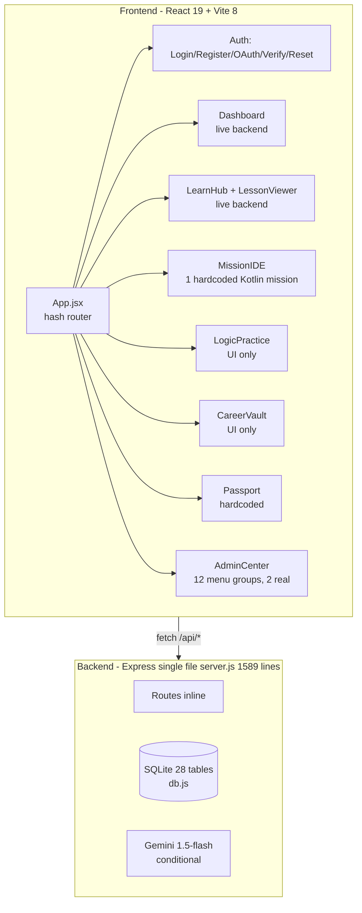
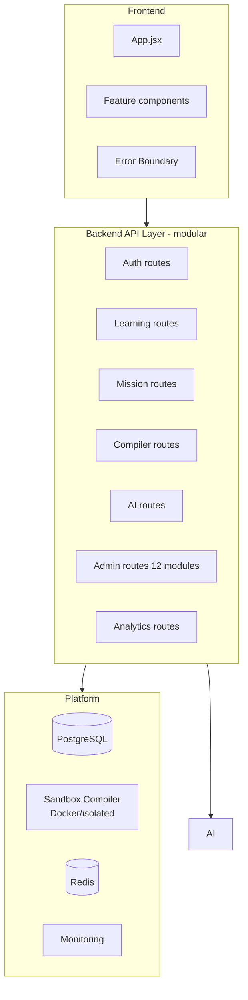

# Phases.doc.md — Atlas Master Implementation Roadmap

**Document Status:** Living roadmap — updated as milestones are completed.
**Last Updated:** 2026-09-04
**Source-of-Truth Hierarchy:** PRD.md > architecture.md > Design.md > Rules.md > Memory.md > intro.txt
**Scope:** A single master reference for HOW Atlas will be built, improved, tested, deployed, and maintained across **Phase 0 through Phase 17**.
**Companion Documents:** `PRD.md` (what/why), `architecture.md` (how/system), `rules.md` (constraints), `todo` (progress tracker).

> **CRITICAL HONESTY RULE**
>
> This roadmap distinguishes THREE states at all times, without exception:
> - **CURRENT** — what is actually implemented and working in the codebase today
> - **TARGET / PRODUCTION** — the desired end-state this roadmap will build toward
> - **FUTURE** — deliberately deferred, out of MVP scope
>
> Completion of a **UI shell does NOT mean a feature is complete**. A nav item is not a module. A chatbot box is not AI. A benchmark simulator is not a compiler. Progress is recorded truthfully (⬜/🟡/🟢/🔴/⚠️/🔵). Percent completion is only reported when derived from actual implemented behavior. Where current state is unclear, the marker is `Unknown`, never a fabricated number.

---

## Table of Contents

1. [Document Purpose & Governance](#1-document-purpose--governance)
2. [Terminology & Concepts](#2-terminology--concepts)
3. [Source-of-Truth & Phase Mapping](#3-source-of-truth--phase-mapping)
4. [Status Legend & DoD Compliance](#4-status-legend--dod-compliance)
5. [Phase Overview (0–17)](#5-phase-overview-017)
6. [Architecture Diagrams (Mermaid)](#6-architecture-diagrams-mermaid)
7. [Phase 0 — Foundation & Governance](#7-phase-0--foundation--governance)
8. [Phase 1 — Repository, Env & Tooling](#8-phase-1--repository-env--tooling)
9. [Phase 2 — Database & Backend Foundation](#9-phase-2--database--backend-foundation)
10. [Phase 3 — Authentication & Security](#10-phase-3--authentication--security)
11. [Phase 4 — Onboarding & Dashboard](#11-phase-4--onboarding--dashboard)
12. [Phase 5 — Learning System (Tracks/Lessons)](#12-phase-5--learning-system-trackslessons)
13. [Phase 6 — Mission Engine & Code Workspace](#13-phase-6--mission-engine--code-workspace)
14. [Phase 7 — Compiler / Execution Platform](#14-phase-7--compiler--execution-platform)
15. [Phase 8 — AI Mentor & Guide/Simplify/Hints](#15-phase-8--ai-mentor--guidesimplifyhints)
16. [Phase 9 — Adaptive Learning, Gamification & Passport](#16-phase-9--adaptive-learning-gamification--passport)
17. [Phase 10 — Admin Control Center (All 12 Modules)](#17-phase-10--admin-control-center-all-12-modules)
18. [Phase 11 — Analytics & Notifications](#18-phase-11--analytics--notifications)
19. [Phase 12 — Testing & CI/CD](#19-phase-12--testing--cicd)
20. [Phase 13 — Security Hardening & Audit](#20-phase-13--security-hardening--audit)
21. [Phase 14 — Deployment & Production OAuth](#21-phase-14--deployment--production-oauth)
22. [Phase 15 — Production Infrastructure & Monitoring](#22-phase-15--production-infrastructure--monitoring)
23. [Phase 16 — MVP Final QA, Soft Launch & Release](#23-phase-16--mvp-final-qa-soft-launch--release)
24. [Phase 17 — Post-Launch Growth & Future Roadmap](#24-phase-17--post-launch-growth--future-roadmap)
25. [Cross-Phase Technical Debt Register](#25-cross-phase-technical-debt-register)
26. [Cross-Phase Risk Register](#26-cross-phase-risk-register)
27. [Milestones & Release Strategy](#27-milestones--release-strategy)
28. [MVP vs Future Separation](#28-mvp-vs-future-separation)
29. [Definition of Done](#29-definition-of-done)
30. [Bug & Issue Classification](#30-bug--issue-classification)
31. [Master TODO (Rollup)](#31-master-todo-rollup)
32. [Conflict Register](#32-conflict-register)
33. [What Next? — Immediate Actions](#33-what-next--immediate-actions)
34. [Changelog](#34-changelog)
35. [Owner & Contacts](#35-owner--contacts)

---

## 1. Document Purpose & Governance

### 1.1 Purpose

This document is the **master implementation roadmap** for Atlas. Where `architecture.md` describes the system and `rules.md` describes the constraints, this document defines the **sequence of work** — phase by phase, task by task — from the current prototype state all the way to a maintainable, tested, production-ready product.

It answers: **"In what order do we build Atlas, and what does 'done' mean for each step?"**

### 1.2 How to Use This Document

| Role | How to use |
|------|-----------|
| Contributor / Agent | Pick the next open task from the current phase; track against the `todo` file; obey `rules.md` |
| Reviewer | Use the Definition of Done (Section 29) and Phase Gates to gate each phase |
| Maintainer | Update the `Master TODO` (Section 31) and Changelog (Section 34) as work is completed |
| Product Owner | Use Milestones & Release Strategy (Section 27) and MVP vs Future (Section 28) to triage scope |

### 1.3 Governance

- Phase order is intentional. **Do not skip a phase gate** unless the gate is explicitly waived with written justification in the Conflict Register (Section 32).
- Phases are not strictly sequential — some technical phases overlap (e.g., testing begins in Phase 2, not Phase 12). Where overlap is intentional, it is noted.
- Task IDs are stable identifiers. **A completed task may be revised, but its ID is never deleted** — it is moved to the Changelog (Section 34).
- All claims about CURRENT state in this document trace to actual code (file:line references). Claims attributed to TARGET/FUTURE are plans, not facts.

---

## 2. Terminology & Concepts

| Term | Definition |
|------|------------|
| **CURRENT** | Actually implemented and working in the codebase today |
| **TARGET / PRODUCTION** | Planned desired end-state; what this roadmap builds toward |
| **FUTURE** | Deliberately deferred; documented but not scheduled for MVP |
| **MVP** | Minimum Viable Product per PRD §34 scope lock |
| **ACC** | Atlas Control Center (admin panel) — 12 modules catalogued in Phase 10 |
| **EME** | Engineering Mission Engine (core differentiator) |
| **ALE** | Adaptive Learning Engine (intelligence layer, future/Phase 9 target) |
| **Guide Mode / Simplify Mode / Hint System** | Progressive guidance features (Phase 8) |
| **Passport** | Learner portfolio/verification profile (Phase 9) |
| **SRS** | Spaced Repetition System (Phase 9) |
| **Task ID** | Stable identifier, format `{Phase}-{Module?}-{Seq}`, e.g., `T3-AUTH-01` |
| **Phase Gate** | A hard acceptance checkpoint before the next phase begins |

**Roles in use (CURRENT):** `Student`, `jr architect`, `guider`, `mentor`, `admin`, `super admin`. Roles use spaces (e.g., `'super admin'`).

---

## 3. Source-of-Truth & Phase Mapping

### 3.1 Hierarchy

```
PRD.md          = Product requirements and scope (highest authority)
architecture.md = Technical architecture and implementation decisions
Design.md       = Visual/UX system (NOT yet created)
Rules.md        = Engineering rules and constraints
Memory.md       = Persistent decisions/context (NOT yet created)
intro.txt       = Onboarding/context summary
phases.doc.md   = This document: the ordered build plan (implementation-focused)
```

### 3.2 Reconciling Phase Numbering (IMPORTANT — documented conflict)

The existing documents already contain two different phase schemes. This document introduces a third (authoritative build sequence). This is a **documented mapping, not a silent override**.

| Phase scheme | Source | Granularity |
|--------------|--------|-------------|
| **Phase 0–17** (this doc) | phases.doc.md | Master build sequence for the whole lifecycle |
| **Phase 1–5** | architecture.md §41 | Micro-phases for the *technical foundation* work (Foundation, Security, Production Infra, Compiler & AI, Production Readiness) |
| **Phase 1–6** | PRD.md §3 | Product evolution phases (Foundations, AI Learning, Simulator, Collaboration, Hiring, Ecosystem) |

**Mapping (this document ↔ architecture.md §41):**

| phases.doc.md | architecture.md §41 analog |
|---------------|-----------------------------|
| Phase 1 (Repository, Env & Tooling) | Phase 1 (Foundation) |
| Phase 3 (Auth & Security) — partial | Phase 2 (Security & Reliability) |
| Phase 15 (Prod Infrastructure) | Phase 3 (Production Infrastructure) |
| Phase 7 (Compiler/Execution) | Phase 4 (Compiler & AI) — compiler half |
| Phase 8 (AI Mentor) | Phase 4 (Compiler & AI) — AI half |
| Phase 15–16 (Prod Readiness) | Phase 5 (Production Readiness) |

**Mapping (this document ↔ PRD.md §3 product phases):**

| phases.doc.md | PRD.md §3 analog |
|---------------|------------------|
| Phase 0–16 (build to MVP) | Phase 1 — Foundations |
| Phase 17 (post-launch) | Phases 2–6 (AI Learning, Simulator, Collaboration, Hiring, Ecosystem) — all FUTURE |

> **Guidance:** When a task in this document maps to an existing architecture.md §41 item, both are tracked. The phases.doc.md numbering is the **master**; architecture.md §41 remains a subset view. A future cleanup should harmonize the two (see Conflict Register #CR-01).

---

## 4. Status Legend & DoD Compliance

### 4.1 Status Markers

| Marker | Meaning |
|--------|---------|
| ⬜ **NOT STARTED** | No work begun |
| 🟡 **IN PROGRESS** | Work actively underway (partially complete); never claim completion on UI-only progress |
| 🟢 **COMPLETED** | Meets Definition of Done (Section 29) — backend behavior + validation present |
| 🔴 **BLOCKED** | Blocked by an external or ordering dependency |
| ⚠️ **TECHNICAL DEBT** | Functionally present but known to violate rules.md or be substandard; flagged for remediation |
| 🔵 **PROTOTYPE** | Demonstrative/simulated; must be replaced before production |
| **TARGET** | Planned desired state, not yet built |
| `Unknown` | State not confidently determinable; no fabricated figure |

### 4.2 The Honesty Rules (apply to EVERY task in this document)

1. **A UI shell is not a feature.** Presence of a nav item, tab, or panel does not equal implementation.
2. **A compiler is not complete while only a keyword-match benchmark simulator exists.** (CURRENT: `/api/missions/execute` checks for `Trie`/`TrieNode`/`buildIndex` substrings — server.js:830. No real compilation.)
3. **AI is not complete because a chatbot UI exists.** (CURRENT: `/api/mentor/chat` calls Gemini only if `GEMINI_API_KEY` is set, else falls back to hardcoded keyword replies — server.js:913–934.)
4. **An admin module is not complete because its navigation exists.** (CURRENT: AdminCenter has 12 menu groupings, but only Security Tags CRUD + role dropdown are backed by real endpoints; the rest are simulated panels.)
5. **No fabricated completion percentages.** Use `Partial`, `Prototype`, `Unknown`, or the status markers above — never a number invented for appearance.

---

## 5. Phase Overview (0–17)

| Phase | Title | Core Deliverable | Gate |
|-------|-------|------------------|------|
| 0 | Foundation & Governance | Docs governance, truthful baselining, MVP scope lock | G0 |
| 1 | Repository, Env & Tooling | Clean repo, env config, secrets hygiene, tooling | G1 |
| 2 | Database & Backend Foundation | Schema management, modular server, validation, first tests | G2 |
| 3 | Authentication & Security | Secure auth (cookies), OAuth fix, session hardening | G3 |
| 4 | Onboarding & Dashboard | Real onboarding + live dashboard | G4 |
| 5 | Learning System | Tracks/lessons content + progress (real backend) | G5 |
| 6 | Mission Engine & Code Workspace | Real multi-mission engine + IDE | G6 |
| 7 | Compiler / Execution Platform | Real sandbox compiler replacing simulator | G7 |
| 8 | AI Mentor & Guide/Simplify/Hints | Real AI integration + progressive guidance | G8 |
| 9 | Adaptive Learning, Gamification & Passport | ALE, XP/badges, real passport | G9 |
| 10 | Admin Control Center (12 modules) | All 12 admin modules with real backends | G10 |
| 11 | Analytics & Notifications | Analytics + notification engine | G11 |
| 12 | Testing & CI/CD | Automated test suite + CI pipeline | G12 |
| 13 | Security Hardening & Audit | Hardening + audit + pen-review | G13 |
| 14 | Deployment & Production OAuth | Deploy + production OAuth | G14 |
| 15 | Production Infrastructure & Monitoring | PostgreSQL/monitoring/scaling | G15 |
| 16 | MVP Final QA, Soft Launch & Release | MVP release + QA | G16 |
| 17 | Post-Launch Growth & Future | Roadmap execution + future phases | G17 |

**Relative criticality:** Phases 0–3 are **critical path** (foundation). Phases 6–7 are **core value** (the EME + compiler). Phases 10–12 are **platform-completing**. Phases 14–16 are **shipping**.

---

## 6. Architecture Diagrams (Mermaid)

### 6.1 Phase Dependency & Gate Flow

```mermaid
graph LR
    P0[Phase 0<br/>Foundation] -->|G0| P1[Phase 1<br/>Repo & Env]
    P1 -->|G1| P2[Phase 2<br/>DB & Backend]
    P2 -->|G2| P3[Phase 3<br/>Auth & Security]
    P3 -->|G3| P4[Phase 4<br/>Onboarding & Dashboard]
    P4 -->|G4| P5[Phase 5<br/>Learning System]
    P4 -->|G4| P6[Phase 6<br/>Mission Engine & IDE]
    P5 -->|G5| P6
    P6 -->|G6| P7[Phase 7<br/>Compiler/Execution]
    P5 -->|G5| P8[Phase 8<br/>AI Mentor & Guidance]
    P6 -->|G6| P8
    P7 -->|G7| P8
    P5 -->|G5| P9[Phase 9<br/>ALE, Gamification, Passport]
    P6 -->|G6| P9
    P7 -->|G7| P9
    P8 -->|G8| P9
    P9 -->|G9| P10[Phase 10<br/>Admin Control Center]
    P10 -->|G10| P11[Phase 11<br/>Analytics & Notifications]
    P11 -->|G11| P12[Phase 12<br/>Testing & CI/CD]
    P12 -->|G12| P13[Phase 13<br/>Security Hardening]
    P13 -->|G13| P14[Phase 14<br/>Deployment & Prod OAuth]
    P14 -->|G14| P15[Phase 15<br/>Prod Infra & Monitoring]
    P15 -->|G15| P16[Phase 16<br/>QA, Launch & Release]
    P16 -->|G16| P17[Phase 17<br/>Growth & Future]
```



### 6.2 Current Prototype State (what exists today)



### 6.3 Target Production State (what this roadmap builds)



---

## 7. Phase 0 — Foundation & Governance

**Summary:** Establish truthful baselining, governance, scope lock, and a zero-honesty audit of what actually exists. No feature code is written in Phase 0.

### 7.1 Tasks

| Task ID | Task | Priority | Status | Notes / Evidence |
|---------|------|----------|--------|------------------|
| T0-FND-01 | Confirm source-of-truth hierarchy and doc status | High | 🟢 | rules.md §3 |
| T0-FND-02 | Establish truthful CURRENT-vs-TARGET baselining guidelines | High | 🟢 | This document §4.2 |
| T0-FND-03 | Resolve MVP scope lock per PRD §34 | High | 🟢 | PRD.md:2752; matches `todo` §2 |
| T0-FND-04 | Audit repo and document actual tech stack | High | 🟢 | React 19.2.8, Vite 8.2.0, Express 4.21.2, SQLite (sqlite+sqlite3), no TS/Tailwind/Router |
| T0-FND-05 | Inventory all tables and endpoints; correct inaccuracies (e.g., 28 tables not 24) | High | 🟢 | db.js 28 tables; server.js endpoints §1–24 |
| T0-FND-06 | Classify every frontend component as Functional/Partial/UI-only | Medium | 🟢 | See §4; Passport/LogicPractice/CareerVault = UI-only |
| T0-FND-07 | Record the GitHub OAuth `redirect_uri` issue and its location | High | 🟢 | todo §4 "Current GitHub Issue" |
| T0-FND-08 | Create `Design.md` and `Memory.md` (currently absent) | Medium | ⬜ | Source-of-truth lists both; neither exists |
| T0-FND-09 | Create `.env.example` files for frontend and backend | High | ⬜ | rules.md mandates; architecture.md §41 P1 item |

**CURRENT state note:** Authentication, Dashboard, Learning Hub/Lessons, Mission IDE (single mission), and Account Settings have real backend wiring. Passport, LogicPractice, and CareerVault are UI-only prototypes. AdminCenter is a nav shell with 2 real functions.

### 7.2 Phase Gate G0 — Exits Phase 0

- [ ] All T0-FND tasks either complete or have a written waiver in the Conflict Register.
- [ ] Repo has a truthful, current baseline (no fabricated completions).
- [ ] MVP scope is locked and matches `todo` §2.

---

## 8. Phase 1 — Repository, Env & Tooling

**Summary:** Clean repository hygiene, environment configuration, secret management, and developer tooling so subsequent phases build on solid ground.

### 8.1 Tasks

| Task ID | Task | Priority | Status | Notes / Evidence |
|---------|------|----------|--------|------------------|
| T1-REPO-01 | Finalize Git workflow & branching model | High | 🟡 | `todo` §3 |
| T1-REPO-02 | Verify `.gitignore` (currently ignores node_modules/.env/*.sqlite/*.db/.DS_Store) | High | 🟢 | .gitignore |
| T1-REPO-03 | Confirm no secrets committed; remove hardcoded fallback secrets | Critical | 🔴 | server.js:45,58,68-69; rules.md §25 |
| T1-REPO-04 | Create `.env.example` (frontend + backend) | High | ⬜ | Duplicate of T0-FND-09; single source |
| T1-REPO-05 | Add env validation on server start (fail-fast if required vars missing in prod) | High | ⬜ | rules.md §24 |
| T1-REPO-06 | Standardize `localStorage.getItem('token')` vs `accessToken` prop mismatch | Medium | ⚠️ | AdminCenter.jsx:53,68,94 vs others |
| T1-REPO-07 | Add oxlint + type awareness (oxlintrc exists; no TS) | Medium | 🟣 | frontend/.oxlintrc.json; no tsc |
| T1-REPO-08 | Document local dev setup in README (runner scripts exist) | Medium | 🟡 | root package.json scripts |
| T1-REPO-09 | Pin/audit dependency versions; document versions | Medium | ⬜ | uuid v14, express-session, passport |
| T1-REPO-10 | Configure frontend dev proxy to backend to avoid CORS hacks in dev | Medium | ⬜ | vite.config.js has no proxy |

### 8.2 Phase Gate G1 — Exits Phase 1

- [ ] No hardcoded fallback secrets remain in production paths.
- [ ] Env config documented; `.env.example` present.
- [ ] Repo and lint tooling verified to run.

---

## 9. Phase 2 — Database & Backend Foundation

**Summary:** Turn the monolithic single-file Express server into a maintainable, validated, tested backend with a schema management story.

### 9.1 Tasks

| Task ID | Task | Priority | Status | Notes / Evidence |
|---------|------|----------|--------|------------------|
| T2-DB-01 | Choose and document DB strategy (SQLite now → PostgreSQL target) | High | 🟡 | rules.md §10-11; PRD targets PG |
| T2-DB-02 | Introduce schema management / migrations (none exist today) | High | ⬜ | db.js uses CREATE TABLE IF NOT EXISTS with no migration tracking |
| T2-DB-03 | Add indexes on hot query columns (none exist today) | High | ⬜ | rules.md §51 |
| T2-DB-04 | Add foreign key + constraint audit across 28 tables | Medium | ⬜ | db.js |
| T2-DB-05 | Split `server.js` into modular route files | High | ⬜ | architecture.md §41 Phase 1; current single file 1589 lines |
| T2-DB-06 | Add a global error handler middleware | High | ⬜ | none exists |
| T2-DB-07 | Add request body validation (zod) | High | ⬜ | rules.md §12; architecture.md §41 |
| T2-DB-08 | Add centralized data-access layer for DB queries | Medium | ⬜ | queries inline in server.js |
| T2-DB-09 | Add a basic test suite (Vitest) for pure helpers/schema | High | ⬜ | no test framework installed |
| T2-DB-10 | Seed data review: classify seed vs live data; never commit real credentials | High | 🟡 | db.js seeds demo users with passwords |
| T2-DB-11 | Add CORS origin restriction (currently bare `app.use(cors())`) | High | ⬜ | server.js:22; rules.md §19.3 |

### 9.2 Phase Gate G2 — Exits Phase 2

- [ ] Server starts from modular structure (not a single 1589-line file).
- [ ] Global error handler + validation + CORS restriction present.
- [ ] At least a minimal test suite runs green.
- [ ] Schema changes are tracked (migrations) with no data loss on upgrade.

---

## 10. Phase 3 — Authentication & Security

**Summary:** Harden authentication — currently JWT with localStorage storage and tokens in URL query params, plus a broken GitHub OAuth. Move to secure token handling and fix OAuth end-to-end.

### 10.1 Tasks

| Task ID | Task | Priority | Status | Notes / Evidence |
|---------|------|----------|--------|------------------|
| T3-AUTH-01 | Move access token from localStorage to httpOnly/samesite cookie | Critical | ⚠️ | rules.md §15.3/§18.4; tokens currently in localStorage |
| T3-AUTH-02 | Stop passing tokens in URL query params on OAuth redirect | Critical | 🔴 | server.js:613,632 redirect with `?accessToken=` |
| T3-AUTH-03 | Fix GitHub OAuth `redirect_uri is not associated with this app` | High | 🔴 | todo §4; callback hardcoded localhost (server.js:59) |
| T3-AUTH-04 | Make Google/GitHub callback URLs configurable per environment | High | 🔴 | server.js:47,59 use env or localhost hardcode |
| T3-AUTH-05 | Add CSRF protection | High | ⬜ | rules.md §19.4 |
| T3-AUTH-06 | Add helmet security headers | High | ⬜ | not installed |
| T3-AUTH-07 | Add global rate limiting (beyond login brute-force map) | High | ⬜ | only login limiter exists (server.js:94) |
| T3-AUTH-08 | Add request logging (e.g., Pino/Morgan) | Medium | ⬜ | not installed |
| T3-AUTH-09 | Add refresh-token rotation + revocation checks (rotation not implemented) | High | ⬜ | refresh inserts new token but no rotation |
| T3-AUTH-10 | Audit session management: session expiry, force-logout, device mgmt | Medium | ⬜ | sessions table; rules.md §17 |
| T3-AUTH-11 | Fix role case/space normalization (roles use spaces) | Medium | ⚠️ | authorizeRoles lowercases; role values like `'super admin'` |
| T3-AUTH-12 | Add email delivery service (today emails are console.log only) | Medium | ⬜ | server.js:241-244, 486-487, 315-318 print localhost links |

### 10.2 Phase Gate G3 — Exits Phase 3

- [ ] No tokens in URL or localStorage for production flow.
- [ ] GitHub + Google OAuth work end-to-end in dev and are environment-configurable.
- [ ] CSRF + helmet + rate limiting present.
- [ ] Email verification/password reset actually dispatch (not console-only).

---

## 11. Phase 4 — Onboarding & Dashboard

**Summary:** Replace the student keypad bypass with real onboarding, and make the dashboard data truthful (remove hardcoded insight).

### 11.1 Tasks

| Task ID | Task | Priority | Status | Notes / Evidence |
|---------|------|----------|--------|------------------|
| T4-ONB-01 | Implement real student onboarding (currently keypad uses hardcoded temp password `PassWord123!_keypad` and auto-verify) | High | 🔵 | App.jsx:177-222 |
| T4-ONB-02 | Persist onboarding wizard profile correctly to backend | High | 🟡 | OnboardingWizard; PUT /api/auth/profile |
| T4-ONB-03 | Make onboarding collect career goal, skill level, daily time, track per PRD | High | 🟡 | PRD §FR-ONBOARD-001 |
| T4-ONB-04 | Remove the client-side student 4-digit bypass (Onboarding.jsx:82-87) | High | 🔵 | Onboarding.jsx |
| T4-ONB-05 | Replace hardcoded "Engineering Insights" text with backend-driven insight | Medium | ⚠️ | Dashboard.jsx:696-699 |
| T4-ONB-06 | Make dashboard analytics truthful (currently mock data in /api/dashboard/summary) | Medium | ⚠️ | server.js:1003-1013 mock analytics |
| T4-ONB-07 | Persist today-plan / goals / streak (streak is hardcoded `5`) | Medium | ⚠️ | server.js:1018 `streak: 5` |
| T4-ONB-08 | Keep/deliver the 30s heartbeat system | Low | 🟢 | Dashboard.jsx:87,101 |

### 11.2 Phase Gate G4 — Exits Phase 4

- [ ] New users complete a real personalized onboarding with no keypad bypass.
- [ ] Dashboard shows no hardcoded/mock analytics or insights.
- [ ] Streak, goals, and plan derive from persisted user data.

---

## 12. Phase 5 — Learning System (Tracks/Lessons)

**Summary:** The learning backend already exists and is functional. Expand content, fix gaps (spaced-repetition stub, missing tables), and improve progress handling.

### 12.1 Tasks

| Task ID | Task | Priority | Status | Notes / Evidence |
|---------|------|----------|--------|------------------|
| T5-LRN-01 | Expand seeded tracks/modules/lessons to PRD Phase 1 scope (Java, Kotlin, Android, Compose, Git, SQL, REST, DB, Fundamentals) | High | 🟡 | PRD §7; db.js seeds only android/backend |
| T5-LRN-02 | Implement true content management (author/CRUD for tracks/courses/lessons) | High | ⬜ | no create/update endpoints |
| T5-LRN-03 | Implement real spaced-repetition (SRS) — currently `/api/revision/rate` is a stub | Medium | 🔵 | server.js:1546-1551 returns stub; no `user_flashcards` table |
| T5-LRN-04 | Add `mission_steps` support or generalize lesson/mission step model | Medium | ⬜ | no mission_steps table; missions have status |
| T5-LRN-05 | Validate quiz submission server-side (currently trusts client `score`) | Medium | ⚠️ | server.js:1554 trusts client score |
| T5-LRN-06 | Persist revision_queue state correctly (interval math) | Medium | ⬜ | interval always set to 1 (server.js:1416-1419) |
| T5-LRN-07 | Add lesson analytics (viewed, time, retries) | Medium | ⬜ | PRD §FR-LEARN-002 |
| T5-LRN-08 | Add `UserActivityLogger`/concept mastery tracking hooks for ALE | Medium | ⬜ | future ALE foundation |
| T5-LRN-09 | Keep functional progress/notes/bookmarks endpoints (already live) intact | Low | 🟢 | server.js §§1236-1584 |

### 12.2 Phase Gate G5 — Exits Phase 5

- [ ] Learning tracks cover PRD Phase 1 scope.
- [ ] SRS actually updates review dates (no stub).
- [ ] Progress, notes, bookmarks, quizzes verified end-to-end.

---

## 13. Phase 6 — Mission Engine & Code Workspace

**Summary:** The MissionIDE currently hardcodes exactly one Kotlin mission and the execute endpoint is a keyword simulator. Build a real multi-mission engine.

### 13.1 Tasks

| Task ID | Task | Priority | Status | Notes / Evidence |
|---------|------|----------|--------|------------------|
| T6-MIS-01 | Introduce a real mission data model (multiple missions, steps, stories, prerequisites, constraints) | High | 🔵 | MissionIDE.jsx:14-122 hardcodes one mission |
| T6-MIS-02 | Add mission discovery/listing endpoint + UI | High | ⬜ | PRD §FR-MISSION-001 |
| T6-MIS-03 | Add mission detail endpoint (story, requirements, objectives, deliverables, success criteria) | High | ⬜ | PRD §FR-MISSION-002 |
| T6-MIS-04 | Replace monolithic `MissionIDE.jsx` file tree with data-driven multi-file mission loading | High | 🔵 | hardcoded files MissionIDE.jsx:16-121 |
| T6-MIS-05 | Add mission submission, attempts, and review lifecycle | High | ⬜ | PRD §9 Mission Engine |
| T6-MIS-06 | Replace the keyword-match success check at `/api/missions/execute` | Critical | 🔵 | server.js:830 checks `Trie` substring |
| T6-MIS-07 | Add Engineering Thinking Canvas (pre-code planning phase) | Medium | ⬜ | PRD §12.12 |
| T6-MIS-08 | Add progressive Hint System (6 levels) with XP modifier | High | ⬜ | PRD §12.11; todo §13 |
| T6-MIS-09 | Add mission story templates / story universe scaffolding | Low | ⬜ | FUTURE-aligned seed |
| T6-MIS-10 | Persist mission reflection and portfolio artifact generation | Medium | ⬜ | PRD §9 |

### 13.2 Phase Gate G6 — Exits Phase 6

- [ ] Multiple distinct missions can be discovered, loaded, and submitted.
- [ ] Mission lifecycle (attempts, review, reflection, XP/portfolio) is functional.
- [ ] Success is determined by real submission validation, not string matching.

---

## 14. Phase 7 — Compiler / Execution Platform

**Summary:** Build a real isolated execution platform. Today's "compiler" is a benchmark simulator that fabricates latency/memory via `Math.random()` (server.js:846-882).

### 14.1 Tasks

| Task ID | Task | Priority | Status | Notes / Evidence |
|---------|------|----------|--------|------------------|
| T7-COM-01 | Design sandbox compiler architecture (Docker isolation, resource limits, timeouts) | Critical | 🔵 | PRD §12.14; todo §15 |
| T7-COM-02 | Replace fabricated benchmark logs/latency/memory with real measurements | Critical | 🔵 | server.js:846-879 uses Math.random |
| T7-COM-03 | Implement execution queue + worker model | High | ⬜ | todo §15 |
| T7-COM-04 | Implement hidden test harness (assertions beyond latency budget) | High | ⬜ | PRD §12.15 |
| T7-COM-05 | Support Phase 1 languages per PRD (Kotlin minimum; Java, Python, JS, TS, C++, Go as rollout) | Medium | ⬜ | todo §15 Phase 1 languages |
| T7-COM-06 | Add timeout + memory limits + sandbox cleanup + security monitoring | High | ⬜ | rules.md §40 |
| T7-COM-07 | Stream real execution output (WebSocket or SSE) | Medium | ⬜ | architecture.md §41 P4 |
| T7-COM-08 | Add usage/cost tracking and per-user submission rate limits | Medium | ⬜ | rules.md §21 |
| T7-COM-09 | Disable/flag the prototype simulator in production; never present it as real | Critical | 🔵 | honesty rule §4.2 |

### 14.2 Phase Gate G7 — Exits Phase 7

- [ ] At least Kotlin missions execute in an isolated sandbox with real measurements.
- [ ] Hidden tests run; timeouts/memory limits enforced.
- [ ] The keyword-match simulator is replaced or explicitly disabled in production.

---

## 15. Phase 8 — AI Mentor & Guide/Simplify/Hints

**Summary:** Build real AI behavior. Today AI is a conditional chatbot with a hardcoded keyword fallback; Guide/Simplify modes exist as admin sliders, not learner features.

### 15.1 Tasks

| Task ID | Task | Priority | Status | Notes / Evidence |
|---------|------|----------|--------|------------------|
| T8-AI-01 | Create a dedicated AI service (prompt library, model config, error handling, usage tracking) | High | 🔵 | AI logic inline server.js:903-945 |
| T8-AI-02 | Add AI conversation context/memory (currently stateless per message) | High | ⬜ | rules.md §35-38 |
| T8-AI-03 | Replace hardcoded keyword fallback with defined graceful-degradation policy | Medium | 🔵 | server.js:927-934 |
| T8-AI-04 | Implement AI code review (post-submission) | High | ⬜ | PRD §12.17; todo §16 |
| T8-AI-05 | Implement Guide Mode as a real learner feature (requirement clarification, partial guidance, no full solution) | High | 🔵 | PRD §12.9 |
| T8-AI-06 | Implement Simplify Mode (stage generation, current stage, completion, dynamic sub-stages, recovery) | High | 🔵 | PRD §12.10 |
| T8-AI-07 | Implement progressive Hint System (6 levels) with XP/score modifiers | High | 🔵 | PRD §12.11 |
| T8-AI-08 | Add AI usage budgets, rate limiting, and cost tracking | Medium | ⬜ | rules.md §21; PRD risk |
| T8-AI-09 | Add AI safety/guardrails (PII, plagiarism checks are admin mocks today) | Medium | 🔵 | AdminCenter.jsx:582-599 panels (static) |
| T8-AI-10 | Keep `/api/mentor/chat` history intact and verified | Low | 🟢 | server.js:893-900, 903-945 |

### 15.2 Phase Gate G8 — Exits Phase 8

- [ ] AI mentor/review has real context and graceful degradation.
- [ ] Guide Mode, Simplify Mode, and 6-level Hints work end-to-end in the learner flow.
- [ ] AI costs and safety are controlled.

---

## 16. Phase 9 — Adaptive Learning, Gamification & Passport

**Summary:** Make XP/levels real, build the Adaptive Learning Engine, and replace the hardcoded Passport with a truthful, shareable, verifiable learner profile.

### 16.1 Tasks

| Task ID | Task | Priority | Status | Notes / Evidence |
|---------|------|----------|--------|------------------|
| T9-ALE-01 | Implement Adaptive Learning Engine concepts (knowledge graph, mastery, weak/strong concepts) | High | ⬜ | PRD §12.18/§12.19; FUTURE-aligned but starts here |
| T9-ALE-02 | Derive XP/level from real activity (XP is incremented today but not fully auditable) | Medium | ⚠️ | server.js brandishes +800 XP etc. |
| T9-ALE-03 | Implement badges, streaks, milestones (streak currently hardcoded 5) | Medium | ⚠️ | server.js:1018 |
| T9-ALE-04 | Keep XP ≠ Mastery ≠ Experience separation per PRD | Medium | ⬜ | PRD §18; todo §18 |
| T9-PORT-01 | Replace hardcoded Passport ID `SECURE_NODE_0x78B9` with per-user persisted ID | Critical | 🔵 | Passport.jsx:24 |
| T9-PORT-02 | Build real passport data from user achievements/missions/lessons | High | 🔵 | Passport.jsx hardcodes accomplishments at :50-98 |
| T9-PORT-03 | Replace hardcoded share URL `https://atlas.dev/passport/{username}` with working public route | High | 🔵 | Passport.jsx:9; no backend serves it |
| T9-PORT-04 | Make passport metrics (XP, missions passed, code quality, compiles) truthful | High | 🔵 | Passport.jsx:126-140 hardcoded |
| T9-PORT-05 | Add public passport profile URL + recruiter view (FUTURE: hiring) | Medium | ⬜ | PRD §19 |
| T9-PORT-06 | Replace fictitious static resume in CareerVault with generated resume from real data | Medium | 🔵 | CareerVault.jsx:161-213 hardcoded; "4,250 XP" fabricated |

### 16.2 Phase Gate G9 — Exits Phase 9

- [ ] Passport ID, metrics, share URL, and accomplishments are real and per-user.
- [ ] XP/levels/badges derive from auditable activity.
- [ ] ALE produces recommendations from real mastery data (no mock analytics).

---

## 17. Phase 10 — Admin Control Center (All 12 Modules)

**Summary:** The ACC (AdminCenter.jsx) has 12 menu groupings, but only **Users→Security Tags CRUD** and the **role dropdown** have real backends. Everything else is a simulated panel. This phase builds real admin modules one by one.

### 17.1 The 12 Admin Modules Inventory

| # | Module | Current Real Backend? | Evidence |
|---|--------|----------------------|----------|
| 1 | Dashboard (Overview, System Status) | No — simulated stats ("1,248 active learners", mocked chart) | AdminCenter.jsx:343-419 |
| 2 | Users (Students, Mentors, Companies, Universities, Admins, Security Tags) | **Partial** — real role dropdown + Security Tags CRUD via `/api/users`, `/api/tags`; Companies/Universities are empty | AdminCenter.jsx:422-535; server.js:710-816 |
| 3 | Learning (Paths, Courses, Lessons, Roadmaps) | No — static text | AdminCenter.jsx:537-551 |
| 4 | Mission Studio (Missions, Templates, Stories, Guide, Simplify, AI Prompts, Hidden Tests) | No — static sliders/asserts | AdminCenter.jsx:553-579 |
| 5 | AI Management (Prompt Library, Models, Memory, Evaluation, Safety) | No — static flags | AdminCenter.jsx:581-599 |
| 6 | Compiler (Queues, Workers, Images, Performance, Errors) | No — simulated queues | AdminCenter.jsx:601-617 |
| 7 | Analytics (Learning, Business, AI, Hiring, Infra) | No — fallback panel | AdminCenter.jsx:686-705 |
| 8 | Community (Posts, Comments, Reports, Moderation) | No — fallback panel | AdminCenter.jsx:686-705 |
| 9 | Hiring Portal (Companies, Jobs, Assessments, Recruiters) | No — fallback panel | AdminCenter.jsx:686-705 |
| 10 | Finance (Revenue, Payments, Refunds, Subscriptions) | No — fallback panel | AdminCenter.jsx:686-705 |
| 11 | Feature Flags (Experiments, A/B, Rollouts) | No — client-side React state only; not persisted | AdminCenter.jsx:619-668 |
| 12 | System (Logs, Monitoring, Deployments, Health, Backups) | No — mock log stream generated client-side | AdminCenter.jsx:670-684 |

**Admin API modules currently in server.js:** `/api/users`, `/api/users/:id/role`, `/api/tags`, `/api/tags/:name` (all RBAC-gated).

### 17.2 Tasks (one sub-module per real build)

| Task ID | Task | Priority | Status |
|---------|------|----------|--------|
| T10-ADM-01 | Standardize AdminCenter to use the `accessToken` prop (currently reads `localStorage.getItem('token')`) | High | ⚠️ |
| T10-ADM-02 | Build **Admin Dashboard** module with real server stats endpoint | High | ⬜ |
| T10-ADM-03 | Build **Users** module fully (real directory; Companies/Universities entities + CRUD) | High | 🟡 |
| T10-ADM-04 | Build **Security Tags** module to full Admin CRUD (already partial) | High | 🟡 |
| T10-ADM-05 | Build **Learning** module (course/lesson/track management CRUD backend) | High | ⬜ |
| T10-ADM-06 | Build **Mission Studio** module (mission builder, templates, hidden-test editor, guide/simplify config) | High | ⬜ |
| T10-ADM-07 | Build **AI Management** module (prompt library, model config, memory, evaluation, safety) backed by real settings | High | ⬜ |
| T10-ADM-08 | Build **Compiler** module (queues, workers, images, performance, errors from real platform) | High | ⬜ |
| T10-ADM-09 | Build **Analytics** module (real metrics from events, not mocked) | Medium | ⬜ |
| T10-ADM-10 | Build **Community** module (posts/comments/reports/moderation entities + CRUD) | Medium | ⬜ |
| T10-ADM-11 | Build **Hiring Portal** module (companies/jobs/assessments/recruiters) | Low | ⬜ |
| T10-ADM-12 | Build **Finance** module (revenue/payments/refunds/subscriptions) | Low | ⬜ |
| T10-ADM-13 | Persist **Feature Flags** module (server-side flags + rollouts, not React state) | High | 🔵 |
| T10-ADM-14 | Build **System** module (real logs, monitoring, health, backups, deployments) | Medium | ⬜ |
| T10-ADM-15 | Add admin audit-log viewer (audit_logs table exists) | Medium | ⬜ |
| T10-ADM-16 | Remove/replace all simulated "Node is nominal" fallback panels with real data or explicit empty states | High | 🔵 |
| T10-ADM-17 | RBAC review: ensure each admin endpoint has correct `authorizeRoles` | High | ⚠️ |

### 17.3 Phase Gate G10 — Exits Phase 10

- [ ] **All 12 admin modules** have real backend CRUD/settings; no simulated fallback panels remain.
- [ ] Feature flags persisted server-side.
- [ ] Every admin action writes an audit log.

---

## 18. Phase 11 — Analytics & Notifications

**Summary:** Move from mock analytics to a real analytics pipeline and a functional notification engine.

### 18.1 Tasks

| Task ID | Task | Priority | Status | Notes / Evidence |
|---------|------|----------|--------|------------------|
| T11-ANL-01 | Replace mock analytics in `/api/dashboard/summary` with real aggregated events | High | ⚠️ | server.js:1003-1013 |
| T11-ANL-02 | Add event tracking (register, login, mission, lesson, hint, guide, AI usage, compiler) | High | ⬜ | todo §29 |
| T11-ANL-03 | Add admin analytics dashboards fed from real metrics | Medium | ⬜ | T10-ADM-09 dependency |
| T11-ANL-04 | Expand notification engine (categories, read/unread exists; add dispatch triggers, preferences) | Medium | 🟡 | server.js:1169-1194 |
| T11-ANL-05 | Add notification live push (polling → optional push) | Medium | ⬜ | currently polling only |
| T11-ANL-06 | Add dashboards for API latency, errors, business metrics | Medium | ⬜ | PRD §12.25 |

### 18.2 Phase Gate G11 — Exits Phase 11

- [ ] Analytics derived from real tracked events; no mock data.
- [ ] Notifications have preferences + dispatch; admin views real metrics.

---

## 19. Phase 12 — Testing & CI/CD

**Summary:** Introduce automated testing and a CI pipeline. Today there is **no test framework, no test files, no `.github` directory**.

### 19.1 Tasks

| Task ID | Task | Priority | Status |
|---------|------|----------|--------|
| T12-TST-01 | Add backend unit + API test suite (Vitest/Supertest) for auth, learning, missions, sub-APIs | High | ⬜ |
| T12-TST-02 | Add frontend component + auth-flow tests (Vitest + Testing Library) | High | ⬜ |
| T12-TST-03 | Add integration tests for auth (register/login/OAuth/onboarding) | High | ⬜ |
| T12-TST-04 | Add mission/execution tests + hidden-test validation + sandbox security tests | High | ⬜ |
| T12-TST-05 | Add E2E tests (Playwright) for the learner journey | Medium | ⬜ |
| T12-TST-06 | Add perf tests (k6) for hot endpoints | Medium | ⬜ |
| T12-TST-07 | Create GitHub Actions CI (lint, typecheck, test, build) on PR | High | ⬜ |
| T12-TST-08 | Enforce CI in code review; link to rules.md §52-55 | High | ⬜ |

### 19.2 Phase Gate G12 — Exits Phase 12

- [ ] CI runs lint + tests + build on every PR; failing CI blocks merge.
- [ ] Auth, learning, mission, and execution have automated coverage.

---

## 20. Phase 13 — Security Hardening & Audit

**Summary:** Security audit and hardening of the now-feature-complete product.

### 20.1 Tasks

| Task ID | Task | Priority | Status |
|---------|------|----------|--------|
| T13-SEC-01 | Input sanitization + SQL-injection audit (queries use parameterization; verify all) | High | 🟡 |
| T13-SEC-02 | XSS audit (React escaping OK; localStorage token exposure addressed in T3-AUTH-01) | High | ⚠️ |
| T13-SEC-03 | Command-injection review around compiler sandbox | High | ⬜ |
| T13-SEC-04 | OAuth security review (token handling, state param) | High | ⚠️ |
| T13-SEC-05 | Secret management audit (hardcoded fallback secrets removed) | High | 🔴 |
| T13-SEC-06 | Audit-logs completeness review | Medium | ⬜ |
| T13-SEC-07 | External penetration / dependency vulnerability scan (npm audit) | High | ⬜ |
| T13-SEC-08 | Ensure no `.env`/secrets committed; re-verify git history | Critical | 🔴 |

### 20.2 Phase Gate G13 — Exits Phase 13

- [ ] All critical/high security findings resolved.
- [ ] No secrets in source or git history.
- [ ] Compiler sandbox passes security review.

---

## 21. Phase 14 — Deployment & Production OAuth

**Summary:** Deploy frontend (Vercel exists) + backend, wire production OAuth redirect URIs, and stand up production env config.

### 21.1 Tasks

| Task ID | Task | Priority | Status | Notes / Evidence |
|---------|------|----------|--------|------------------|
| T14-DEP-01 | Finalize backend hosting choice (Render/Railway/Fly/AWS ECS) | High | ⬜ | todo §26 |
| T14-DEP-02 | Deploy backend; configure production `.env` (no fallback secrets) | High | 🔴 | G3/G13 input |
| T14-DEP-03 | Configure production CORS + HTTPS | High | ⬜ | |
| T14-DEP-04 | Configure production Google OAuth redirect URI | High | 🔴 | |
| T14-DEP-05 | Configure production GitHub callback URL | High | 🔴 | current bug in dev |
| T14-DEP-06 | Configure production DB (SQLite → PG per Phase 15; interim SQLite accepted for soft-launch only) | High | ⬜ | |
| T14-DEP-07 | Update frontend/backend production environment vars | High | ⬜ | |
| T14-DEP-08 | Test production login (email, Google, GitHub), onboarding, learning, missions | High | ⬜ | |
| T14-DEP-09 | Configure domain (atlasdevhub.com candidate — not yet purchased) | Medium | ⬜ | todo §27 |
| T14-DEP-10 | Vercel SPA config verified (vercel.json rewrites exist) | Medium | 🟢 | frontend/vercel.json |

### 21.2 Phase Gate G14 — Exits Phase 14

- [ ] Backend and frontend deployed to production URLs.
- [ ] Production OAuth (Google + GitHub) work.
- [ ] Production login/onboarding/learning/mission flows verified.

---

## 22. Phase 15 — Production Infrastructure & Monitoring

**Summary:** Scale and instrument the production deployment.

### 22.1 Tasks

| Task ID | Task | Priority | Status |
|---------|------|----------|--------|
| T15-INF-01 | Migrate SQLite → PostgreSQL with Drizzle ORM + migrations | High | ⬜ |
| T15-INF-02 | Add Redis caching layer | Medium | ⬜ |
| T15-INF-03 | Set up Docker Compose for local + prod parity | Medium | ⬜ |
| T15-INF-04 | Add database connection pooling | High | ⬜ |
| T15-INF-05 | Add response compression + pagination on list endpoints | Medium | ⬜ |
| T15-INF-06 | Add monitoring (Prometheus/Grafana or hosted) | Medium | ⬜ |
| T15-INF-07 | Add error tracking (Sentry) | Medium | ⬜ |
| T15-INF-08 | Add automated backups + restore drills | High | ⬜ |
| T15-INF-09 | Add load testing (k6) and capacity plan | Medium | ⬜ |

### 22.2 Phase Gate G15 — Exits Phase 15

- [ ] Production on PostgreSQL with migrations; backups verified.
- [ ] Monitoring and error tracking live; load-tested to target concurrency.

---

## 23. Phase 16 — MVP Final QA, Soft Launch & Release

**Summary:** Formal QA against the MVP checklist, then soft launch and release.

### 23.1 Tasks

| Task ID | Task | Priority | Status |
|---------|------|----------|--------|
| T16-QA-01 | Run MVP QA checklist (register, login, Google, GitHub, onboarding, dashboard, learning, missions, guide, simplify, hints, editor, execution, hidden tests, AI review, XP, progress, passport, admin, security, deploy, domain, no secrets) | High | ⬜ |
| T16-QA-02 | Fix all P0/P1 critical bugs | High | ⬜ |
| T16-QA-03 | Accessibility audit + mobile responsiveness pass | Medium | ⬜ |
| T16-QA-04 | Final security re-check | High | ⬜ |
| T16-QA-05 | Soft launch to a closed user group | Medium | ⬜ |
| T16-QA-06 | Collect feedback, triage, fix blockers | Medium | ⬜ |
| T16-QA-07 | Public release / launch announcement | Medium | ⬜ |

### 23.2 Phase Gate G16 — Exits Phase 16

- [ ] Full MVP checklist passes; no P0/P1 open bugs.
- [ ] Soft-launch feedback triaged; blockers closed.
- [ ] MVP released.

---

## 24. Phase 17 — Post-Launch Growth & Future Roadmap

**Summary:** Execute the PRD §3 future phases. All of this is OUT of the MVP scope lock.

### 24.1 Tasks

| Task ID | Task | Future Phase | Notes |
|---------|------|--------------|-------|
| T17-FUT-01 | Full Adaptive Learning + AI Mentor + Recommendations | PRD Phase 2 | T9 ALE foundation extends |
| T17-FUT-02 | Story Universe + engineering simulator workflows | PRD Phase 3 | |
| T17-FUT-03 | Team missions, pair programming, collaboration | PRD Phase 4 | |
| T17-FUT-04 | Hiring platform (companies, recruiters, assessments, verified evidence, pipelines) | PRD Phase 5 | ties to T9-PORT-05, T10-ADM-11 |
| T17-FUT-05 | Universities, enterprise, SDK, plugins, marketplace, broader tracks | PRD Phase 6 | |
| T17-FUT-06 | Voice mentor, mobile apps, live competitions, marketplace, enterprise SSO | todo §32 backlog | |

### 24.2 Phase Gate G17 — Exits Phase 17 (ongoing)

- [ ] Post-launch growth is executed against a prioritized backlog aligned to PRD future phases.
- [ ] Product health metrics (retention, completion, error) monitored and healthy.

---

## 25. Cross-Phase Technical Debt Register

Recorded so debt is visible and scheduled for remediation (rules.md §64).

| # | Item | Severity | Introduced In | Affected Code | Remediation Phase |
|---|------|----------|---------------|---------------|-------------------|
| TD-01 | Hardcoded fallback JWT/session/OAuth secrets | Critical | Phase 0/1 | server.js:45,58,68-69 | Phase 1/13 |
| TD-02 | Tokens in localStorage + URL query params | Critical | Phase 0 | App.jsx; server.js:613,632 | Phase 3 |
| TD-03 | Single-file monolith server (1589 lines) | High | Phase 0 | server.js | Phase 2 |
| TD-04 | No migration system / no indexes | High | Phase 0 | db.js | Phase 2 |
| TD-05 | Compiler is a keyword-match simulator | Critical | Phase 0 | server.js:830-882 | Phase 7 |
| TD-06 | Passport/LogicPractice/CareerVault UI-only & hardcoded | High | Phase 0 | Passport.jsx etc. | Phase 9 |
| TD-07 | AdminCenter 10/12 modules simulated | High | Phase 0 | AdminCenter.jsx | Phase 10 |
| TD-08 | Mock analytics + hardcoded streak/insights | Medium | Phase 0 | server.js:1003-1018; Dashboard.jsx:696 | Phase 4/11 |
| TD-09 | Spaced-repetition is a stub | Medium | Phase 0 | server.js:1546-1551 | Phase 5 |
| TD-10 | Quiz scoring trusts client score | Medium | Phase 0 | server.js:1554 | Phase 5 |
| TD-11 | Email/password reset only console.logs | Medium | Phase 0 | server.js:241-244 etc. | Phase 3 |
| TD-12 | AdminCenter reads wrong token key | Medium | Phase 0 | AdminCenter.jsx:53,68,94 | Phase 10 |
| TD-13 | No test framework / CI | High | Phase 0 | whole repo | Phase 2/12 |
| TD-14 | HTML/JSX for hero asset unused | Low | Phase 0 | assets/hero.png | Phase 4 |

---

## 26. Cross-Phase Risk Register

| # | Risk | L | I | Mitigation |
|---|------|---|---|------------|
| RK-01 | Hardcoded secrets leak in production | High | Critical | Remove fallbacks; fail-fast env validation (Phase 1/13) |
| RK-02 | Prototype compiler used as real compiler | Medium | High | Explicitly disable/produce real sandbox (Phase 7) |
| RK-03 | SQLite corruption under load | Medium | High | Migrate to PostgreSQL (Phase 15); interim backups |
| RK-04 | XSS via localStorage tokens | Medium | High | httpOnly cookies (Phase 3) |
| RK-05 | No tests → regression | High | High | Test suite + CI gating (Phase 2/12) |
| RK-06 | Single-file server merge conflicts | High | Medium | Modular routes (Phase 2) |
| RK-07 | AI costs uncontrolled | Medium | Medium | Rate limits + budgets + usage tracking (Phase 8) |
| RK-08 | OAuth callback hardcoded localhost | High | High | Env-configurable callbacks (Phase 3/14) |
| RK-09 | Seed passwords in source | Medium | Medium | Env-based seeds (Phase 2) |
| RK-10 | No backup strategy | Medium | Critical | Automated backups + drills (Phase 15) |
| RK-11 | UI-shell mistaken for complete feature | Medium | High | Honesty rules + truthful markers (Phase 0, all) |
| RK-12 | Scope creep into FUTURE during MVP | Medium | Medium | MVP scope lock (Phase 0) + Conflict Register |

---

## 27. Milestones & Release Strategy

### 27.1 Milestones

| Milestone | Included Phases | Exit Criteria |
|-----------|-----------------|---------------|
| M0 — Foundation | 0–1 | Env/secret hygiene, docs, tooling |
| M1 — Backend Core | 2–3 | Modular server, validated DB, secure auth + OAuth |
| M2 — Learner Core | 4–6 | Onboarding, dashboard, learning, mission engine |
| M3 — Execution & Intelligence | 7–8 | Real compiler + real AI/guidance |
| M4 — Progress & Portfolio | 9 | ALE, gamification, real passport |
| M5 — Platform | 10–11 | 12 admin modules, analytics, notifications |
| M6 — Quality & Security | 12–13 | Tests, CI, hardening, audit |
| M7 — Ship | 14–16 | Deploy, prod OAuth, monitoring, MVP QA, release |
| M8 — Growth | 17 | Future roadmap execution |

### 27.2 Release Strategy

- **Environment flow:** `dev` (local) → `staging` (after G10/G12) → `production` (after G16).
- **Branch flow:** feature branch → PR → CI green → merge to `main` → deploy.
- **Versioning:** adopt SemVer once M2 lands (`0.x.y` pre-MVP). Tag releases in git.
- **Do not release** a module marked 🔵 PROTOTYPE as if it were production.
- **Include** a feature only if it meets §29 Definition of Done. Use feature flags (real, server-side — T10-ADM-13) for staged rollouts.

---

## 28. MVP vs Future Separation

### 28.1 IN MVP (build across Phases 0–16)

Authentication (email + Google + GitHub), Onboarding, Dashboard, Learning Paths, Lessons, Mission Engine, Code Editor, Compiler (real, Phase 7), Hidden Tests, XP/Progression, Portfolio/Passport (real, Phase 9), AI Review, Admin Control Center (Phase 10), Simplify/Guide/Hints (real, Phase 8), Analytics, Notifications, Testing/CI, Security, Deployment.

### 28.2 OUT OF MVP (Phase 17 / FUTURE)

Team Collaboration, Hiring Platform (full), Live Competitions, Marketplace, Voice Mentor, Mobile Apps, Enterprise SSO, University Portal, Enterprise Platform, Plugin/SDK Ecosystem, full Story Universe, full Atlas Senior Engineer.

---

## 29. Definition of Done

A task is **COMPLETE (🟢)** only when **all** applicable criteria hold. A UI-only implementation is never marked complete.

1. **Backend behavior** exists and is verified (not hardcoded placeholders/mock data).
2. **Real data** persisted where appropriate; **no fabricated/mock** values in production paths.
3. **Validation** (input) and **authorization** (RBAC) are in place.
4. **The component/endpoint is wired end-to-end** (UI → API → DB → response).
5. **Tests** exist for the new behavior (Phase 12+ standard; earlier phases add as feasible).
6. **Documentation** (`todo`, and affected doc) updated; no knowledge hidden.
7. **No known P0/P1 bugs** in the touched scope.
8. **Rules.md compliance** — no new violations; existing violations logged in TD register.
9. **Phase gate** for the owning phase is satisfied.

---

## 30. Bug & Issue Classification

| Severity | Label | Definition | Handling |
|----------|-------|-----------|----------|
| P0 | Critical | Blocks all users / data loss / security breach | Fix immediately, hotfix, block release |
| P1 | High | Blocks a primary flow for many users | Fix before next milestone/release |
| P2 | Medium | Degrades UX; workaround exists | Schedule in current phase |
| P3 | Low | Cosmetic / minor | Backlog |
| TD | Tech Debt | Works but violates rules.md / substandard | Log in TD register; schedule |
| SEC | Security | Security/privacy issue | Treat as P0/P1 by severity; log in RK/SEC |

---

## 31. Master TODO (Rollup)

Authoritative per-task tracking lives in the repo `todo` file. This section rolls up phase completion state. Update the `todo` file as tasks complete and refresh this table.

| Phase | Title | Open Tasks | Blocked (🔴) | Prototype (🔵) | Tech Debt (⚠️) | Done (🟢) | Gate |
|-------|-------|-----------|--------------|----------------|-----------------|-----------|------|
| 0 | Foundation | 2 | 0 | 0 | 0 | 6 | G0 |
| 1 | Repo/Env/Tooling | 4 | 1 | 0 | 1 | 2 | G1 |
| 2 | DB & Backend | 5 | 0 | 0 | 0 | 0 | G2 |
| 3 | Auth & Security | 7 | 3 | 0 | 2 | 0 | G3 |
| 4 | Onboarding & Dashboard | 4 | 0 | 2 | 3 | 1 | G4 |
| 5 | Learning System | 5 | 0 | 1 | 1 | 2 | G5 |
| 6 | Mission Engine | 8 | 0 | 2 | 0 | 0 | G6 |
| 7 | Compiler/Execution | 5 | 0 | 3 | 0 | 0 | G7 |
| 8 | AI Mentor & Guidance | 6 | 0 | 4 | 0 | 1 | G8 |
| 9 | ALE/Gamification/Passport | 6 | 0 | 4 | 2 | 0 | G9 |
| 10 | Admin (12 modules) | 11 | 0 | 2 | 2 | 0 | G10 |
| 11 | Analytics & Notifications | 4 | 0 | 0 | 1 | 0 | G11 |
| 12 | Testing & CI/CD | 8 | 0 | 0 | 0 | 0 | G12 |
| 13 | Security Hardening | 5 | 2 | 0 | 1 | 0 | G13 |
| 14 | Deployment & Prod OAuth | 6 | 4 | 0 | 0 | 1 | G14 |
| 15 | Prod Infra & Monitoring | 8 | 0 | 0 | 0 | 0 | G15 |
| 16 | MVP QA & Release | 6 | 0 | 0 | 0 | 0 | G16 |
| 17 | Growth & Future | 6 | 0 | 0 | 0 | 0 | G17 |

> **Honesty:** The above numbers reflect current open-work counts in this document. They are living figures; update as gates are passed. Total completion percentage is intentionally NOT stated because numerous modules remain prototype and truthful per-module completion is not established.

---

## 32. Conflict Register

Explicit, documented conflicts/decisions rather than silent resolution.

| # | Conflict | Resolution / Status |
|---|----------|---------------------|
| CR-01 | Three phase-numbering schemes exist (this doc 0–17; architecture.md §41 1–5; PRD §3 1–6) | Harmonize in a future cleanup; map documented in §3.2. Master = this doc. |
| CR-02 | PRD/architecture list tables/features; earlier doc claims vs actual 28 tables | Corrected to actual: 28 tables in db.js; noted. |
| CR-03 | App.jsx `handleOnboardingComplete` uses hardcoded temp password + auto email verification (keypad bypass) vs PRD onboarding requirements | Flagged 🔵; must be replaced in Phase 4. |
| CR-04 | `/api/quiz/submit` trusts client `score` vs rules.md validation requirements | Flagged ⚠️; Phase 5. |
| CR-05 | Domain candidate `atlasdevhub.com` vs production domain confirmation | Candidate only (todo §27); block until confirmed. |
| CR-06 | Passport share URL uses `atlas.dev` (fabricated) | Replace with real domain/route (Phase 9). |
| CR-07 | GitHub OAuth redirect_uri error | Open bug (todo §4); Phase 3/14. |

---

## 33. What Next? — Immediate Actions

Based on **current state**, the highest-value next actions in dependency order:

1. **Phase 1 / 3 security** (blocking risk): Remove hardcoded fallback secrets and stop passing tokens in URLs. Highest risk first.
2. **Phase 2 backend modularization** (enables everything): Split `server.js`; add migrations, validation, global error handler, CORS restriction, first tests.
3. **Phase 3 auth**: Fix GitHub OAuth; move to httpOnly cookies + CSRF.
4. **Phase 6/7 core value**: Prototype mission engine + real compiler (replaces simulator).
5. **Phase 9 honesty**: Replace hardcoded Passport with per-user real data.
6. **Phase 10**: Build the 12 admin modules one at a time, starting with real backend for Admin Dashboard and Learning.

**Priority guidance:** Security risks (TD-01/02) and the simulated compiler (TD-05) outrank feature breadth. Never present prototype modules as production-complete.

---

## 34. Changelog

| Date | Change | Author |
|------|--------|--------|
| 2026-09-04 | Created phases.doc.md — master 18-phase implementation roadmap (Phase 0–17), 12 admin modules, gates, DoD, bug classification, tech debt, risks, milestones, release strategy, MVP/future separation, Mermaid diagrams, Master TODO, What Next, Conflict Register | AI Agent |
| 2026-09-04 | Baselined CURRENT state from code: 28 tables, endpoint inventory, component classification (Passport/LogicPractice/CareerVault UI-only; AdminCenter 2/12 real; compiler simulator; AI conditional) | AI Agent |

---

## 35. Owner & Contacts

| Role | Owner |
|------|-------|
| Product / Roadmap author | Project lead (workspace owner) |
| Technical governance | rules.md owner |
| Progress tracking | repo `todo` file + this document's §31 |

**Feedback / changes:** Update source-of-truth docs first, then reconcile this roadmap and the `todo` file. Never edit this document to claim a prototype is complete when the backend behavior is missing.
